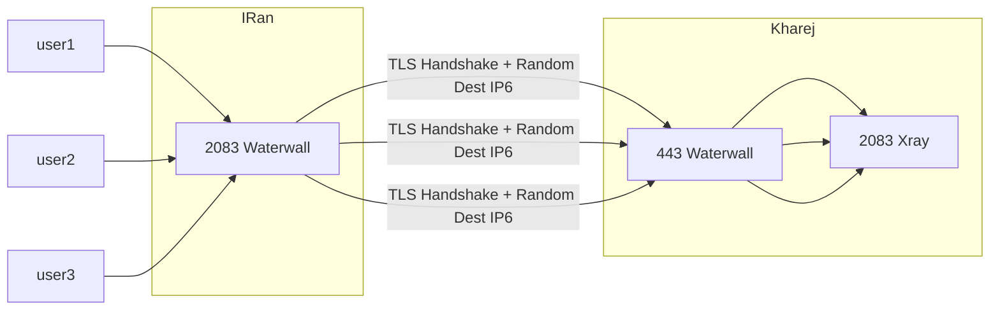

<p dir="rtl">
روش freebind به ما اجازه می ده که به جای اینکه به یک ایپی مشخص سرور خارج وصل بشیم ؛ بین یه رنج که با سابنت ماسک مشخص می کنیم بالانس انجام بدیم و رندوم به یکی وصل بشیم
</p>


<p dir="rtl">
این عمل برای فیلتر نشدن و بهبود سرعت به نظر خیلی مناسب میاد
</p>

<p dir="rtl">

سرور ها یه رنج عظیمی از ipv6 به شما می دهند که با این قابلیت می تونید هر کانکشن جدید به یه دونه از این رنج به صورت رندوم متصل بشه که اینجوری فایروال همش ایپی های متفاوت میبینه. و سرور های هتزنر مثلا رنج 64 می هدند که یعنی ۲ به توان 64 عدد ایپی داریم برای اتصال که یعنی 18446744073709551615 عدد ایپی 

</p>


<p dir="rtl">
روی مستقیم اجرا کردنش به این صورته:
</p>


<p dir="rtl">
اول اینکه باید بدونیم این روش node جدا نداره و ما باید در نود های listener, connector یه تغییراتی بدیم
</p>

<p dir="rtl">
فرض می کنیم من یه سرور خارج دارم که این ایپی ۶ هست که هتزنر به من داده
</p>


> 2a01:4f8:1c1b:276c::1/64 


<p dir="rtl">
کانفیگ tls multi port رو برای مثال میخوایم به حالت freebind در بیاریم
</p>

<p dir="rtl">
در سرور ایران تغییری که می دهیم اینه که ؛‌در tcp connector میایم و ادرس رو به صورت رنج وارد می کنیم 
</p>




<p dir="rtl">
کانفیگ سرور ایران:
</p>


```json
{
    "name": "tls_port_to_port",
    "nodes": [
        {
            "name": "input",
            "type": "TcpListener",
            "settings": {
                "address": "0.0.0.0",
                "port": 2083,
                "nodelay": true
            },
            "next": "mysslclient"
        },
        {
            "name": "mysslclient",
            "type": "OpenSSLClient",
            "settings": {
                "sni": "mydomain.ir",
                "verify": true,
                "alpn":"http/1.1"
            
            },
            "next": "output"
        },
        
        {
            "name": "output",
            "type": "TcpConnector",
            "settings": {
                "nodelay": true,
                "address": "2a01:4f8:1c1b:276c::1/64",
                "port": 443
            }
        }

    ]
}
```

<p dir="rtl">
همونطور که دیدید دقیقا همون ایپی که هتزنر داد با رنجش گذاشتم داخل address
</p>

<p dir="rtl">
سپس در سرور خارج اینجروی اجرا می کنم
</p>


```json
{
    "name": "tls_port_to_port_kharej",
    "nodes": [
        {
            "name": "input",
            "type": "TcpListener",
            "settings": {
                "address": "؛؛",
                "port": 443,
                "nodelay": true
            },
            "next": "mysslserver"
        },
        {
            "name": "mysslserver",
            "type": "OpenSSLServer",
            "settings": {
                "cert-file": "fullchain.pem",
                "key-file": "privkey.pem",
                "alpns": [
                    {
                        "value": "h2",
                        "next": "node->next"
                    },
                    {
                        "value": "http/1.1",
                        "next": "node->next"
                    }
                ]

            },
            "next": "output"  
        },
        {
            "name": "output",
            "type": "TcpConnector",
            "settings": {
                "nodelay": true,
                "address": "127.0.0.1",
                "port": 2083
            }
        }

    ]
}
```
<p dir="rtl">
تنها تغییر این بود که در نود listener که اولی هست ؛ پارامتر آدرس به جای 0.0.0.0 به :: تغییر پیدا کرد ؛ این باعث میشه که 
</p>

<p dir="rtl">
ما علاوه بر کاکنکشن های آیپی ۴ بتونیم کانکنشن های آیپی ۶ هم دریافت کنیم 
</p>


<p dir="rtl">
اینجا کار تمام هست اما یه کار مهم مونده که حتما باید انجام بدیم ؛ در سرور خارج نیازه که این دستورو شما اجرا کنید
</p>

<p dir="rtl">
دقت کنید این دستور بعد ری استارت سرور میپره ؛ که می دونید راه زیاده برای اتومات کردنش 
</p>

``` bash
ip route add local 2a01:4f8:1c1b:276c::/64 dev eth0
```

<p dir="rtl">
تو این دستور ایپی ۶ سرور خارج رو درست بزارید و دقت کنید که اون عدد یک آخر ایپی رو نزارید ؛ همچنین عبارت eth0 
</p>

<p dir="rtl">
که روی سرور های هتزنر معمولا همینه ولی بغیه جاها مثل والتر این نیست ؛ این عبارت رو با دستور
</p>


``` bash
> ip a
```

<p dir="rtl">
خروجی این دستور چند تا پاراگراف هست که تو یکی از پاراگراف ها ایپی خارج واقعی سرور نوشته شده ؛ عنوان اون پاراگراف میشه 
همین عبارت که میخوایم
</p>

<p dir="rtl">
معمولا به جز این ens+number میزارن یا چیز های شبیه به این
</p>


* * *
<p dir="rtl">
شما همچنین میتونید به جای دادن آدرس که توش رنج ایپی هست در کانفیگ سرور ایران ؛ یک دامنه که پشتش همون ایپی ۶ هست را وارد کنید
</p>

<p dir="rtl">
و خود واتروال رنج رو محاسبه خواهد کرد بر اساس سابنت مسک
</p>

> "address" : "mydomain.com/64"

<p dir="rtl">
تست نکردم البته اینو ولی باید کار کنه ؛ اگه نکرد ایشیو باز کنید
</p>

* * *

<p dir="rtl">
الان که دیدی تغییرات خیلی جزیی نیاز بود تا ما به این قابلیت دست پیدا کنیم ؛ با انجام همین تغییرات روی هر روش دیگه حتی ریورس می توانید کانفیگ مورد نظرتونو ایجاد کنید ولی وقتی ریورس ایجاد می کنید ؛ سرور ایران باید رنج ایپی ۶ داشته باشه.
</p>


* * *


<p dir="rtl">
با تشکر از @Edizam که این ایده را در گیت هاب مطرح کرندو
</p>

