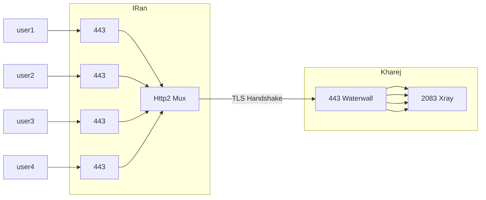

<p dir="rtl">
اضافه کردن http2 به تونل ؛ باعث میشه که ما به امکاناتی که Http2 ارایه میده دسترسی پیدا کنیم
</p>

<p dir="rtl">
از جمله mux , grpc 
</p>

<p dir="rtl">
با استفاده از grpc میشه کانکشن رو از کلود فلیر هم عبور داد و مستقیم هم میشه استفاده کرد فرقی نمیکنه
</p>

<p dir="rtl">
و mux هم باعث میشه تعداد کانشکن های کمتری بین سرور ایران و خارج ایجاد بشه و هند شیک تایم هم تا حد خیلی خوبی پایین بیاد
</p>

<p dir="rtl">
استفاده از روش های تونل بدون mux باعث میشه این احتمال وجود داشته باشه که سرور خارج شما دچار اختلال یا حتی در نهایت فیلتر بشه
</p>

<p dir="rtl">
پس به شدت توصیه میکنم این مورد را در تونل هاتون اعمال کنید بخصوص اگه مشتری زیاد دارید روی یه سرور 
</p>

<p dir="rtl">
وقتی که از http2 استفاده میکنیم دیگه نیازی به preconnect نداریم و استفاده ازش میشه گفت بی تاثیره
</p>


# اعمال روی Tls tunnel

* * *

<p dir="rtl">
ایپی سرور خارج 1.1.1.1 فرض شده ؛ اگه ایپی پشت دامنه هست هم میتونید توی نود output دامنه وارد کنید به جای ایپی
</p>

<p dir="rtl">
سرور ایران:
</p>




```json
{
    "name": "tls_port_to_port_grpc_iran",
    "nodes": [
        {
            "name": "input",
            "type": "TcpListener",
            "settings": {
                "address": "0.0.0.0",
                "port": 443,
                "nodelay": true
            },
            "next": "pbclient"
        },
        {
            "name": "pbclient",
            "type": "ProtoBufClient",
            "settings": {},
            "next": "h2client"
        },
        {
            "name": "h2client",
            "type": "Http2Client",
            "settings": {
                "host": "mydomain.ir",
                "port": 443,
                "path": "/",
                "content-type": "application/grpc"
            },
            "next": "sslclient"
        },
        {
            "name": "sslclient",
            "type": "OpenSSLClient",
            "settings": {
                "sni": "mydomain.ir",
                "verify": true,
                "alpn": "h2"
            },
            "next": "output"
        },
        {
            "name": "output",
            "type": "TcpConnector",
            "settings": {
                "nodelay": true,
                "address": "1.1.1.1",
                "port": 443
            }
        }
    ]
}
```

<p dir="rtl">
:سرور خارج
</p>


```json
{
    "name": "tls_port_to_port_grpc_kharej",
    "nodes": [
        {
            "name": "input",
            "type": "TcpListener",
            "settings": {
                "address": "0.0.0.0",
                "port": 443,
                "nodelay": true
            },
            "next": "sslserver"
        },
        {
            "name": "sslserver",
            "type": "OpenSSLServer",
            "settings": {
                "cert-file": "fullchain.pem",
                "key-file": "privkey.pem",
                "alpns": [
                    {
                        "value": "h2",
                        "next": "node->next"
                    },
                    {
                        "value": "http/1.1",
                        "next": "node->next"
                    }
                ]
            },
            "next": "pbserver"
        },
        {
            "name": "pbserver",
            "type": "ProtoBufServer",
            "settings": {},
            "next": "h2server"
        },
        {
            "name": "h2server",
            "type": "Http2Server",
            "settings": {},
            "next": "output"
        },
        {
            "name": "output",
            "type": "Connector",
            "settings": {
                "nodelay": true,
                "address": "127.0.0.1",
                "port": 2083
            }
        }
    ]
}
```

<p dir="rtl">
در این مثال نود ProtoBuf اجباری نیست وجودش ؛ ولی وقتی قرار داشته باشه کانکشن grpc حساب میشه و میتونه از cdn هم رد بشه
</p>


[Homepage](.) | [Prev Page](PreConnect) | [Next Page](Reverse-Tunnel)