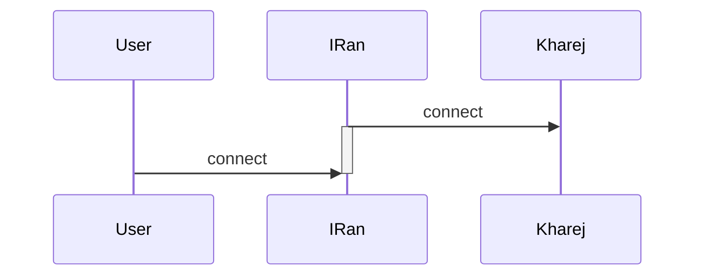
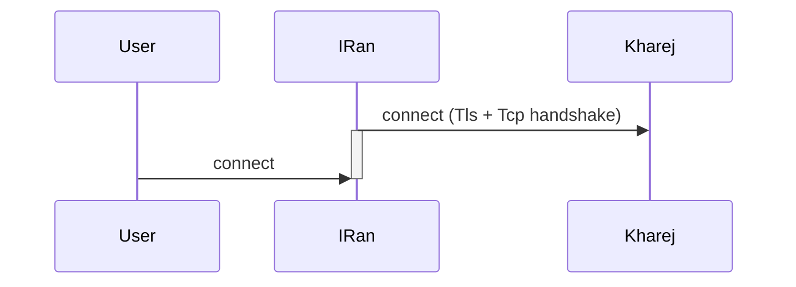

<p dir="rtl">
یک node هست که کارش به این صورته که قبل از کاربر کاکشن رو هند شیک میکنه و به اصطلاح میزاره داخل آب نمک
</p>

<p dir="rtl">
استفاده از این نود باعث میشه هند شیک تایم روی تونل کم بشه حتی نصف حالتی که این node در کانفیگ نیست
</p>

<p dir="rtl">
این node رو در کانفیگ های ریورس استفاده نکنید چون reverse client درون خودش این قابلیت رو داره و بی تاثیر میشه کاملا
</p>

<p dir="rtl">
برای استفاده از perconnect باید آن را در کانفیگ سرور ایران اضافه کنید 
</p>

<p dir="rtl">
اما پیدا کردن جای مناسب مهم هست و اگه جای مناسب رو پیدا کنید بیشترین کاهش هند شیک تایم رو بهتون میده
</p>

<p dir="rtl">
مثلا در حالت پورت فوروارد ؛ ما فقط سرور ایران رو کانفیگ میکنیم و ۲ تا node داریم کلا
</p>

<p dir="rtl">
پس جایگاه این نود میشه وسط و باید بین ۲ تا نود قرار بگیره 
</p>

<p dir="rtl">
که یعنی این:
</p>




```json
{
    "name": "simple_port_to_port_with_preconnect",
    "nodes": [
        {
            "name": "input",
            "type": "TcpListener",
            "settings": {
                "address": "0.0.0.0",
                "port": 443,
                "nodelay": true
            },
            "next": "output"
        },
    {
            "name": "precon_client",
            "type": "PreConnectClient",
            "settings": {
                "minimum-unused":1

            },
            "next": "output"
        },
        {
            "name": "output",
            "type": "TcpConnector",
            "settings": {
                "nodelay": true,
                "address": "1.1.1.1",
                "port": 443
            }
        }
    ]
}
```

<p dir="rtl">
این کار باعث میشه که هندشیک tcp پیش از اتصال انجام بشه
</p>

<p dir="rtl">
اما اهمیت این node در کانفیگ tls tunnel بیشتره
</p>

<p dir="rtl">
این مثال رو برسی میکنیم:
</p>




```json
{
    "name": "tls_port_to_port_preconnect",
    "nodes": [
        {
            "name": "input",
            "type": "TcpListener",
            "settings": {
                "address": "0.0.0.0",
                "port": 443,
                "nodelay": true
            },
            "next": "precon_client"
        },
        {
            "name": "precon_client",
            "type": "PreConnectClient",
            "settings": {
                "minimum-unused": 1
            },
            "next": "mysslclient"
        },
        {
            "name": "mysslclient",
            "type": "OpenSSLClient",
            "settings": {
                "sni": "mydomain.ir",
                "verify": true,
                "alpn":"http/1.1"
            
            },
            "next": "output"
        },
        
        {
            "name": "output",
            "type": "TcpConnector",
            "settings": {
                "nodelay": true,
                "address": "1.1.1.1",
                "port": 443
            }
        }

    ]
}
```

<p dir="rtl">
اینجا حضور preconnect باعث میشه هند شیک tls + tcp قبل از اتصال کاربر تکمیل بشه و شاید ۳۰۰ میلی ثانیه یا بیشتر صرفه جویی میشه 
</p>


# نکات مهم

* * *

<p dir="rtl">
همچنین این نود پارامتر minimum-unused را دارد که ان رو بسته به تعداد کاربر ها بین ۱ تا ۱۶ بهتره تنظیم کنید ولی دقت کنید اگه این رو خیلی زیاد هم تنظیم کنید خوب نیست
چون فایروال ایران اگه ببینه کانکشن ول مونده برای مدت طولانی روش اختلال میندازه
</p>

<p dir="rtl">
اگه از مالتی پورت استفاده میکنید ؛ این نود رو بعد از header قراربدید وگرنه مالتی پورت کار نخواهد کرد
</p>

<p dir="rtl">
preConnectClient هم مثل بغیه node ها جفت preConnectServer هست
</p>

<p dir="rtl">
با اینکه اگه سمت سرور خارج جفتش رو قرار بدید چیز خوبیه ولی این نود استثنائا نیازی به جفت نداره 
</p>


[Homepage](.) | [Prev Page](Tls-Tunnel) | [Next Page](Http2-Mux-Grpc)