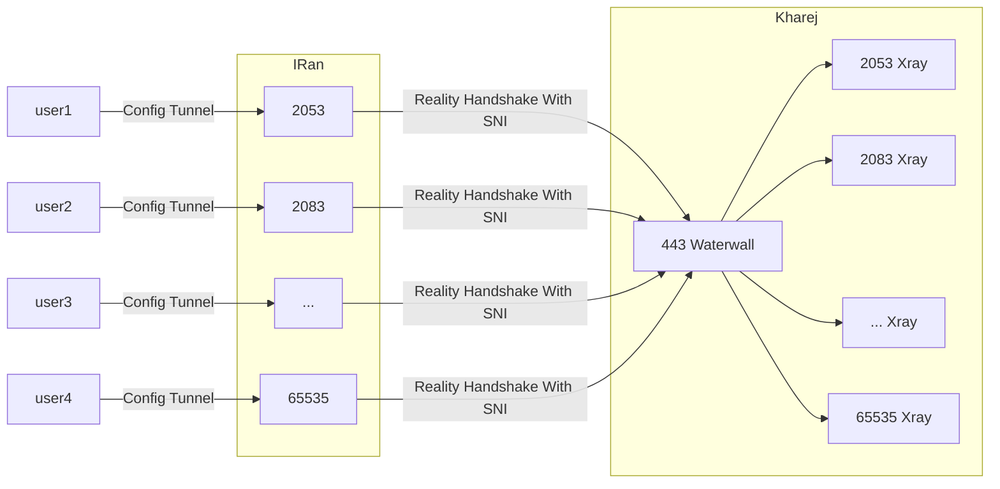

<p dir="rtl">
ریلیتی مدت هاست که استفاده میشه و همه میشناسن
</p>

<p dir="rtl">
این نسخه از ریلیتی که داخل واتروال استفاده میشه با روش های دیگه ای که برنامه نویس های دیگه نوشتن فرق میکنه اما درکل به یک هدف میرسند
</p>

<p dir="rtl">
ریلیتی به شما این اجازه رو میده که هندشیک رو با دامنه دلخواه تکمیل کنید و اگر کاکشن احراز نشد ؛ خیلی ساده فالبک بشه به همون سایت destination
</p>

<p dir="rtl">
درحقیقت سرور شما انگار iptalbe شده به destination و به خاطر همین تشخیصش توسط فایروال خیلی سخته
</p>

<p dir="rtl">
البته شاید راه های دیگه پیدا کرده باشن که خیلی درگیرش نشیم چون نمیخوام به کسی ایده بدم درکل ولی
</p>

<p dir="rtl">
خلاصه کلام اینکه ریلیتی رمزنگاری هم داره ؛ برای تونل رمزنگاری کامل و سنگین مثل aes نیاز نیست ولی خوب الان واتروال برای ریلیتی فقط همین الگوریتم رو داره
</p>

<p dir="rtl">
که خوب خیلی هم performance شاید نگیره چون hardware accelerated پیاده شده توسط openssl
</p>

<p dir="rtl">
ریلیتی در واتروال ساده پیاده شده ولی در عین حال تا جایی که من علمشو داشتم نکاتش رعایت شده 
</p>

<p dir="rtl">
شما تنها باید یک پسورد مشترک داشته باشید و همچنین یک sni که خودتون هرچی دوست داشتید میزنید
</p>

<p dir="rtl">
با اینکه یک پسورد مشترک استفاده میشه ؛ اما دیتای ارسالی کاملا tls simulated هست و همچین تمام پکت ها با کمک IV رندوم هستند و دیتای هیچ سمپلی تکرار نمیشه 
</p>

<p dir="rtl">
و همچنین امضا با hmac هم انجام میشه تا یوقت هکر ها اطلاعات با ارزش شما رو هک نکن و دامنه ای که کاربر میخواد وصل بشه رو پیدا نکنن !
</p>

<p dir="rtl">
امیدوارم این ها کافی بوده باشه و جایی سوتی نداده باشم 😁
</p>

<p dir="rtl">
ولی این جور چیز ها تا وقتی چند نفر متخصص توی امنیت برسی نکنن نمیشه نظر داد ؛ اگه کسی رو میشناسید یا خودتون فعال هستید تو این حیطه خوشحالم میشم 
کد رو برسی کنید و سوتی های فراوانی که دادم رو بهم اطلاع بدید
</p>

<p dir="rtl">
این نکات امنیتی الگوریتم aes بود ؛ بعدا براش الگوریتم مورد علاقه خودم که xor هست رو اضافه میکنم که هیچ کودم از این جزییات امنیتی روش رعایت نمیشه ولی پرفورمنس بهتری خواهد داد
</p>


<p dir="rtl">
برای تونل مستقیم ریلیتی از این مثال میشه استفاده کرد
</p>


- ایپی سرور خارج 1.1.1.1
- رمز passwd
- sni: i.stack.imgur.com
- multi port (443 - 65535)

* * *

# سرور ایران

* * *





```json
{
    "name": "reality_client_multiport",
    "nodes": [
        {
            "name": "users_inbound",
            "type": "TcpListener",
            "settings": {
                "address": "0.0.0.0",
                "port": [443,65535],
                "nodelay": true
            },
            "next": "header"
        },
        {
            "name": "header",
            "type": "HeaderClient",
            "settings": {
                "data": "src_context->port"
            },
            "next": "my_reality_client"
        },
        {
            "name": "my_reality_client",
            "type": "RealityClient",
            "settings": {
                "sni":"i.stack.imgur.com",
                "password":"passwd"

            },
            "next": "outbound_to_kharej"
        },

        {
            "name": "outbound_to_kharej",
            "type": "TcpConnector",
            "settings": {
                "nodelay": true,
                "address":"1.1.1.1",
                "port":443
            }
        }
     
      
    ]
}
```

* * *

# سرور خارج


* * *

```json
{
    "name": "reality_server_multiport",
    "nodes": [
        {
            "name": "main_inbound",
            "type": "TcpListener",
            "settings": {
                "address": "0.0.0.0",
                "port": 443,
                "nodelay": true
            },
            "next": "my_reality_server"
        },

        {
            "name": "my_reality_server",
            "type": "RealityServer",
            "settings": {
                "destination":"reality_dest_node",
                "password":"passwd"

            },
            "next": "header_server"
        },
        
        {
            "name": "header_server",
            "type": "HeaderServer",
            "settings": {
                "override": "dest_context->port"
            },
            "next": "final_outbound"
        },

        {
            "name": "final_outbound",
            "type": "TcpConnector",
            "settings": {
                "nodelay": true,
                "address":"127.0.0.1",
                "port":"dest_context->port"

            }
        },

        {
            "name": "reality_dest_node",
            "type": "TcpConnector",
            "settings": {
                "nodelay": true,
                "address":"i.stack.imgur.com",
                "port":443
            }
        }
      
    ]
}
```


[Homepage](.) | [Prev Page](Reverse-Tunnel) | [Next Page](Reality-Reverse-Tunnel)
