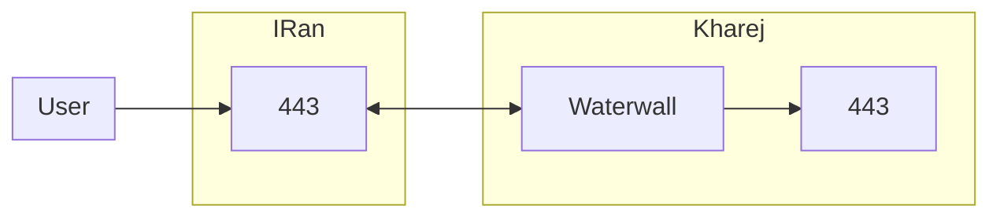
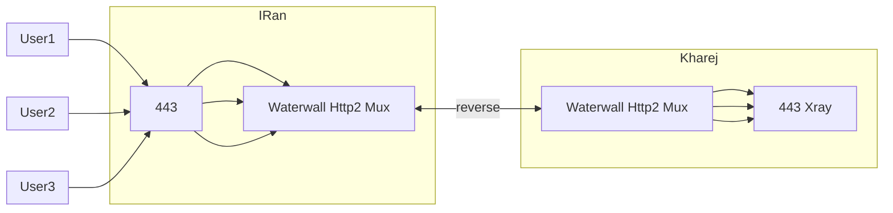

<p dir="rtl">
روش ریورس رو همه میشناسن ؛ توی روش اول که پورت به پورت مستقیم تونل میکردیم
</p>

<p dir="rtl">
کاربر به سرور ایران وصل میشد و بعد سرور ایران به سرور خارج
</p>

<p dir="rtl">
اما در روش ریورس؛ ابتدا سرور خارج مثل یه کاربر خارجی به سرور ایران وصل میشه و منتظر میمونه 
</p>

<p dir="rtl">
سپس یه کاربر ایرانی هم به سرور ایران وصل میشه و بعد سرور ایران کانکشن کاربر ایرانی و کاربر خارجی (سرور خارج شما) رو به هم پیوند میزنه و اینطوری یک اتصال بین کاربر ایرانی و سرور خارج ایجاد میشه
</p>

<p dir="rtl">
این نوع اتصال نقطع ضعف تمام سیستم های فیلترینگ و سانسور هستن و جلو گیری ازش هم سخت تره
</p>

<p dir="rtl">
قبلا سیستم فیلترینگ ایران هیچ دفاعی در برابر این روش نداشت اما الان که تست کردیم ؛ به این صورت عمل میکنه
</p>

<p dir="rtl">
1- بعضی ایپی های خارج عموما از هتزنر ممکنه سرعت خوبی ندهند؛ یعنی توی اسپید تست سرعت دانلود مناسب نباشه اما این الان کمتره چون روی چند تا سرور هتزنر تست کردیم و مشکلی نبود
</p>

<p dir="rtl">
2- دامنه ؛ دامنه ای که سرور خارج باهاش به ایران وصل میشه مهمه ؛ توی تست هایی که اخیرا زدیم تفاوت خیلی زیادی در کیفیت اتصال و پینگ  دیدیم که فقط با تغییر دامنه خودشو نشون میداد
</p>

<p dir="rtl">
پس اگه میخواید با tls ارتباط سرور خارج و ایران برقرار بشه بهتره یه دامنه ای داشته باشید که کم استفاده باشه و فیلترینگ روش پیش نیومده باشه و درکل تمیز باشه
</p>

<p dir="rtl">
اما اگرم ندارید ؛ باید با استفاده از reality سرور خارج رو به ایران وصل کنیم و یه دامنه سایت معروف ایرانی رو استفاده کنیم برای اتصال
</p>

<p dir="rtl">
و این روش مشکلی ایجاد نمیکنه و کاملا جواب گو هست
</p>

<p dir="rtl">
در کل بهتره از ساده به سخت شروع کنیم ؛ اول اتصال ریورس به شکل tcp رو میگم 
</p>

<p dir="rtl">
سرور ایران:
</p>

<p dir="rtl">
ایپی سرور خارج 2.2.2.2 فرض شده 
</p>

<p dir="rtl">
کاربر ها به ۴۴۳ ایران وصل میشن و در نهایت به ۴۴۳ خارج
</p>




```json
{
    "name": "myconf",
    "nodes": [
        {
            "name": "users_inbound",
            "type": "TcpListener",
            "settings": {
                "address": "0.0.0.0",
                "port": 443,
                "nodelay": true
            },
            "next":  "bridge2"
        },
      
        {
            "name": "bridge2",
            "type": "Bridge",
            "settings": {
                "pair": "bridge1"
            }
        },
        {
            "name": "bridge1",
            "type": "Bridge",
            "settings": {
                "pair": "bridge2"
            }

            
        },
        {
            "name": "reverse_server",
            "type": "ReverseServer",
            "settings": {},
            "next": "bridge1"
        },

   

        {
            "name": "kharej_inbound",
            "type": "TcpListener",
            "settings": {
                "address": "0.0.0.0",
                "port": 443,
                "nodelay": true,
                "whitelist":[
                    "2.2.2.2/32"
                ]
            },
            "next": "reverse_server"
        }
    ]
}
```


<p dir="rtl">
سپس در سرور خارج این کانفیگ رو اجرا میکنیم ؛ فرض شده کاربرها روی پورت ۴۴۳ ساخته شدن
</p>

<p dir="rtl">
و ایپی سرور ایران 1.1.1.1 باشه
</p>


```json
{
    "name": "reverse_simple",
    "nodes": [
       

        {
            "name": "outbound_to_core",
            "type": "TcpConnector",
            "settings": {
                "nodelay": true,
                "address":"127.0.0.1",
                "port":443
            }

        },
      
        {
            "name": "bridge1",
            "type": "Bridge",
            "settings": {
                "pair": "bridge2"
            },
            "next": "outbound_to_core"

        },
        {
            "name": "bridge2",
            "type": "Bridge",
            "settings": {
                "pair": "bridge1"
            },
            "next": "reverse_client"

        },
      
        {
            "name": "reverse_client",
            "type": "ReverseClient",
            "settings": {
                "minimum-unused":16
            },
            "next":  "outbound_to_iran"
        },


        {
            "name": "outbound_to_iran",
            "type": "TcpConnector",
            "settings": {
                "nodelay": true,
                "address":"1.1.1.1",
                "port":443
            }
        }

    ]
}
```

<p dir="rtl">
این الان شد ساده ترین تانل ریورس و در عین حال سریع ترین نوع
</p>

<p dir="rtl">
و اینجا تک پورت اجراش کردیم ولی مالتی پورت اجرا کردنش هم کاری نداره مثل همون قبل باید از header استفاده کنیم و پورت رو بازه وارد کنیم 
</p>

<p dir="rtl">
این نوع تانل ریورس با اینکه سبک و سریعه ولی خوب رمزنگاری خاصی وجود نداره و از همه مهم تر ماکس وجود نداره
سرور خارج به اندازه کل کاربرها باید کانکشن بزنه به سرور ایران و فایروال ایران اصلا از این خوشش نمیاد و بعد یه مدت سرور ایرانتونو بلاک میکنه
</p>

# استفاده از Tls و Http2

* * *

<p dir="rtl">
این کار تونل ریورس مارو تکمیل میکنه ؛ با سرعت عالی کار خواهد کرد و فیلتر هم نخواهد شد
</p>

<p dir="rtl">
البته ؛ وقتی از tls استفاده می کنیم دامنه خودمون هست که کیفیت اتصال رو تعین می کنه؛ می تونید هم از ریلتی استفاده کنید اگه دامنه خودتون خوب نبود
</p>

<p dir="rtl">
تو این مثال مالتی پورت تونل انجام میشه
</p>

<p dir="rtl">
ایپی سرور خارج 2.2.2.2 فرض شده
</p>

<p dir="rtl">
سرور ایران:
</p>




```json
{
    "name": "reverse_tls_h2_multi_iran",
    "nodes": [
        {
            "name": "inbound_users",
            "type": "TcpListener",
            "settings": {
                "address": "0.0.0.0",
                "port": [80,65535],
                "nodelay": true
            },
            "next": "header"
        },
        {
            "name": "header",
            "type": "HeaderClient",
            "settings": {
                "data": "src_context->port"
            },
            "next": "bridge2"
        },
        {
            "name": "bridge2",
            "type": "Bridge",
            "settings": {
                "pair": "bridge1"
            }
        },
        {
            "name": "bridge1",
            "type": "Bridge",
            "settings": {
                "pair": "bridge2"
            }
        },
        {
            "name": "reverse_server",
            "type": "ReverseServer",
            "settings": {},
            "next": "bridge1"
        },
        {
            "name": "pbserver",
            "type": "ProtoBufServer",
            "settings": {},
            "next": "reverse_server"
        },
        {
            "name": "h2server",
            "type": "Http2Server",
            "settings": {},
            "next": "pbserver"
        },
        {
            "name": "sslserver",
            "type": "OpenSSLServer",
            "settings": {
                "cert-file": "fullchain.pem",
                "key-file": "privkey.pem",
                "alpns": [
                    {
                        "value": "h2",
                        "next": "node>next"
                    },
                    {
                        "value": "http/1.1",
                        "next": "node>next"
                    }
                ],
                "fallbackintencedelay": 0
            },
            "next": "h2server"
        },
        {
            "name": "inbound_server_kharej",
            "type": "TcpListener",
            "settings": {
                "address": "0.0.0.0",
                "port": 443,
                "nodelay": true,
                "whitlelist": [
                    "2.2.2.2/32"
                ]
            },
            "next": "sslserver"
        }
    ]
}
```

<p dir="rtl">
سرور خارج:
</p>

<p dir="rtl">
ایپی سرور ایران 1.1.1.1 فرض شده
</p>


```json
{
    "name": "reverse_tls_h2_multi_kharej",
    "nodes": [
        {
            "name": "core_outbound",
            "type": "TcpConnector",
            "settings": {
                "nodelay": true,
                "address": "127.0.0.1",
                "port": "dest_context->port"
            }
        },
        {
            "name": "header",
            "type": "HeaderServer",
            "settings": {
                "override": "dest_context->port"
            },
            "next": "core_outbound"
        },
        {
            "name": "bridge1",
            "type": "Bridge",
            "settings": {
                "pair": "bridge2"
            },
            "next": "header"
        },
        {
            "name": "bridge2",
            "type": "Bridge",
            "settings": {
                "pair": "bridge1"
            },
            "next": "reverse_client"
        },
        {
            "name": "reverse_client",
            "type": "ReverseClient",
            "settings": {
                "minimum-unused": 16
            },
            "next": "pbclient"
        },
        {
            "name": "pbclient",
            "type": "ProtoBufClient",
            "settings": {},
            "next": "h2client"
        },
        {
            "name": "h2client",
            "type": "Http2Client",
            "settings": {
                "host": "mydomain.ir",
                "port": 443,
                "path": "/",
                "content-type": "application/grpc"
            },
            "next": "sslclient"
        },
        {
            "name": "sslclient",
            "type": "OpenSSLClient",
            "settings": {
                "sni": "mydomain.ir",
                "verify": true,
                "alpn": "h2"
            },
            "next": "iran_outbound"
        },
        {
            "name": "iran_outbound",
            "type": "TcpConnector",
            "settings": {
                "nodelay": true,
                "address": "1.1.1.1",
                "port": 443
            }
        }
    ]
}
```

[Homepage](.) | [Prev Page](Http2-Mux-Grpc) | [Next Page](Reality-Direct-Tunnel)

