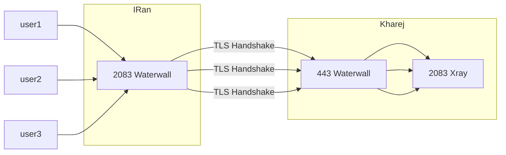
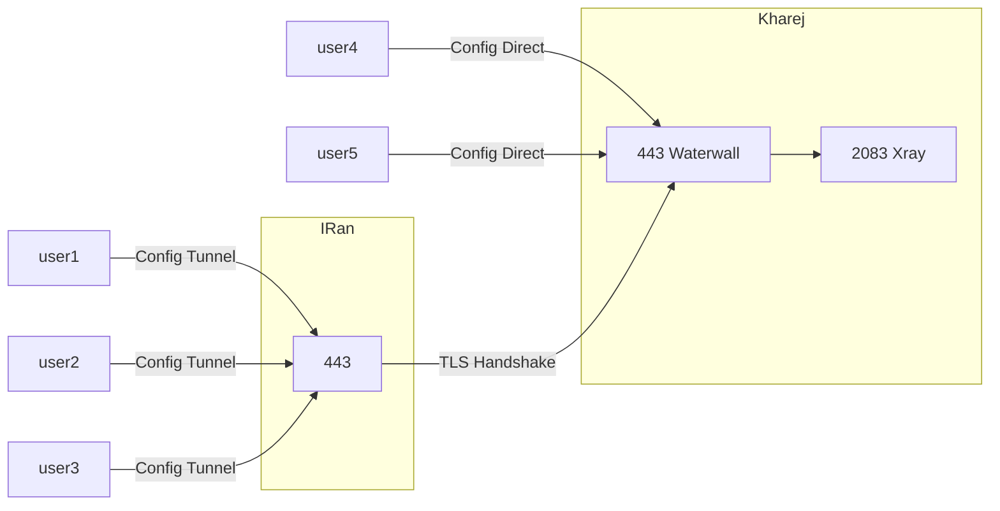
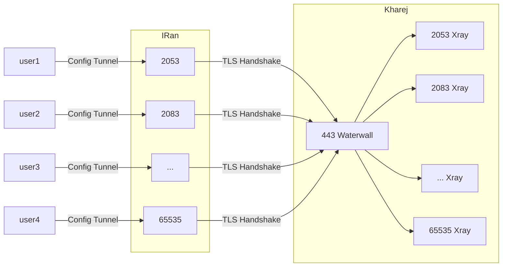

<p dir="rtl">
در صفحه قبلی تانل پورت به پورت رو دیدیم؛‌ اون تانل با اینکه تانل خوبی هست ولی خوب خیلی هم ساده هست و احتمال فیلتر شدنش هم بسته به دیتا سنترها ممکنه بالا باشه
برای همین میایم روی یه چیزی سوار میکنیم به اسم tls 
</p>

<p dir="rtl">
دوستانی که سرور خارج هتزنر دارن و روی تانل های معکوس مشکل سرعت دارن این روش خیلی عالی جواب میده پس حتما تست کنید
</p>


# دامنه

* * *

<p dir="rtl">
برای اینکه تانل tls انجام بشه نیاز به دامنه هست ؛ دامنه هارو معمولا با قیمت های مختلف میخرن و ارزون ترینش هم ir هست که برای اینکار مناسب هم هست 
همچنین بعضی سایت ها ساب دامنه رایگان میدن ؛ از اون ها هم میتونید استفاده کنید یه ساب دامنه رایگان بگیرید 
</p>

<p dir="rtl">
همچنین درمورد دامنه ir بعضی ها نگران بودند که ممکنه دستگیر بشن یا چمیدونم گیر بدن؛ خیالتون راحت اصلا چنین چیزی نیست و مدت هاست خودم به روش های مختلف استفاده کرده ام و میکنم
</p>

# سرتیفیکیت

* * *

<p dir="rtl">
بعد از تهیه دامنه یا ساب دامنه ؛ باید براش سرتیفکیت گرفت
</p>

<p dir="rtl">
 که اموزش هاش هم تویویوب فراوان هست هم متنی ها هستن؛ اما خلاصه بخوام بگم ؛ دامنه رو بدون روشن کردن پروکسی کلود یا هیچ کار خاصی ؛ پشتش ایپی یه سرور قرار میدید
که یعنی یه رکورد dns از نوع A میسازید و ایپی سرورتون رو وارد میکنید
</p>

<p dir="rtl">
بعد روی اون سرور که ایپی اش وارد شده ؛ درخواست گرفتن سرتیفکیت رو صادر میکنید به این صورت
</p>


```sh
apt-get install certbot
```

```sh
sudo certbot certonly --standalone --preferred-challenges http --agree-tos --email emaileshoma@gmail.com -d sub.mydomain.ir
```


<p dir="rtl">
ایمیل رو هرچی دلتون خواست بزنید ولی دامنه رو درست وارد کنید ؛ همچنین سرتیفکیت ها ۳ ماه اعتبار دارن و بعد از ۳ ماه باید دستور certbot renew رو بزنید تا تمدید بشه
</p>

<p dir="rtl">
این دستور براتون سرتیفکیت میگیره و در انتها مسیر دو تا فایل رو نشون میده که کجا ذخیره شدن
</p>

<p dir="rtl">
 fullchain.pem  و privkey.pem  هستند اون فایل ها 
</p>

<p dir="rtl">
این فایل هارو یجا دانلود کنید یا ذخیره کنید و بهتره هم کنار خود waterwall قرار بدید که توی دادن مسیر اش دچار مشکل نشید
</p>


# اجرای تانل Tls 

* * *

<p dir="rtl">
فرض میکنیم شما از دامنه mydomain.ir استفاده کردید و براش سرتیفیکیت گرفتید
</p>

<p dir="rtl">
و ایپی سرور خارج شما هم 1.1.1.1 هست
</p>

<p dir="rtl">
این روش نیاز به اجرا شدن waterwall هم در سرور ایران داره و هم خارج
</p>

# حالت تک پورت و جدا

* * *

<p dir="rtl">
اینجا فرض میشه شما همه کاربرهاتون روی یه پورت ساخته شدن و در سرور خارج هم پنل نصب شده و درحال اجرا هست
پورت کاربر ها هم فرض میکنیم 2083 هست
</p>

<p dir="rtl">
سرور ایران رو تنظیم میکنیم که کاربر ها به پورت 2083 سرور ایران وصل بشن ؛ سپس سرور ایران با پورت ۴۴۳ که بهترین پورت برای tls هست با سرور خارج ارتباط بگیره
</p>

<p dir="rtl">
و سپس سرور خارج کاکشن رو از پورت ۴۴۳ بگیره و به پنل که کاربرهارو روی پورت 2083 ساخته متصل کنه
</p>





<p dir="rtl">
کانفیگ سرور ایران:
</p>


```json
{
    "name": "tls_port_to_port",
    "nodes": [
        {
            "name": "input",
            "type": "TcpListener",
            "settings": {
                "address": "0.0.0.0",
                "port": 2083,
                "nodelay": true
            },
            "next": "mysslclient"
        },
        {
            "name": "mysslclient",
            "type": "OpenSSLClient",
            "settings": {
                "sni": "mydomain.ir",
                "verify": true,
                "alpn":"http/1.1"
            
            },
            "next": "output"
        },
        
        {
            "name": "output",
            "type": "TcpConnector",
            "settings": {
                "nodelay": true,
                "address": "1.1.1.1",
                "port": 443
            }
        }

    ]
}
```

<p dir="rtl">
و کانفیگ سرور خارج:
</p>


```json
{
    "name": "tls_port_to_port_kharej",
    "nodes": [
        {
            "name": "input",
            "type": "TcpListener",
            "settings": {
                "address": "0.0.0.0",
                "port": 443,
                "nodelay": true
            },
            "next": "mysslserver"
        },
        {
            "name": "mysslserver",
            "type": "OpenSSLServer",
            "settings": {
                "cert-file": "fullchain.pem",
                "key-file": "privkey.pem",
                "alpns": [
                    {
                        "value": "h2",
                        "next": "node->next"
                    },
                    {
                        "value": "http/1.1",
                        "next": "node->next"
                    }
                ]

            },
            "next": "output"  
        },
        {
            "name": "output",
            "type": "TcpConnector",
            "settings": {
                "nodelay": true,
                "address": "127.0.0.1",
                "port": 2083
            }
        }

    ]
}
```

<p dir="rtl">
اینجوری تونل تکمیل میشه و بعد اجرا شدن waterwall در سرور ها باید اتصال برقرار باشه
</p>

<p dir="rtl">
خوب حالا بریم ببینیم چه تغییراتی میتونیم بدیم
</p>

<p dir="rtl">
اولین چیزی که به ذهن من میرسه اینه که ؛ ما الان پورت ۴۴۳ روی سرور خارج رو از دست دادیم ؛ این پورت افتاده دست تونل و پورت کاربر ها هم ۲۰۸۳ بود
</p>

<p dir="rtl">
اما اگه مثلا ما روی سرور خارج کاربرهارو روی پورت ۴۴۳ ساخته بودیم چی؟ خیلی ها اینکارو میکنن برای اینکه کاربرها مستقیم هم بتونن وصل بشن 
</p>

<p dir="rtl">
اونوقت باید به تونل بگیم با پورت ۲۰۸۳ سرور خارج متصل بشه درسته؟ 
</p>

<p dir="rtl">
بله درسته؛ اما بازم کیفیت اتصال tls وقتی با پورت ۴۴۳ هند شیک بشه 
 هم خیلی بهتره و هم از دیدگاه فیلترینگ احتمال فیلتر شدنش به شدت کمتره؛
</p>

<p dir="rtl">
اما سوال اینه که چطوری پورت ۴۴۳ رو هم کاربر ها استفاده کنن وقتی مستقیم وصل میشن به سرور و هم خود تونل برای ارتباط tls استفاده کنه؟ 
</p>

<p dir="rtl">
برای اینکار ؛ باید پورت کاربر هارو بزاریم یه پورت دیگه به جز ۴۴۳ اما کانفیگ هاشون باید به همون پورت ۴۴۳ اشاره کنه  پس پورت رو در پنل میکنیم ۲۰۸۳ ؛ سپس کانفیگ واتر وال رو اینجوری تغییر میدیم:
</p>


<p dir="rtl">
وقتی کاربر به کانفیگ تونل وصل شد:
</p>


user ---> (443) iran-server ---> (443) kharej-server-waterwall ---> 2083 kharej-server-xray

<p dir="rtl">
وقتی به کانفیگ مستقیم وصل شد:
</p>

user ---> (443) kharej-server-waterwall ---> 2083 kharej-server-xray





<p dir="rtl">
کانفیگ سرور ایران :
</p>


```json
{
    "name": "tls_port_to_port_iran",
    "nodes": [
        {
            "name": "input",
            "type": "TcpListener",
            "settings": {
                "address": "0.0.0.0",
                "port": 443,
                "nodelay": true
                
            },
            "next": "mysslclient"
        },
        {
            "name": "mysslclient",
            "type": "OpenSSLClient",
            "settings": {
                "sni": "mydomain.ir",
                "verify": true,
                "alpn":"http/1.1"
            
            },
            "next": "output"
        },
        
        {
            "name": "output",
            "type": "TcpConnector",
            "settings": {
                "nodelay": true,
                "address": "1.1.1.1",
                "port": 443
            }
        }

    ]
}
```

<p dir="rtl">
کانفیگ سرور خارج:
</p>

<p dir="rtl">
ایپی سرور ایران 2.2.2.2 فرض شده
</p>


```json
{
    "name": "tls_port_to_port_kharej",
    "nodes": [
        {
            "name": "input_direct_users",
            "type": "TcpListener",
            "settings": {
                "address": "0.0.0.0",
                "port": 443,
                "nodelay": true
            },
            "next": "output_direct_users"
        },
        {
            "name": "output_direct_users",
            "type": "TcpConnector",
            "settings": {
                "nodelay": true,
                "address": "127.0.0.1",
                "port": 2083
            }
        },

        {
            "name": "input_tunnel",
            "type": "TcpListener",
            "settings": {
                "address": "0.0.0.0",
                "port": 443,
                "nodelay": true,
                "whitelist": [
                    "2.2.2.2/32"
                ]
            },
            "next": "mysslserver"
        },
        {
            "name": "mysslserver",
            "type": "OpenSSLServer",
            "settings": {
                "cert-file": "fullchain.pem",
                "key-file": "privkey.pem",
                "alpns": [
                    {
                        "value": "h2",
                        "next": "node->next"
                    },
                    {
                        "value": "http/1.1",
                        "next": "node->next"
                    }
                ]

            },
            "next": "output_tunnel"  
        },
        {
            "name": "output_tunnel",
            "type": "TcpConnector",
            "settings": {
                "nodelay": true,
                "address": "127.0.0.1",
                "port": 2083
            }
        }
    ]
}
```

<p dir="rtl">
اینطوری دیگه پورت ۴۴۳ هم برای تونل استفاده شده هم کاربر میتونه مستقیم وصل شه و استفاده کنه
</p>

<p dir="rtl">
این حرکت رو بار روش های تونل دیگه ای که با waterwall میزنید هم میشه انجام داد و یا حتی بازم جدا سازی کرد ...
</p>

# حالت مالتی پورت

* * *

<p dir="rtl">
برای اینکه فایل خیلی طولانی نشه من این حالت رو ساده توضیح میدم و اون حرکتی که زدیم برای استفاده از پورت ۴۴۳ رو با این ادغام نمیکنم و خودتون 
</p>

<p dir="rtl">
با نگاه به مثال کاملا متوجه شدین چطور میشه ادغامش کرد 
</p>

<p dir="rtl">
اینجا میخواهیم این حالت رو بریم که ؛ کابر به هرپورتی که روی سرور ایران وصل شد ؛ وصل میشه به همون پورت روی سرور خارج مثل همون ایپی تیبل
</p>

<p dir="rtl">
اما؛ تبادل اطلاعات از طریق کانکشن tls که waterwall سرور ایران با پورت ۴۴۳ سرور خارج انجام داده ؛ انجام خواهد شد
</p>

<p dir="rtl">
پس پورت ۴۴۳ روی سرور خارج باید خالی باشه ؛ اگه رو اون پورت هم یوزر هست باید اون حرکتی که بالا زدیم رو ادغام کنید
</p>

<p dir="rtl">
کانفیگ سرور ایران:
</p>




```json
{
    "name": "tls_multiport_iran",
    "nodes": [
        {
            "name": "input",
            "type": "TcpListener",
            "settings": {
                "address": "0.0.0.0",
                "port": [23,65535],
                "nodelay": true
            },
            "next": "port_header"
        },
        {
            "name": "port_header",
            "type": "HeaderClient",
            "settings": {
                "data": "src_context->port"
            },
            "next": "sslclient"
        }, 
 
        {
            "name": "sslclient",
            "type": "OpenSSLClient",
            "settings": {
                "sni": "mydomain.ir",
                "verify": true,
                "alpn":"http/1.1"
            
            },
            "next": "output"
        },
        
        {
            "name": "output",
            "type": "TcpConnector",
            "settings": {
                "nodelay": true,
                "address": "1.1.1.1",
                "port": 443
            }
        }
    ]
}
```

<p dir="rtl">
از اونجایی که سرور خارج خبر نداره که کاربر به کدوم پورت سرور ایران وصل شده بوده ؛ ما باید این اطلاعات رو بهش برسونم که header node این کاررو اینجا انجام داده
</p>

<p dir="rtl">
کانفیگ سرور خارج:
</p>


```json
{
    "name": "tls_multiport_kharej",
    "nodes": [
        {
            "name": "input",
            "type": "TcpListener",
            "settings": {
                "address": "0.0.0.0",
                "port": 443,
                "nodelay": true
            },
            "next": "sslserver"
        },

        {
            "name": "sslserver",
            "type": "OpenSSLServer",
            "settings": {
                "cert-file": "fullchain.pem",
                "key-file": "privkey.pem",
                "alpns": [
                    {
                        "value": "h2",
                        "next": "node->next"
                    },
                    {
                        "value": "http/1.1",
                        "next": "node->next"
                    }
                ],
                "fallback-intence-delay":0

            },
            "next": "port_header"
            
        },

        {
            "name":"port_header",
            "type": "HeaderServer",
            "settings": {
                "override": "dest_context->port"
            },
            "next": "output"

        },

        {
            "name": "output",
            "type": "TcpConnector",
            "settings": {
                "nodelay": true,
                "address":"127.0.0.1",
                "port":"dest_context->port"
            }
        }
    ]
}
```

<p dir="rtl">
و بعد از اجرا تانل برقرار میشه وسرعت دانلود و کلا همه چی خوبه اما ؛ هند شیک تایم رو میشه پایین تر هم اوردش که در آموزش بعد میگم چیکار کنیم که بشه روی هر روشی هم که استفاده میکنیم
هند شیک تایم کمتر حتی تا نصف حالت عادی داشته باشیم
</p>


[Homepage](.) | [Prev Page](Direct-Port-To-Port) | [Next Page](PreConnect)