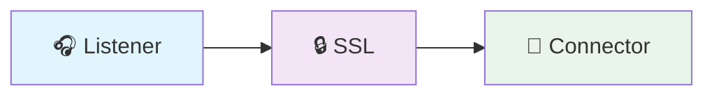
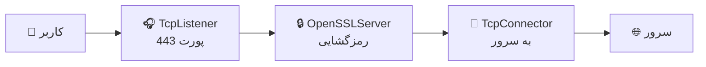
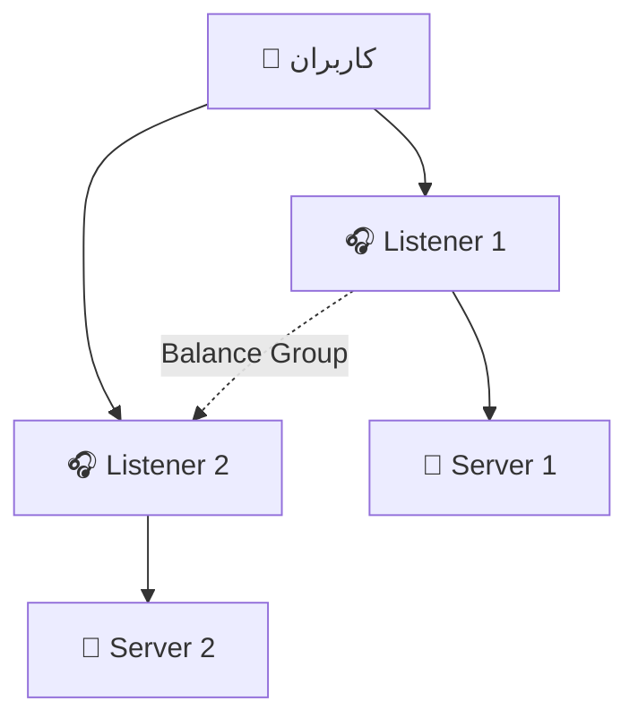
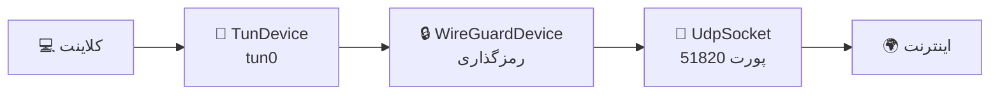

# مفاهیم پایه

WaterWall را از صفر تا صد بیاموزید - به زبان ساده! 🧠

## WaterWall چیست؟ 🤔

تصور کنید می‌خواهید آب از یک نقطه به نقطه دیگر منتقل کنید. شما لوله‌های مختلفی دارید:
- لوله فلزی (TCP)
- لوله پلاستیکی (UDP) 
- لوله‌های ضد زنگ (TLS)
- پمپ‌های مختلف (گره‌ها)

WaterWall به شما اجازه می‌دهد این لوله‌ها را **به هر شکلی که می‌خواهید** به هم وصل کنید!

## اجزای اصلی 🧱

### 1. گره (Node) 
یک **گره** مثل یک کارگر است که یک کار خاص انجام می‌دهد:

```
🎧 TcpListener   = نگهبان که گوش می‌دهد
🔌 TcpConnector  = کارگر که وصل می‌کند  
🔒 OpenSSLServer = قفل‌ساز که رمز می‌کند
```

### 2. زنجیره (Chain)
چندین گره که به هم متصل شده‌اند:



### 3. جریان داده (Data Flow)
داده‌ها مثل آب در لوله حرکت می‌کنند:

- **Upstream**: از کلاینت به سرور ➡️
- **Downstream**: از سرور به کلاینت ⬅️

## مثال ساده 🎯

بیایید یک **پراکسی HTTP** بسازیم:

### قدم 1: طراحی
```
کلاینت ---> [گوش‌کن] ---> [متصل‌کننده] ---> سرور
```

### قدم 2: انتخاب گره‌ها
- **گوش‌کن**: `TcpListener` (گوش دادن به پورت 8080)
- **متصل‌کننده**: `TcpConnector` (اتصال به httpforever.com)

### قدم 3: پیکربندی JSON
```json
{
  "name": "simple_proxy",
  "nodes": [
    {
      "name": "listener",           // نام دلخواه
      "type": "TcpListener",        // نوع گره
      "settings": {                 // تنظیمات
        "address": "0.0.0.0",
        "port": 8080
      },
      "next": "connector"           // گره بعدی
    },
    {
      "name": "connector",
      "type": "TcpConnector", 
      "settings": {
        "address": "httpforever.com",
        "port": 80
      }
      // گره آخر next ندارد
    }
  ]
}
```

## انواع گره‌ها 📦

### گره‌های شبکه (Network) 🌐
```
TcpListener      = گوش‌دهنده TCP
TcpConnector     = متصل‌کننده TCP  
UdpStatelessSocket = سوکت UDP ساده
```

**مثال**: پراکسی ساده
```json
{
  "name": "http_listener",
  "type": "TcpListener",
  "settings": {"address": "0.0.0.0", "port": 8080}
}
```

### گره‌های دستگاه (Device) 💾
```
TunDevice        = رابط شبکه مجازی
WireGuardDevice  = VPN WireGuard
RawSocket        = دسترسی مستقیم به شبکه
```

**مثال**: تونل VPN
```json
{
  "name": "vpn_interface", 
  "type": "TunDevice",
  "settings": {
    "device-name": "tun0",
    "device-ip": "10.0.0.1/24"
  }
}
```

### گره‌های پروتکل (Protocol) 🔒
```
OpenSSLServer    = سرور TLS/SSL
OpenSSLClient    = کلاینت TLS/SSL
Http2Server      = سرور HTTP/2
RealityServer    = سرور Reality (ضد فیلتر)
```

**مثال**: رمزگذاری TLS
```json
{
  "name": "ssl_server",
  "type": "OpenSSLServer",
  "settings": {
    "cert-file": "/path/to/cert.pem",
    "key-file": "/path/to/key.pem"
  }
}
```

### گره‌های پیشرفته (Advanced) ⚡
```
HalfDuplexClient = تقسیم کانال‌ها  
IpManipulator    = دستکاری IP
IpOverrider      = تغییر آدرس IP
```

## مفاهیم مهم 🔑

### Context (اطلاعات مشترک)
مثل یک **کارت شناسایی** که بین گره‌ها رد و بدل می‌شود:

```
Context = {
  آدرس مبدأ: "192.168.1.100"
  آدرس مقصد: "httpforever.com"  
  پورت: 80
  ...
}
```

### Balance Groups (تعادل بار)
وقتی چندین گره یکسان دارید، می‌توانید بارشان را تقسیم کنید:

```json
{
  "name": "server1",
  "type": "TcpListener", 
  "settings": {
    "port": 80,
    "balance-group": "web_servers"  // گروه مشترک
  }
}
```

### Chain Positions (موقعیت در زنجیره)
```
┌─────────┐    ┌─────────┐    ┌─────────┐
│  HEAD   │───▶│ MIDDLE  │───▶│  TAIL   │
│ (اول)   │    │ (میانی) │    │ (آخر)  │
└─────────┘    └─────────┘    └─────────┘
```

- **HEAD**: گره‌هایی که می‌توانند اول باشند (مثل TcpListener)
- **MIDDLE**: گره‌هایی که در وسط قرار می‌گیرند (مثل OpenSSLServer)  
- **TAIL**: گره‌هایی که در انتها قرار می‌گیرند (مثل TcpConnector)

## مثال‌های کاربردی 🎨

### 1. پراکسی HTTPS


### 2. Load Balancer


### 3. VPN Tunnel


## چرا JSON؟ 📝

### خوانا و ساده
```json
// ✅ واضح و قابل فهم
{
  "name": "my_proxy", 
  "type": "TcpListener",
  "settings": {"port": 8080}
}
```

### قابل ویرایش
هر ویرایشگر متنی می‌تواند JSON را ویرایش کند.

### قابل اشتراک
فایل‌های JSON را راحت می‌توانید کپی و اشتراک بگذارید.

## ساختار فایل‌ها 📁

### core.json (تنظیمات اصلی)
```json
{
  "log": {                    // تنظیمات لاگ
    "path": "logs/",
    "core": {"loglevel": "INFO"}
  },
  "misc": {                   // تنظیمات عمومی
    "workers": 0,             // تعداد thread (0=خودکار)
    "ram-profile": "client"   // استفاده از RAM
  },
  "configs": ["proxy.json"]   // فایل‌های پیکربندی
}
```

### proxy.json (پیکربندی تونل)
```json
{
  "name": "my_tunnel",        // نام تونل
  "author": "من",           // سازنده  
  "config-version": 1,        // نسخه پیکربندی
  "nodes": [                  // لیست گره‌ها
    // گره‌ها اینجا
  ]
}
```

## اشتباهات رایج ❌

### 1. نام تکراری
```json
// ❌ اشتباه
{"name": "listener", "type": "TcpListener"},
{"name": "listener", "type": "TcpConnector"}  // نام تکراری!

// ✅ درست  
{"name": "http_listener", "type": "TcpListener"},
{"name": "http_connector", "type": "TcpConnector"}
```

### 2. next نامعتبر
```json
// ❌ اشتباه
{"name": "A", "next": "C"}  // C وجود ندارد!

// ✅ درست
{"name": "A", "next": "B"}  // B باید تعریف شده باشد
```

### 3. JSON غلط
```json
// ❌ اشتباه - کاما اضافی
{
  "name": "test",
  "type": "TcpListener",  // کاما نباید باشد
}

// ✅ درست
{
  "name": "test", 
  "type": "TcpListener"   // بدون کاما
}
```

## نکات طلایی ✨

### 1. شروع ساده
همیشه با ساده‌ترین حالت شروع کنید:
```json
// شروع با 2 گره
Listener ──> Connector
```

### 2. تست مرحله‌ای  
هر بار یک گره اضافه کنید و تست کنید:
```json
// مرحله 1: Listener + Connector
// مرحله 2: Listener + SSL + Connector  
// مرحله 3: Listener + SSL + HTTP2 + Connector
```

### 3. نام‌گذاری واضح
```json
// ✅ نام‌های توصیفی
"http_listener_port_80"
"ssl_server_with_cert" 
"backend_connector_api"

// ❌ نام‌های مبهم
"node1"
"thing"
"stuff"
```

### 4. مستندسازی
```json
{
  "name": "production_lb",
  "author": "تیم شبکه",
  "description": "Load balancer برای سرویس‌های تولید", 
  "nodes": [...]
}
```

## تمرین عملی 🏋️

### تمرین 1: پراکسی HTTP
```json
// TODO: یک پراکسی HTTP بسازید که:
// - روی پورت 3000 گوش کند
// - به google.com:80 وصل شود
```

### تمرین 2: پراکسی HTTPS  
```json
// TODO: یک پراکسی HTTPS بسازید که:
// - SSL termination داشته باشد
// - به backend محلی وصل شود
```

## خلاصه 📋

### WaterWall =
- **گره‌ها**: کارگران مختلف
- **زنجیره**: اتصال گره‌ها
- **JSON**: زبان پیکربندی
- **مدولار**: ترکیب آسان

### قانون طلایی
```
هر گره = یک کار
هر زنجیره = یک تونل
هر JSON = یک پیکربندی
```

## مراحل بعدی 🎯

حالا که مفاهیم پایه را یاد گرفتید:

1. **[تنظیمات Core](core-configuration)** - core.json را شخصی‌سازی کنید
2. **[پیکربندی تونل](tunnel-configuration)** - تونل‌های پیچیده بسازید  
3. **[آموزش عملی](../02-tutorials/)** - تونل‌های واقعی راه‌اندازی کنید
4. **[مرجع گره‌ها](../04-reference/)** - تمام گره‌ها را بشناسید

**تبریک! حالا آماده‌اید برای ساخت تونل‌های قدرتمند** 🚀

*"بهترین راه یادگیری، تمرین است!"* 💪