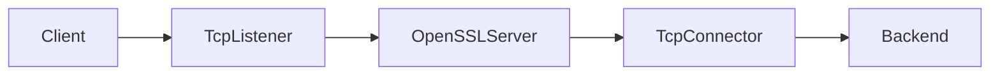
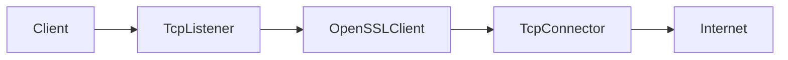
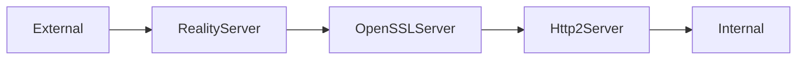

# پیکربندی تونل

راهنمای جامع ساخت و پیکربندی تونل‌های WaterWall - از ساده تا پیشرفته! 🚇✨

## تونل چیست؟ 🤔

**تونل** مثل یک **لوله امن** است که اطلاعات شما را از یک نقطه به نقطه دیگر می‌برد:

```
کامپیوتر شما ──[تونل امن]──> سرور هدف
```

هر تونل از **گره‌ها** (nodes) تشکیل شده که مثل کارگران مختلف هستند:
- گوش‌دهنده (Listener) = نگهبان ورودی
- رمزگذار (SSL/TLS) = قفل‌ساز  
- متصل‌کننده (Connector) = پیک

## ساختار فایل JSON 📝

### فرمت پایه
```json
{
  "name": "نام_تونل",                    // نام تونل
  "author": "سازنده",                  // سازنده 
  "config-version": 1,                 // نسخه پیکربندی
  "nodes": [                           // لیست گره‌ها
    // گره‌ها اینجا
  ]
}
```

### ساختار گره
```json
{
  "name": "نام_گره",                    // نام منحصربه‌فرد
  "type": "نوع_گره",                   // نوع گره (مثل TcpListener)
  "settings": {                        // تنظیمات گره
    // تنظیمات مخصوص هر گره
  },
  "next": "گره_بعدی"                   // نام گره بعدی در زنجیره
}
```

## مثال‌های عملی 🎯

### 1. پراکسی HTTP ساده
```json
{
  "name": "simple_http_proxy",
  "author": "شما", 
  "config-version": 1,
  "nodes": [
    {
      "name": "http_listener",
      "type": "TcpListener",
      "settings": {
        "address": "0.0.0.0",            // گوش به همه IP ها
        "port": 8080                     // پورت 8080
      },
      "next": "http_connector"
    },
    {
      "name": "http_connector",
      "type": "TcpConnector", 
      "settings": {
        "address": "httpforever.com",    // سرور مقصد
        "port": 80                       // پورت HTTP
      }
      // گره آخر next ندارد
    }
  ]
}
```

**تست:**
```bash
curl -x localhost:8080 http://httpforever.com
```

### 2. پراکسی HTTPS با SSL Termination
```json
{
  "name": "https_ssl_proxy",
  "author": "شما",
  "config-version": 1,
  "nodes": [
    {
      "name": "https_listener",
      "type": "TcpListener",
      "settings": {
        "address": "0.0.0.0",
        "port": 8443
      },
      "next": "ssl_terminator"
    },
    {
      "name": "ssl_terminator",
      "type": "OpenSSLServer",           // پایان SSL اینجا
      "settings": {
        "cert-file": "ssl/cert.pem",     // فایل گواهی
        "key-file": "ssl/key.pem",       // فایل کلید
        "alpns": ["http/1.1"]            // پروتکل‌های پشتیبانی‌شده
      },
      "next": "backend_connector"
    },
    {
      "name": "backend_connector",
      "type": "TcpConnector",
      "settings": {
        "address": "192.168.1.100",      // سرور داخلی
        "port": 80                       // HTTP ساده
      }
    }
  ]
}
```

### 3. Load Balancer 
```json
{
  "name": "web_load_balancer",
  "author": "تیم شبکه",
  "config-version": 1,
  "nodes": [
    {
      "name": "web_listener_1",
      "type": "TcpListener",
      "settings": {
        "address": "0.0.0.0",
        "port": 80,
        "balance-group": "web_servers"   // گروه تعادل بار
      },
      "next": "backend_1"
    },
    {
      "name": "web_listener_2", 
      "type": "TcpListener",
      "settings": {
        "address": "0.0.0.0",
        "port": 8080,
        "balance-group": "web_servers"   // همان گروه
      },
      "next": "backend_2"
    },
    {
      "name": "backend_1",
      "type": "TcpConnector",
      "settings": {
        "address": "web1.internal.com",
        "port": 80
      }
    },
    {
      "name": "backend_2",
      "type": "TcpConnector", 
      "settings": {
        "address": "web2.internal.com",
        "port": 80
      }
    }
  ]
}
```

### 4. تونل HTTP/2 پیشرفته
```json
{
  "name": "http2_tunnel",
  "author": "شما",
  "config-version": 1,
  "nodes": [
    {
      "name": "h2_listener",
      "type": "TcpListener",
      "settings": {
        "address": "0.0.0.0",
        "port": 443
      },
      "next": "ssl_server"
    },
    {
      "name": "ssl_server",
      "type": "OpenSSLServer",
      "settings": {
        "cert-file": "ssl/cert.pem",
        "key-file": "ssl/key.pem", 
        "alpns": ["h2", "http/1.1"]      // HTTP/2 اولویت دارد
      },
      "next": "h2_server"
    },
    {
      "name": "h2_server",
      "type": "Http2Server",
      "settings": {
        "host": "api.example.com",       // Host header
        "path": "/tunnel"                // مسیر تونل
      },
      "next": "backend_connector"
    },
    {
      "name": "backend_connector",
      "type": "TcpConnector",
      "settings": {
        "address": "backend.internal",
        "port": 8080
      }
    }
  ]
}
```

## تنظیمات پیشرفته ⚙️

### Multi-Protocol Support
```json
{
  "name": "multi_protocol_proxy",
  "nodes": [
    {
      "name": "tcp_listener",
      "type": "TcpListener",
      "settings": {
        "address": "0.0.0.0",
        "port": 443,
        "nodelay": true,                 // بهبود latency
        "fastopen": true                 // بهبود اتصال
      },
      "next": "protocol_detector"
    },
    {
      "name": "protocol_detector",
      "type": "OpenSSLServer",
      "settings": {
        "cert-file": "ssl/cert.pem",
        "key-file": "ssl/key.pem",
        "alpns": ["h2", "http/1.1", "trojan"],  // چند پروتکل
        "session-ticket": true           // بهبود handshake
      },
      "next": "smart_router"
    }
  ]
}
```

### Connection Pooling
```json
{
  "name": "pooled_proxy",
  "nodes": [
    {
      "name": "pooled_connector",
      "type": "TcpConnector",
      "settings": {
        "address": "api.backend.com",
        "port": 443,
        "pool-size": 10,                 // تعداد اتصالات pool
        "pool-idle-timeout": 300         // timeout pool (ثانیه)
      }
    }
  ]
}
```

### IP Range Selection
```json
{
  "name": "ip_range_proxy",
  "nodes": [
    {
      "name": "freebind_connector",
      "type": "TcpConnector",
      "settings": {
        "address": "target.com",
        "port": 80,
        "freebind-ip-range": "192.168.1.0/24"  // انتخاب از این محدوده
      }
    }
  ]
}
```

## انواع گره‌های رایج 📦

### گره‌های شبکه 🌐
```json
// TCP Listener - گوش‌دهنده
{
  "name": "tcp_in",
  "type": "TcpListener",
  "settings": {
    "address": "0.0.0.0",              // IP bind
    "port": 8080,                      // پورت
    "nodelay": true,                   // بهبود latency
    "fastopen": true                   // TCP Fast Open
  }
}

// TCP Connector - متصل‌کننده
{
  "name": "tcp_out", 
  "type": "TcpConnector",
  "settings": {
    "address": "target.com",           // آدرس مقصد
    "port": 80,                        // پورت مقصد
    "pool-size": 5                     // connection pool
  }
}

// UDP Socket - سوکت UDP
{
  "name": "udp_proxy",
  "type": "UdpStatelessSocket",
  "settings": {
    "address": "0.0.0.0",
    "port": 53                         // برای DNS مناسب است
  }
}
```

### گره‌های رمزگذاری 🔒
```json
// SSL Server - سرور SSL/TLS  
{
  "name": "ssl_term",
  "type": "OpenSSLServer", 
  "settings": {
    "cert-file": "ssl/cert.pem",
    "key-file": "ssl/key.pem",
    "alpns": ["h2", "http/1.1"],       // Application Layer Protocol
    "session-ticket": true,            // بهبود handshake
    "session-timeout": 3600            // timeout session (ثانیه)
  }
}

// SSL Client - کلاینت SSL/TLS
{
  "name": "ssl_client",
  "type": "OpenSSLClient",
  "settings": {
    "sni": "example.com",              // Server Name Indication
    "verify": true,                    // اعتبارسنجی گواهی
    "alpns": ["http/1.1"]
  }
}
```

### گره‌های پروتکل 🚀
```json
// HTTP/2 Server
{
  "name": "h2_srv",
  "type": "Http2Server",
  "settings": {
    "host": "api.example.com",
    "path": "/api/tunnel"
  }
}

// Reality Server (ضد فیلتر)
{
  "name": "reality_srv",
  "type": "RealityServer", 
  "settings": {
    "dest": "www.google.com:443",      // مقصد واقعی
    "private-key": "server_private_key",
    "short-ids": ["abcd1234"]
  }
}
```

## قوانین پیکربندی 📋

### 1. نام‌گذاری منحصربه‌فرد
```json
// ❌ اشتباه - نام تکراری
{
  "nodes": [
    {"name": "proxy", "type": "TcpListener"},
    {"name": "proxy", "type": "TcpConnector"}  // خطا!
  ]
}

// ✅ درست - نام‌های منحصربه‌فرد
{
  "nodes": [
    {"name": "http_listener", "type": "TcpListener"},
    {"name": "backend_connector", "type": "TcpConnector"}
  ]
}
```

### 2. زنجیره معتبر
```json
// ❌ اشتباه - next به گره غیرموجود اشاره دارد
{
  "nodes": [
    {"name": "A", "next": "C"},        // C وجود ندارد!
    {"name": "B", "type": "TcpConnector"}
  ]
}

// ✅ درست - زنجیره کامل
{
  "nodes": [
    {"name": "A", "next": "B"},
    {"name": "B", "type": "TcpConnector"}
  ]
}
```

### 3. موقعیت گره‌ها
```json
// هر گره جایگاه خاصی دارد:
TcpListener     → HEAD (شروع زنجیره)
OpenSSLServer   → MIDDLE (وسط زنجیره)  
TcpConnector    → TAIL (انتهای زنجیره)
```

## الگوهای کاربردی 🎨

### الگو 1: Reverse Proxy


### الگو 2: Forward Proxy  


### الگو 3: Security Gateway


## تست و عیب‌یابی 🔧

### بررسی Syntax JSON
```bash
# تست JSON با python
python3 -m json.tool tunnel.json

# تست JSON با jq
jq . tunnel.json

# تست JSON آنلاین
# استفاده از jsonlint.com
```

### تست اتصال
```bash
# تست پراکسی HTTP
curl -x localhost:8080 http://httpforever.com

# تست پراکسی HTTPS
curl -x localhost:8080 https://httpforever.com

# تست با timeout
timeout 10 curl -x localhost:8080 http://httpforever.com
```

### نظارت بر Logs
```bash
# مشاهده logs زنده
tail -f logs/core.log

# جستجو در logs
grep "ERROR\|WARN" logs/core.log

# آمار اتصالات
grep "connection" logs/network.log | wc -l
```

### مشکلات رایج و حل

#### ❌ خطای "node not found"
```
Error: next node 'connector' not found
```
**حل**: مطمئن شوید نام در `next` دقیقاً با نام گره موجود یکسان است.

#### ❌ خطای "port in use"
```
Error: bind failed: Address already in use
```
**حل**: 
```bash
# پیدا کردن process
sudo lsof -i :8080

# تغییر پورت در config
sed -i 's/8080/9090/g' tunnel.json
```

#### ❌ خطای SSL Certificate
```
Error: SSL certificate not found
```
**حل**:
```bash
# ایجاد self-signed certificate
openssl req -x509 -newkey rsa:4096 -keyout key.pem -out cert.pem -days 365 -nodes
```

## نکات بهینه‌سازی ⚡

### 1. استفاده از Connection Pool
```json
{
  "name": "optimized_connector",
  "type": "TcpConnector",
  "settings": {
    "pool-size": 20,                   // تعداد اتصالات pool
    "pool-idle-timeout": 600           // نگهداری اتصالات
  }
}
```

### 2. بهبود TCP Performance
```json
{
  "name": "fast_listener", 
  "type": "TcpListener",
  "settings": {
    "nodelay": true,                   // کاهش latency
    "fastopen": true,                  // بهبود اتصال
    "reuseport": true                  // استفاده مجدد پورت
  }
}
```

### 3. تنظیمات SSL بهینه
```json
{
  "name": "fast_ssl",
  "type": "OpenSSLServer",
  "settings": {
    "session-ticket": true,            // کش کردن session
    "session-timeout": 7200,           // timeout طولانی‌تر
    "cipher-suites": "TLS_AES_256_GCM_SHA384"  // cipher مناسب
  }
}
```

## تولید خودکار پیکربندی 🤖

### اسکریپت تولید پراکسی
```bash
#!/bin/bash
# generate-proxy.sh

cat > proxy-${1:-8080}.json << EOF
{
  "name": "auto_proxy_${1:-8080}",
  "author": "اسکریپت خودکار",
  "config-version": 1,
  "nodes": [
    {
      "name": "listener_${1:-8080}",
      "type": "TcpListener",
      "settings": {
        "address": "0.0.0.0",
        "port": ${1:-8080}
      },
      "next": "connector_${2:-httpforever.com}"
    },
    {
      "name": "connector_${2:-httpforever.com}",
      "type": "TcpConnector", 
      "settings": {
        "address": "${2:-httpforever.com}",
        "port": ${3:-80}
      }
    }
  ]
}
EOF

echo "✅ پراکسی ایجاد شد: proxy-${1:-8080}.json"
```

### استفاده از اسکریپت
```bash
# پراکسی ساده
./generate-proxy.sh 8080 google.com 80

# پراکسی HTTPS  
./generate-proxy.sh 8443 secure.example.com 443
```

## قالب‌های آماده 📋

### قالب پراکسی ساده
```json
{
  "name": "TEMPLATE_simple_proxy",
  "author": "YOUR_NAME",
  "config-version": 1,
  "nodes": [
    {
      "name": "listener",
      "type": "TcpListener", 
      "settings": {
        "address": "0.0.0.0",
        "port": PORT_NUMBER
      },
      "next": "connector"
    },
    {
      "name": "connector",
      "type": "TcpConnector",
      "settings": {
        "address": "TARGET_HOST",
        "port": TARGET_PORT
      }
    }
  ]
}
```

### قالب SSL Termination
```json
{
  "name": "TEMPLATE_ssl_termination",
  "author": "YOUR_NAME", 
  "config-version": 1,
  "nodes": [
    {
      "name": "https_listener",
      "type": "TcpListener",
      "settings": {
        "address": "0.0.0.0",
        "port": 443
      },
      "next": "ssl_terminator"
    },
    {
      "name": "ssl_terminator",
      "type": "OpenSSLServer",
      "settings": {
        "cert-file": "SSL_CERT_PATH",
        "key-file": "SSL_KEY_PATH",
        "alpns": ["http/1.1"]
      },
      "next": "backend"
    },
    {
      "name": "backend",
      "type": "TcpConnector",
      "settings": {
        "address": "BACKEND_HOST",
        "port": BACKEND_PORT
      }
    }
  ]
}
```

## خلاصه 📋

### چک‌لیست پیکربندی
- [ ] نام‌گذاری منحصربه‌فرد برای گره‌ها
- [ ] زنجیره کامل بدون شکستگی
- [ ] JSON syntax معتبر
- [ ] تنظیمات مناسب برای هر گره
- [ ] پورت‌های در دسترس
- [ ] فایل‌های SSL موجود (در صورت نیاز)

### نکات طلایی
```
ساده شروع کنید = کمتر خطا
تست مرحله‌ای = عیب‌یابی آسان
Logs را بخوانید = درک بهتر مشکلات
```

## مراحل بعدی 🎯

حالا که تونل‌های خود را می‌توانید بسازید:

1. **[آموزش‌های عملی](../02-tutorials/)** - تونل‌های پیچیده‌تر یاد بگیرید
2. **[مرجع گره‌ها](../04-reference/)** - تمام گره‌ها را بشناسید  
3. **[بهینه‌سازی](../05-guides/performance)** - عملکرد را افزایش دهید
4. **[امنیت](../05-guides/security)** - تونل‌هایتان را امن کنید

**عالی! حالا می‌توانید هر تونلی که می‌خواهید بسازید** 🚇✨

*"بهترین تونل، تونلی است که درست کار کند!"* 💪
