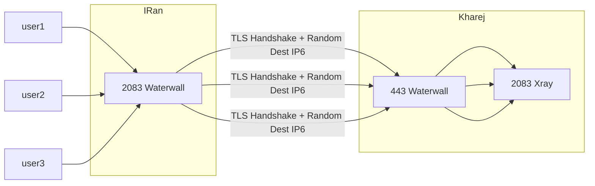

# Freebind

روش Freebind به ما این امکان را می‌دهد که به جای اتصال به یک آی‌پی مشخص سرور خارج، بین یک رنج آی‌پی که با سابنت‌ماسک مشخص می‌شود، تعادل بار ایجاد کنیم و به صورت تصادفی به یکی از آن‌ها متصل شویم. این عمل برای عدم فیلترینگ و بهبود سرعت بسیار مناسب به نظر می‌رسد.

سرورها یک رنج عظیم از آی‌پی‌های IPv6 را در اختیار شما قرار می‌دهند. با استفاده از این قابلیت، می‌توانید هر اتصال جدید را به صورت تصادفی به یکی از آی‌پی‌های این رنج متصل کنید. به این ترتیب، فایروال همواره آی‌پی‌های متفاوت را مشاهده می‌کند.

به عنوان مثال، سرورهای Hetzner رنج `/64` را ارائه می‌دهند که به این معنی است که `2^64` یعنی `18446744073709551615` آدرس آی‌پی برای اتصال در دسترس خواهد بود.

## اجرای روش مستقیم

برای پیاده‌سازی Freebind، نیازی به نود جداگانه نیست و فقط باید در نودهای Listener و Connector تغییراتی ایجاد کنیم. فرض کنیم یک سرور خارجی داریم که هتزنر این آی‌پی IPv6 را به ما داده است:

> `2a01:4f8:1c1b:276c::1/64`

برای مثال، می‌خواهیم کانفیگ TLS Multi Port را به حالت Freebind تبدیل کنیم.



در سرور ایران، تغییری که انجام می‌دهیم این است که در TCP Connector می‌آییم و آدرس را به صورت یک رنج وارد می‌کنیم:

```json
{
  "name": "tls_port_to_port",
  "nodes": [
    {
      "name": "input",
      "type": "TcpListener",
      "settings": {
        "address": "0.0.0.0",
        "port": 2083,
        "nodelay": true
      },
      "next": "mysslclient"
    },
    {
      "name": "mysslclient",
      "type": "OpenSSLClient",
      "settings": {
        "sni": "mydomain.ir",
        "verify": true,
        "alpn": "http/1.1"
      },
      "next": "output"
    },
    {
      "name": "output",
      "type": "TcpConnector",
      "settings": {
        "nodelay": true,
        "address": "2a01:4f8:1c1b:276c::1/64",
        "port": 443
      }
    }
  ]
}
```

همانطور که مشاهده می‌کنید، دقیقاً همان آی‌پی که هتزنر داده است، همراه با رنج آن /64، در پارامتر address قرار گرفته است.

در سرور خارج، تنها تغییر این است که در نود Listener، پارامتر address به جای "0.0.0.0" به "::" تغییر پیدا کرده تا علاوه بر اتصال‌های IPv4، بتوانیم اتصال‌های IPv6 را نیز دریافت کنیم:

```json
{
  "name": "tls_port_to_port_kharej",
  "nodes": [
    {
      "name": "input",
      "type": "TcpListener",
      "settings": {
        "address": "::",
        "port": 443,
        "nodelay": true
      },
      "next": "mysslserver"
    },
    {
      "name": "mysslserver",
      "type": "OpenSSLServer",
      "settings": {
        "cert-file": "fullchain.pem",
        "key-file": "privkey.pem",
        "alpns": [
          {
            "value": "h2",
            "next": "node->next"
          },
          {
            "value": "http/1.1",
            "next": "node->next"
          }
        ]
      },
      "next": "output"
    },
    {
      "name": "output",
      "type": "TcpConnector",
      "settings": {
        "nodelay": true,
        "address": "127.0.0.1",
        "port": 2083
      }
    }
  ]
}
```

در این مرحله، کار تقریباً تمام است، اما یک مرحله مهم باقی مانده که حتماً باید در سرور خارج انجام دهید. نیاز است که این دستور را در سرور خارج اجرا کنید:

```sh
ip route add local 2a01:4f8:1c1b:276c::/64 dev eth0
```
