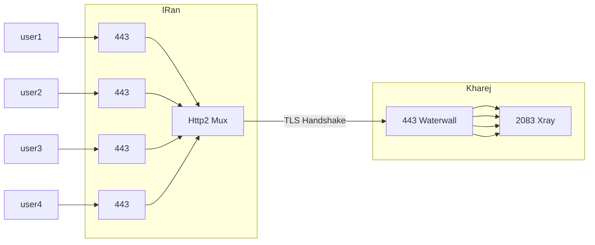

import YouTube from 'react-youtube'

# Http2 Mux Grpc

افزودن پروتکل Http2 به تونل، امکانات و ویژگی‌های جدیدی را در اختیار ما قرار
می‌دهد، از جمله قابلیت‌های multiplexing (mux) و gRPC.

با بهره‌گیری از gRPC، می‌توان ارتباط را هم از طریق سرویس Cloudflare عبور داد و
هم به صورت مستقیم استفاده کرد، بدون تفاوت.

استفاده از mux نیز باعث کاهش تعداد اتصالات (connections) بین سرور داخل ایران و
خارج می‌شود و همچنین زمان handshake را به میزان قابل توجهی بهبود می‌بخشد.

روش‌های تونل بدون mux، احتمال بروز اختلال یا حتی فیلتر شدن سرور خارجی شما را
افزایش می‌دهند.

بنابراین، به ویژه اگر تعداد زیادی کاربر روی یک سرور دارید، اکیداً توصیه می‌شود
این قابلیت را در تونل‌های خود پیاده‌سازی کنید.

هنگام استفاده از Http2، دیگر نیازی به preconnect نیست و تأثیر چندانی نخواهد
داشت.

## ویدیو های آموزشی

#### آموزش تانل MUX با هسته ی واتروال

<YouTube videoId="sn0-ABfIcx4" opts={{width: '100%'}} />

## پیاده‌سازی روی Tls tunnel

در این مثال، آدرس IP سرور خارجی `1.1.1.1` فرض شده است. اگر IP پشت دامنه قرار
دارد، می‌توانید در بخش `node output`، به جای IP، نام دامنه را وارد کنید.

## فلوچارت



```json title="سرور ایران"
{
  "name": "tls_port_to_port_grpc_iran",
  "nodes": [
    {
      "name": "input",
      "type": "TcpListener",
      "settings": {
        "address": "0.0.0.0",
        "port": 443,
        "nodelay": true
      },
      "next": "pbclient"
    },
    {
      "name": "pbclient",
      "type": "ProtoBufClient",
      "settings": {},
      "next": "h2client"
    },
    {
      "name": "h2client",
      "type": "Http2Client",
      "settings": {
        "host": "mydomain.ir",
        "port": 443,
        "path": "/",
        "content-type": "application/grpc",
        "concurrency": 64
      },
      "next": "sslclient"
    },
    {
      "name": "sslclient",
      "type": "OpenSSLClient",
      "settings": {
        "sni": "mydomain.ir",
        "verify": true,
        "alpn": "h2"
      },
      "next": "output"
    },
    {
      "name": "output",
      "type": "TcpConnector",
      "settings": {
        "nodelay": true,
        "address": "1.1.1.1",
        "port": 443
      }
    }
  ]
}
```

```json title="سرور خارج"
{
  "name": "tls_port_to_port_grpc_kharej",
  "nodes": [
    {
      "name": "input",
      "type": "TcpListener",
      "settings": {
        "address": "0.0.0.0",
        "port": 443,
        "nodelay": true
      },
      "next": "sslserver"
    },
    {
      "name": "sslserver",
      "type": "OpenSSLServer",
      "settings": {
        "cert-file": "fullchain.pem",
        "key-file": "privkey.pem",
        "alpns": [
          {
            "value": "h2",
            "next": "node->next"
          },
          {
            "value": "http/1.1",
            "next": "node->next"
          }
        ]
      },
      "next": "h2server"
    },

    {
      "name": "h2server",
      "type": "Http2Server",
      "settings": {},
      "next": "pbserver"
    },
    {
      "name": "pbserver",
      "type": "ProtoBufServer",
      "settings": {},
      "next": "output"
    },
    {
      "name": "output",
      "type": "Connector",
      "settings": {
        "nodelay": true,
        "address": "127.0.0.1",
        "port": 2083
      }
    }
  ]
}
```

در این مثال، وجود node ProtoBuf الزامی نیست، اما با قرار دادن آن، ارتباط به
عنوان gRPC شناخته می‌شود و می‌تواند از طریق CDN عبور کند.

:::info پارامتر concurrency همانطور که در پیکربندی مشاهده می‌کنید، در گره
Http2Client پارامتری به نام concurrency وجود دارد.

به صورت پیش‌فرض، مقدار آن 64 تنظیم شده است که بدین معناست به ازای هر 64 اتصال
کاربر، یک اتصال به سرور خارجی برقرار می‌شود.

اگر تعداد کاربران شما بسیار زیاد است (مثلاً بیش از 150 یا 200 نفر)، پیشنهاد
می‌شود مقدار concurrency را دو برابر کنید و روی 128 تنظیم نمایید تا احتمال فیلتر
شدن بر اساس تعداد اتصالات نیز نصف شود. 
:::

#### دانشنامه Http2 و gRPC در WaterWall

- Http2: نسخه بهبود یافته پروتکل HTTP که امکاناتی مانند multiplexing، فشرده‌سازی
  هدر، و Server Push را ارائه می‌دهد. استفاده از Http2 در تونل‌های WaterWall،
  کارایی و عملکرد را به میزان چشمگیری افزایش می‌دهد.
- gRPC: چارچوبی برای ارتباطات بین سرویس‌ها که از Http2 برای انتقال داده بهره
  می‌برد. با استفاده از gRPC در پیکربندی تونل، امکان عبور ارتباط از سرویس‌های
  CDN مانند Cloudflare فراهم می‌شود.
- Multiplexing (Mux): قابلیت Http2 برای برقراری چندین ارتباط همزمان روی یک اتصال
  واحد. در WaterWall، mux باعث کاهش تعداد اتصالات بین سرور داخل و خارج ایران شده
  و زمان handshake را بهبود می‌بخشد.
- Concurrency: پارامتری در گره Http2Client که تعداد اتصالات کاربر به ازای هر
  اتصال به سرور خارجی را مشخص می‌کند. تنظیم مقدار مناسب برای concurrency بسته به
  تعداد کاربران، از اهمیت بالایی برخوردار است.
- ProtoBuf (Protocol Buffers): فرمت سریال‌سازی داده توسعه یافته توسط Google که
  در gRPC به کار می‌رود. گره‌های ProtoBufClient و ProtoBufServer در پیکربندی
  WaterWall، نقش مهمی در شناسایی ارتباط به عنوان gRPC ایفا می‌کنند.
