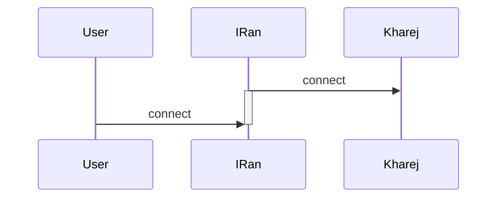
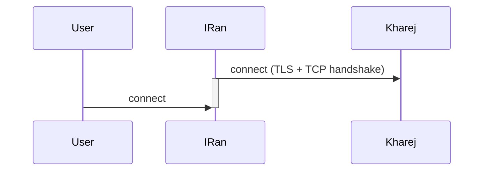

# Pre Connect

PreConnect یک node است که کارش به این صورت است که قبل از اینکه کاربر کانکشن را هندشیک کند، آن را چک می‌کند و به اصطلاح داخل آب نمک می‌گذارد.

استفاده از این node باعث می‌شود هندشیک تایم روی تونل کاهش یابد، حتی تا نصف حالتی که این node در کانفیگ نیست.

**نکات مهم:**

- این node را در کانفیگ‌های ریورس استفاده نکنید چون `reverse client` درون خودش این قابلیت را دارد و استفاده از آن بی‌تاثیر خواهد بود.
- برای استفاده از `preconnect` باید آن را در کانفیگ سرور ایران اضافه کنید.
- پیدا کردن جای مناسب برای این node مهم است و اگر جای مناسب را پیدا کنید، بیشترین کاهش هندشیک تایم را به شما می‌دهد.
- این node پارامتر `minimum-unused` را دارد که بهتر است آن را بسته به تعداد کاربرها بین 1 تا 16 تنظیم کنید. اما دقت کنید اگر این مقدار را خیلی زیاد تنظیم کنید، خوب نیست زیرا فایروال ایران اگر ببیند کانکشن برای مدت طولانی ول مانده، روی آن اختلال می‌اندازد.
- اگر از مالتی‌پورت استفاده می‌کنید، این node را بعد از header قرار دهید وگرنه مالتی‌پورت کار نخواهد کرد.
- `preConnectClient` مثل بقیه node‌ها جفت `preConnectServer` است. با اینکه اگر سمت سرور خارج جفتش را قرار دهید چیز خوبی است، ولی این node به صورت استثنا نیازی به جفت ندارد.

## مثال 1: پورت فوروارد

در حالت پورت فوروارد، ما فقط سرور ایران را کانفیگ می‌کنیم و کلاً 2 تا node داریم. پس جایگاه این node وسط است و باید بین 2 تا node قرار بگیرد.



```json
{
  "name": "simple_port_to_port_with_preconnect",
  "nodes": [
    {
      "name": "input",
      "type": "TcpListener",
      "settings": {
        "address": "0.0.0.0",
        "port": 443,
        "nodelay": true
      },
      "next": "precon_client"
    },
    {
      "name": "precon_client",
      "type": "PreConnectClient",
      "settings": {
        "minimum-unused": 1
      },
      "next": "output"
    },
    {
      "name": "output",
      "type": "TcpConnector",
      "settings": {
        "nodelay": true,
        "address": "1.1.1.1",
        "port": 443
      }
    }
  ]
}
```

این کار باعث می‌شود که هندشیک TCP پیش از اتصال کاربر انجام شود.

## مثال 2: تونل TLS

اهمیت این node در کانفیگ تونل TLS بیشتر است. این مثال را بررسی می‌کنیم:



```json
{
  "name": "tls_port_to_port_preconnect",
  "nodes": [
    {
      "name": "input",
      "type": "TcpListener",
      "settings": {
        "address": "0.0.0.0",
        "port": 443,
        "nodelay": true
      },
      "next": "precon_client"
    },
    {
      "name": "precon_client",
      "type": "PreConnectClient",
      "settings": {
        "minimum-unused": 1
      },
      "next": "mysslclient"
    },
    {
      "name": "mysslclient",
      "type": "OpenSSLClient",
      "settings": {
        "sni": "mydomain.ir",
        "verify": true,
        "alpn": "http/1.1"
      },
      "next": "output"
    },
    {
      "name": "output",
      "type": "TcpConnector",
      "settings": {
        "nodelay": true,
        "address": "1.1.1.1",
        "port": 443
      }
    }
  ]
}
```

در اینجا حضور preconnect باعث می‌شود هندشیک TLS + TCP قبل از اتصال کاربر تکمیل شود و شاید 300 میلی‌ثانیه یا بیشتر صرفه‌جویی شود.

#### دانشنامه

- PreConnect: یک node در WaterWall که قبل از اتصال کاربر، کانکشن را هندشیک می‌کند تا هندشیک تایم کاهش یابد.
- minimum-unused: پارامتری در تنظیمات PreConnectClient که تعداد کانکشن‌های ذخیره‌سازی شده را مشخص می‌کند.
