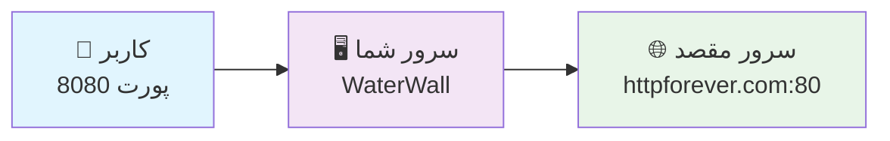
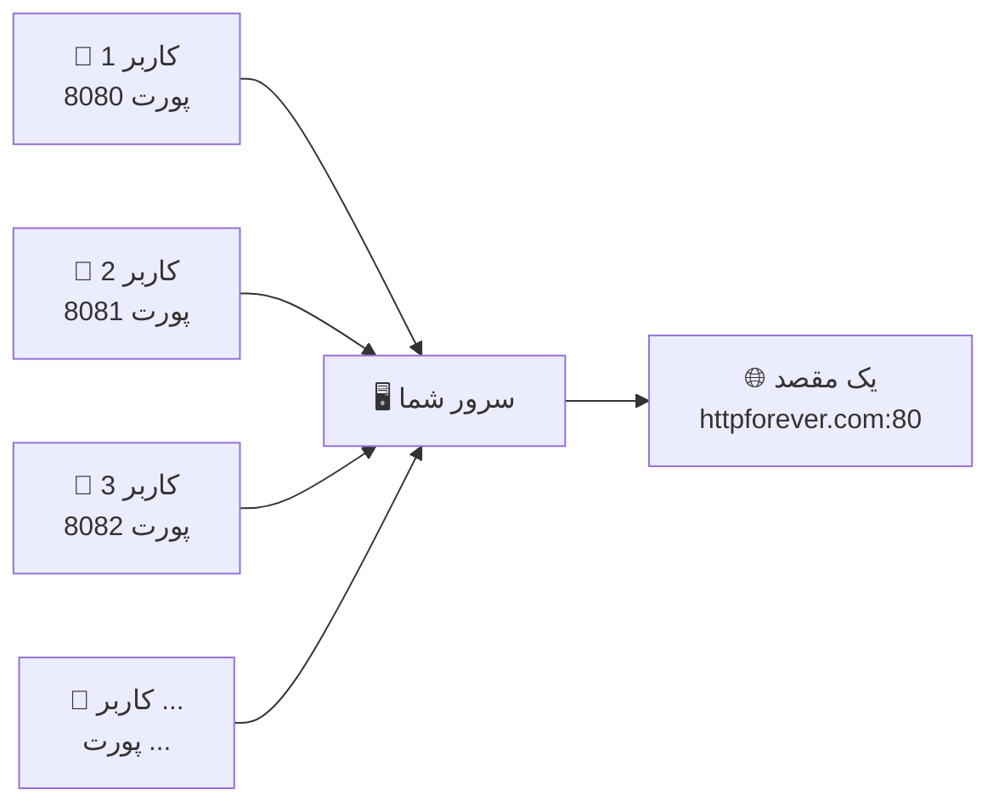
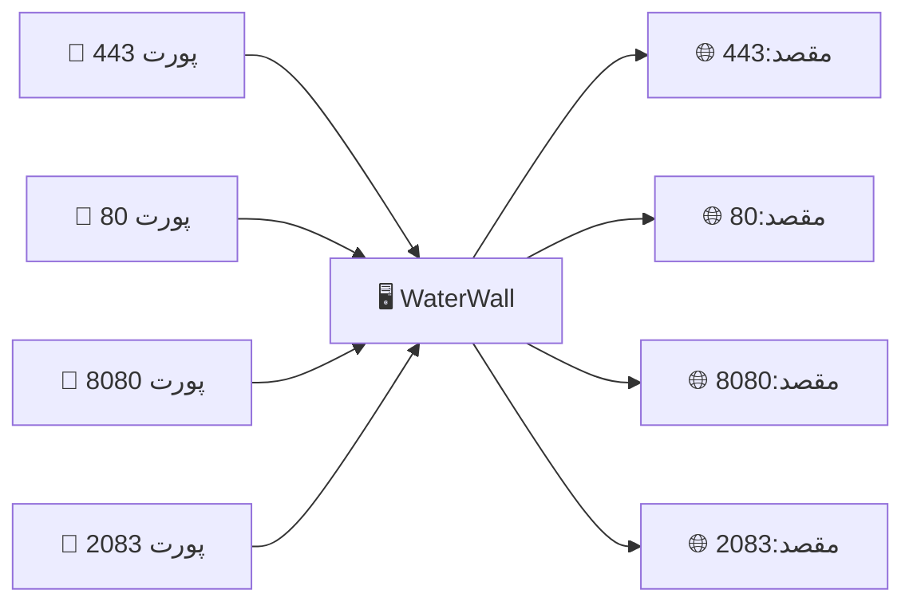
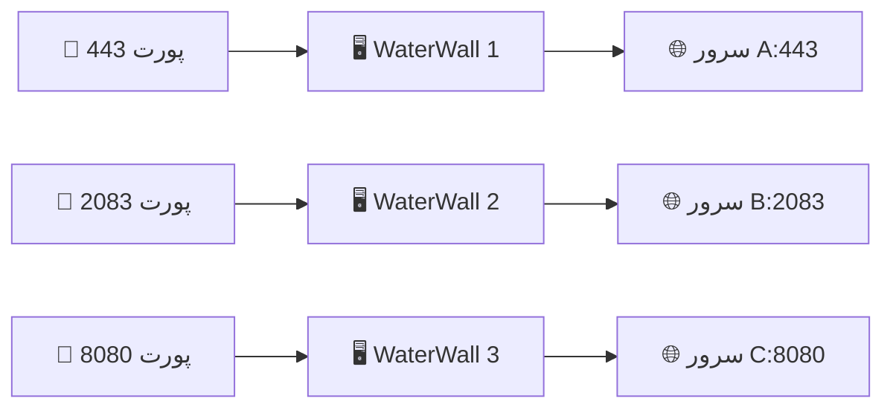

# پراکسی ساده

راهنمای گام به گام ساخت اولین پراکسی با WaterWall! 🚀

## پراکسی چیست؟ 🤔

**پراکسی** مثل یک **میانجی** است که بین شما و اینترنت قرار می‌گیرد:

```
شما ──> [پراکسی WaterWall] ──> اینترنت
```

مزایا:
- 🔄 **هدایت ترافیک**: پورت‌ها را به سرورهای مختلف هدایت کنید
- 🏃 **سرعت بالا**: عملکرد بهتر از iptables در برخی موارد  
- 🛠️ **انعطاف**: پیکربندی ساده و قدرتمند
- 📊 **نظارت**: کنترل و مانیتورینگ ترافیک

## نوع 1: پورت به پورت ساده ⭐

ساده‌ترین حالت - یک پورت به یک پورت!

### نمودار


### پیکربندی
```json title="configs/simple-proxy.json"
{
  "name": "simple_port_proxy",
  "author": "شما",
  "config-version": 1,
  "nodes": [
    {
      "name": "http_listener",
      "type": "TcpListener",
      "settings": {
        "address": "0.0.0.0",         // گوش به همه IP ها
        "port": 8080,                 // پورت ورودی
        "nodelay": true               // کاهش تأخیر
      },
      "next": "http_connector"
    },
    {
      "name": "http_connector", 
      "type": "TcpConnector",
      "settings": {
        "address": "httpforever.com", // سرور مقصد
        "port": 80,                   // پورت مقصد
        "nodelay": true               // کاهش تأخیر
      }
      // گره آخر next ندارد
    }
  ]
}
```

### تست
```bash
# اجرای WaterWall
waterwall core.json

# تست پراکسی
curl -x localhost:8080 http://httpforever.com

# انتظار: "Hello HTTP!"
```

## نوع 2: چند پورت به یک پورت 🎯

هر پورتی که وصل شوید، به یک مقصد می‌رود!

### نمودار


### پیکربندی
```json title="configs/multi-to-single.json"
{
  "name": "multiport_to_single",
  "author": "شما",
  "config-version": 1,
  "nodes": [
    {
      "name": "multi_listener",
      "type": "TcpListener",
      "settings": {
        "address": "0.0.0.0",
        "port": [8080, 8090],         // محدوده پورت: 8080 تا 8090
        "nodelay": true
      },
      "next": "single_connector"
    },
    {
      "name": "single_connector",
      "type": "TcpConnector", 
      "settings": {
        "address": "httpforever.com",
        "port": 80,                   // همه به پورت 80 می‌روند
        "nodelay": true
      }
    }
  ]
}
```

### تست
```bash
# تست پورت‌های مختلف
curl -x localhost:8080 http://httpforever.com
curl -x localhost:8081 http://httpforever.com  
curl -x localhost:8082 http://httpforever.com

# همه باید جواب یکسانی بدهند
```

## نوع 3: چند پورت به چند پورت 🔄

هر پورت به همان پورت در مقصد می‌رود!

### نمودار


### پیکربندی
```json title="configs/multi-to-multi.json"
{
  "name": "multiport_to_multiport",
  "author": "شما", 
  "config-version": 1,
  "nodes": [
    {
      "name": "dynamic_listener",
      "type": "TcpListener",
      "settings": {
        "address": "0.0.0.0",
        "port": [80, 8080],           // محدوده: 80 تا 8080
        "nodelay": true
      },
      "next": "dynamic_connector"
    },
    {
      "name": "dynamic_connector",
      "type": "TcpConnector",
      "settings": {
        "address": "target.example.com",
        "port": "src_context->port",  // استفاده از همان پورت ورودی
        "nodelay": true
      }
    }
  ]
}
```

### مثال کاربردی
```bash
# کاربر به پورت 443 وصل می‌شود
curl -x localhost:443 https://example.com

# WaterWall آن را به target.example.com:443 هدایت می‌کند

# کاربر به پورت 80 وصل می‌شود  
curl -x localhost:80 http://example.com

# WaterWall آن را به target.example.com:80 هدایت می‌کند
```

## نوع 4: چند پورت مجزا ⚙️

هر پورت به مقصد مخصوص خودش می‌رود!

### نمودار


### پیکربندی
```json title="configs/multiple-separate.json"
{
  "name": "multiple_separate_ports",
  "author": "شما",
  "config-version": 1,
  "nodes": [
    {
      "name": "https_listener",
      "type": "TcpListener",
      "settings": {
        "address": "0.0.0.0",
        "port": 443,
        "nodelay": true
      },
      "next": "https_connector"
    },
    {
      "name": "https_connector", 
      "type": "TcpConnector",
      "settings": {
        "address": "secure.example.com",
        "port": 443,
        "nodelay": true
      }
    },
    {
      "name": "alt_listener",
      "type": "TcpListener", 
      "settings": {
        "address": "0.0.0.0",
        "port": 2083,
        "nodelay": true  
      },
      "next": "alt_connector"
    },
    {
      "name": "alt_connector",
      "type": "TcpConnector",
      "settings": {
        "address": "alternative.example.com",
        "port": 2083,
        "nodelay": true
      }
    }
  ]
}
```

## پیکربندی پیشرفته ⚡

### Connection Pooling
```json
{
  "name": "pooled_connector",
  "type": "TcpConnector",
  "settings": {
    "address": "target.com",
    "port": 80,
    "pool-size": 10,                  // 10 اتصال پیش‌ساخته
    "pool-idle-timeout": 300,         // timeout 5 دقیقه
    "nodelay": true
  }
}
```

### بهبود Performance  
```json
{
  "name": "optimized_listener",
  "type": "TcpListener",
  "settings": {
    "address": "0.0.0.0",
    "port": 8080,
    "nodelay": true,                  // کاهش latency
    "fastopen": true,                 // TCP Fast Open  
    "reuseport": true                 // استفاده مجدد پورت
  }
}
```

### Whitelist/Blacklist
```json
{
  "name": "secure_listener",
  "type": "TcpListener",
  "settings": {
    "address": "0.0.0.0", 
    "port": 443,
    "whitelist": [                    // فقط این IP ها
      "192.168.1.0/24",
      "10.0.0.1/32"
    ],
    "blacklist": [                    // این IP ها ممنوع
      "1.2.3.4/32"
    ]
  }
}
```

## اسکریپت‌های کمکی 🤖

### تولید خودکار پراکسی
```bash
#!/bin/bash
# generate-simple-proxy.sh

LISTEN_PORT=${1:-8080}
TARGET_HOST=${2:-httpforever.com}
TARGET_PORT=${3:-80}

cat > configs/proxy-${LISTEN_PORT}.json << EOF
{
  "name": "auto_proxy_${LISTEN_PORT}",
  "author": "اسکریپت خودکار",
  "config-version": 1, 
  "nodes": [
    {
      "name": "listener_${LISTEN_PORT}",
      "type": "TcpListener",
      "settings": {
        "address": "0.0.0.0",
        "port": ${LISTEN_PORT},
        "nodelay": true
      },
      "next": "connector_${TARGET_HOST}"
    },
    {
      "name": "connector_${TARGET_HOST}",
      "type": "TcpConnector",
      "settings": {
        "address": "${TARGET_HOST}",
        "port": ${TARGET_PORT},
        "nodelay": true
      }
    }
  ]
}
EOF

echo "✅ پراکسی ایجاد شد: configs/proxy-${LISTEN_PORT}.json"
echo "🚀 اجرا: waterwall core.json"
echo "🧪 تست: curl -x localhost:${LISTEN_PORT} http://${TARGET_HOST}"
```

### استفاده از اسکریپت
```bash
# پراکسی ساده
./generate-simple-proxy.sh 8080 google.com 80

# پراکسی HTTPS
./generate-simple-proxy.sh 8443 secure.example.com 443

# پراکسی سفارشی
./generate-simple-proxy.sh 9090 api.example.com 3000
```

## تست و عیب‌یابی 🔧

### تست‌های مختلف
```bash
# تست اتصال ساده
nc -zv localhost 8080

# تست HTTP
curl -v -x localhost:8080 http://httpforever.com

# تست HTTPS
curl -v -x localhost:8080 https://httpforever.com

# تست timeout
timeout 5 curl -x localhost:8080 http://httpforever.com

# تست با header سفارشی
curl -H "X-Test: WaterWall" -x localhost:8080 http://httpforever.com
```

### نظارت
```bash
# مشاهده logs
tail -f logs/core.log

# آمار اتصالات
netstat -tuln | grep :8080

# استفاده CPU/RAM
top -p $(pgrep waterwall)

# آمار ترافیک
iftop -i any -P
```

### مشکلات رایج

#### ❌ پورت در حال استفاده
```
Error: bind failed: Address already in use
```
**حل**:
```bash
# پیدا کردن process
sudo lsof -i :8080

# کشتن process
sudo kill -9 <PID>

# یا تغییر پورت
sed -i 's/8080/9090/g' configs/proxy.json
```

#### ❌ اتصال رد شد
```
Error: Connection refused
```
**حل**:
```bash
# بررسی دسترسی شبکه
ping target.example.com

# بررسی پورت مقصد
telnet target.example.com 80

# بررسی فایروال
sudo ufw status
```

#### ❌ JSON نامعتبر
```
Error: invalid JSON syntax
```
**حل**:
```bash
# بررسی syntax
python3 -m json.tool configs/proxy.json

# ابزار آنلاین
# jsonlint.com
```

## مثال‌های کاربردی 💼

### 1. پراکسی وب
```json
{
  "name": "web_proxy",
  "nodes": [
    {
      "name": "web_listener",
      "type": "TcpListener", 
      "settings": {"address": "0.0.0.0", "port": 8080},
      "next": "web_connector"
    },
    {
      "name": "web_connector",
      "type": "TcpConnector",
      "settings": {"address": "nginx.local", "port": 80}
    }
  ]
}
```

### 2. پراکسی API
```json
{
  "name": "api_proxy", 
  "nodes": [
    {
      "name": "api_listener",
      "type": "TcpListener",
      "settings": {"address": "0.0.0.0", "port": 3000},
      "next": "api_connector"
    },
    {
      "name": "api_connector", 
      "type": "TcpConnector",
      "settings": {"address": "api.backend.com", "port": 8080}
    }
  ]
}
```

### 3. پراکسی دیتابیس
```json
{
  "name": "db_proxy",
  "nodes": [
    {
      "name": "db_listener", 
      "type": "TcpListener",
      "settings": {
        "address": "0.0.0.0", 
        "port": 5432,
        "whitelist": ["192.168.1.0/24"]  // فقط شبکه محلی
      },
      "next": "db_connector"
    },
    {
      "name": "db_connector",
      "type": "TcpConnector", 
      "settings": {"address": "postgres.internal", "port": 5432}
    }
  ]
}
```

## خلاصه 📋

### چک‌لیست موفقیت
- [ ] WaterWall نصب شده
- [ ] فایل core.json تنظیم شده
- [ ] پیکربندی پراکسی ساخته شده
- [ ] تست‌ها موفق هستند  
- [ ] Logs خطایی ندارند

### نکات طلایی
```
ساده شروع کنید = کمتر خطا
nodelay = true = سرعت بهتر  
Pool اتصالات = عملکرد بالا
Logs = دوست شما
```

## مراحل بعدی 🎯

حالا که پراکسی ساده را یاد گرفتید:

1. **[SSL Termination](ssl-termination)** - امنیت اضافه کنید
2. **[Load Balancing](load-balancing)** - قدرت را افزایش دهید  
3. **[Advanced Tunnels](advanced-tunnels/)** - تونل‌های پیشرفته بسازید
4. **[مرجع گره‌ها](../04-reference/)** - تمام امکانات را بشناسید

**تبریک! شما اولین پراکسی‌تان را ساختید** 🎉

*"بهترین پراکسی، پراکسی‌ای است که کار کند!"* 💪
