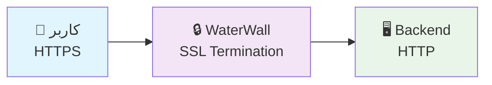
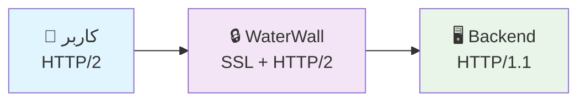
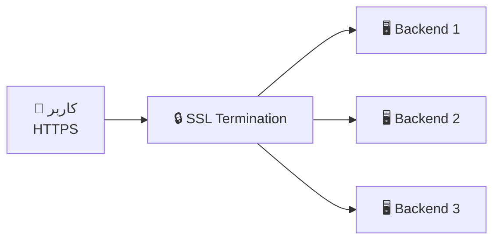

# SSL Termination

راهنمای گام به گام راه‌اندازی SSL Termination با WaterWall! 🔒✨

## SSL Termination چیست؟ 🤔

**SSL Termination** یعنی **پایان SSL** - جایی که رمزگذاری SSL/TLS خاتمه می‌یابد:

```
کاربر ──[HTTPS امن]──> [SSL Termination] ──[HTTP ساده]──> Backend
```

### چرا SSL Termination؟ 🎯

- 🚀 **کاهش بار**: Backend نیازی به SSL processing ندارد
- 🔧 **مدیریت آسان**: گواهی‌ها در یک نقطه مدیریت می‌شوند
- 📊 **بررسی ترافیک**: امکان monitoring و logging
- ⚡ **عملکرد بهتر**: کاهش CPU load در سرورهای backend

### مزایای WaterWall SSL Termination:
- 🏃 **سرعت بالا**: بهتر از nginx در برخی scenarios
- 🛠️ **انعطاف**: پیکربندی قدرتمند
- 🔄 **مقیاس‌پذیری**: پشتیبانی از connection pooling
- 🌐 **چند پروتکل**: HTTP/1.1, HTTP/2, WebSocket

## پیش‌نیازها 📋

### 1. دامنه
شما نیاز به یک دامنه دارید:
- دامنه‌های `.ir` ارزان و مناسب هستند
- دامنه‌های رایگان مانند `.tk`, `.ml` نیز کار می‌کنند
- یا از زیردامنه CloudFlare استفاده کنید

### 2. گواهی SSL
```bash
# نصب certbot
sudo apt update
sudo apt install certbot

# دریافت گواهی (روش standalone)
sudo certbot certonly --standalone \
  --preferred-challenges http \
  --agree-tos \
  --email your-email@example.com \
  -d your-domain.com

# گواهی‌ها در اینجا ذخیره می‌شوند:
ls -la /etc/letsencrypt/live/your-domain.com/
```

### 3. تنظیم سرور
```bash
# ایجاد پوشه‌های مورد نیاز
mkdir -p ~/waterwall-ssl/{configs,logs,ssl}
cd ~/waterwall-ssl

# کپی گواهی‌ها
sudo cp /etc/letsencrypt/live/your-domain.com/fullchain.pem ssl/
sudo cp /etc/letsencrypt/live/your-domain.com/privkey.pem ssl/
sudo chown $USER:$USER ssl/*.pem
```

## نوع 1: SSL Termination ساده ⭐

### نمودار


### پیکربندی
```json title="configs/ssl-termination.json"
{
  "name": "ssl_termination_proxy",
  "author": "شما",
  "config-version": 1,
  "nodes": [
    {
      "name": "https_listener",
      "type": "TcpListener",
      "settings": {
        "address": "0.0.0.0",
        "port": 443,
        "nodelay": true,
        "fastopen": true
      },
      "next": "ssl_terminator"
    },
    {
      "name": "ssl_terminator",
      "type": "OpenSSLServer",
      "settings": {
        "cert-file": "ssl/fullchain.pem",     // مسیر گواهی
        "key-file": "ssl/privkey.pem",       // مسیر کلید خصوصی
        "alpns": ["http/1.1"],               // پروتکل‌های پشتیبانی‌شده
        "session-ticket": true,              // بهبود performance
        "session-timeout": 3600              // timeout session
      },
      "next": "backend_connector"
    },
    {
      "name": "backend_connector",
      "type": "TcpConnector",
      "settings": {
        "address": "127.0.0.1",             // سرور backend
        "port": 8080,                       // پورت HTTP backend
        "nodelay": true,
        "pool-size": 10                     // connection pool
      }
    }
  ]
}
```

### تست
```bash
# اجرای WaterWall
waterwall core.json

# تست HTTPS
curl -k https://your-domain.com

# تست با curl verbose
curl -v -k https://your-domain.com

# بررسی گواهی
openssl s_client -connect your-domain.com:443 -servername your-domain.com
```

## نوع 2: SSL Termination با HTTP/2 🚀

### نمودار  


### پیکربندی
```json title="configs/ssl-http2-termination.json"
{
  "name": "ssl_http2_termination",
  "author": "شما",
  "config-version": 1,
  "nodes": [
    {
      "name": "https_listener",
      "type": "TcpListener",
      "settings": {
        "address": "0.0.0.0",
        "port": 443,
        "nodelay": true,
        "fastopen": true,
        "reuseport": true
      },
      "next": "ssl_http2_terminator"
    },
    {
      "name": "ssl_http2_terminator",
      "type": "OpenSSLServer",
      "settings": {
        "cert-file": "ssl/fullchain.pem",
        "key-file": "ssl/privkey.pem",
        "alpns": [
          "h2",                              // HTTP/2 اولویت اول
          "http/1.1"                         // HTTP/1.1 fallback
        ],
        "session-ticket": true,
        "session-timeout": 7200,
        "cipher-suites": "TLS_AES_256_GCM_SHA384"
      },
      "next": "http2_handler"
    },
    {
      "name": "http2_handler",
      "type": "Http2Server",
      "settings": {
        "host": "your-domain.com",
        "path": "/"
      },
      "next": "backend_connector"
    },
    {
      "name": "backend_connector",
      "type": "TcpConnector",
      "settings": {
        "address": "127.0.0.1",
        "port": 8080,
        "nodelay": true,
        "pool-size": 20,
        "pool-idle-timeout": 600
      }
    }
  ]
}
```

## نوع 3: SSL Termination با Load Balancing ⚖️

چندین backend را پشت SSL load balance کنید!

### نمودار


### پیکربندی
```json title="configs/ssl-load-balancer.json"
{
  "name": "ssl_load_balancer",
  "author": "شما",
  "config-version": 1,
  "nodes": [
    {
      "name": "https_listener",
      "type": "TcpListener",
      "settings": {
        "address": "0.0.0.0",
        "port": 443,
        "nodelay": true
      },
      "next": "ssl_terminator"
    },
    {
      "name": "ssl_terminator",
      "type": "OpenSSLServer",
      "settings": {
        "cert-file": "ssl/fullchain.pem",
        "key-file": "ssl/privkey.pem",
        "alpns": ["h2", "http/1.1"]
      },
      "next": "load_balancer_1"
    },
    {
      "name": "load_balancer_1",
      "type": "TcpConnector",
      "settings": {
        "address": "backend1.local",
        "port": 8080,
        "balance-group": "backends",
        "nodelay": true
      }
    },
    {
      "name": "load_balancer_2", 
      "type": "TcpConnector",
      "settings": {
        "address": "backend2.local",
        "port": 8080,
        "balance-group": "backends",
        "nodelay": true
      }
    },
    {
      "name": "load_balancer_3",
      "type": "TcpConnector", 
      "settings": {
        "address": "backend3.local",
        "port": 8080,
        "balance-group": "backends",
        "nodelay": true
      }
    }
  ]
}
```

## نوع 4: SSL Termination با Whitelist 🛡️

فقط IP های مجاز دسترسی داشته باشند!

### پیکربندی
```json title="configs/ssl-secure-termination.json"
{
  "name": "ssl_secure_termination",
  "author": "شما",
  "config-version": 1,
  "nodes": [
    {
      "name": "secure_https_listener",
      "type": "TcpListener",
      "settings": {
        "address": "0.0.0.0",
        "port": 443,
        "nodelay": true,
        "whitelist": [                       // فقط این IP ها
          "192.168.1.0/24",                 // شبکه محلی
          "10.0.0.0/8",                     // شبکه داخلی
          "1.2.3.4/32"                      // IP مخصوص
        ],
        "blacklist": [                       // این IP ها ممنوع
          "5.6.7.8/32"
        ]
      },
      "next": "ssl_terminator"
    },
    {
      "name": "ssl_terminator",
      "type": "OpenSSLServer",
      "settings": {
        "cert-file": "ssl/fullchain.pem",
        "key-file": "ssl/privkey.pem",
        "alpns": ["http/1.1"],
        "verify-client": true,               // اعتبارسنجی کلاینت
        "client-ca-file": "ssl/client-ca.pem"
      },
      "next": "backend_connector"
    },
    {
      "name": "backend_connector",
      "type": "TcpConnector",
      "settings": {
        "address": "secure-backend.local",
        "port": 8443,                        // Backend هم HTTPS
        "nodelay": true
      }
    }
  ]
}
```

## تنظیمات پیشرفته ⚙️

### بهینه‌سازی SSL Performance
```json
{
  "name": "optimized_ssl_server",
  "type": "OpenSSLServer",
  "settings": {
    "cert-file": "ssl/fullchain.pem",
    "key-file": "ssl/privkey.pem",
    "alpns": ["h2", "http/1.1"],
    
    // Performance optimizations
    "session-ticket": true,                  // کش session ها
    "session-timeout": 7200,                 // نگهداری طولانی‌تر
    "session-cache-size": 20480,             // حافظه کش بیشتر
    
    // Security settings
    "cipher-suites": "TLS_AES_256_GCM_SHA384:TLS_CHACHA20_POLY1305_SHA256",
    "min-version": "TLSv1.2",                // حداقل نسخه TLS
    "max-version": "TLSv1.3",                // حداکثر نسخه TLS
    
    // Connection settings
    "tcp-nodelay": true,
    "tcp-fastopen": true,
    "keepalive": true
  }
}
```

### Multi-Domain SSL (SNI)
```json
{
  "name": "multi_domain_ssl",
  "type": "OpenSSLServer",
  "settings": {
    "sni": {
      "domain1.com": {
        "cert-file": "ssl/domain1-fullchain.pem",
        "key-file": "ssl/domain1-privkey.pem"
      },
      "domain2.com": {
        "cert-file": "ssl/domain2-fullchain.pem", 
        "key-file": "ssl/domain2-privkey.pem"
      }
    },
    "alpns": ["h2", "http/1.1"]
  }
}
```

## مدیریت گواهی‌ها 📜

### تمدید خودکار Let's Encrypt
```bash
#!/bin/bash
# ssl-renew.sh

DOMAIN="your-domain.com"
WATERWALL_CONFIG_DIR="/home/user/waterwall-ssl"

# تمدید گواهی
sudo certbot renew --quiet

# کپی گواهی‌های جدید
sudo cp "/etc/letsencrypt/live/$DOMAIN/fullchain.pem" "$WATERWALL_CONFIG_DIR/ssl/"
sudo cp "/etc/letsencrypt/live/$DOMAIN/privkey.pem" "$WATERWALL_CONFIG_DIR/ssl/"
sudo chown $USER:$USER "$WATERWALL_CONFIG_DIR/ssl/"*.pem

# ریستارت WaterWall
pkill waterwall
sleep 2
cd "$WATERWALL_CONFIG_DIR"
nohup waterwall core.json > logs/waterwall.log 2>&1 &

echo "✅ گواهی تمدید شد و WaterWall ریستارت شد"
```

### Crontab برای تمدید خودکار
```bash
# اضافه کردن به crontab
crontab -e

# تمدید هر ماه
0 2 1 * * /path/to/ssl-renew.sh

# بررسی روزانه
0 2 * * * certbot renew --quiet --deploy-hook "/path/to/ssl-renew.sh"
```

### ایجاد Self-Signed Certificate (برای تست)
```bash
#!/bin/bash
# create-self-signed.sh

DOMAIN=${1:-localhost}
DAYS=${2:-365}

openssl req -x509 -newkey rsa:4096 \
  -keyout ssl/privkey.pem \
  -out ssl/fullchain.pem \
  -days $DAYS -nodes \
  -subj "/C=IR/ST=Tehran/L=Tehran/O=Test/CN=$DOMAIN"

chmod 600 ssl/privkey.pem
chmod 644 ssl/fullchain.pem

echo "✅ گواهی self-signed برای $DOMAIN ایجاد شد"
```

## نظارت و عیب‌یابی 🔧

### بررسی وضعیت SSL
```bash
# تست اتصال SSL
openssl s_client -connect your-domain.com:443 -servername your-domain.com

# بررسی تاریخ انقضا
openssl x509 -in ssl/fullchain.pem -text -noout | grep "Not After"

# تست cipher suites
nmap --script ssl-enum-ciphers -p 443 your-domain.com

# تست HTTP/2
curl -I --http2 https://your-domain.com
```

### مشکلات رایج

#### ❌ گواهی نامعتبر
```
Error: certificate verify failed
```
**حل**:
```bash
# بررسی مسیر فایل‌ها
ls -la ssl/

# بررسی صحت گواهی
openssl x509 -in ssl/fullchain.pem -text -noout

# بررسی تطبیق دامنه
openssl x509 -in ssl/fullchain.pem -text -noout | grep -A1 "Subject Alternative Name"
```

#### ❌ کلید خصوصی رمزدار
```
Error: private key requires passphrase
```
**حل**:
```bash
# حذف رمز از کلید خصوصی
openssl rsa -in ssl/privkey.pem -out ssl/privkey-nopass.pem

# استفاده از کلید بدون رمز در config
```

#### ❌ دسترسی به فایل‌ها
```
Error: permission denied reading ssl files
```
**حل**:
```bash
# تنظیم مجوزها
sudo chown $USER:$USER ssl/*.pem
chmod 600 ssl/privkey.pem
chmod 644 ssl/fullchain.pem
```

## اسکریپت نصب سریع 🚀

```bash
#!/bin/bash
# setup-ssl-termination.sh

DOMAIN=$1
EMAIL=$2
BACKEND_HOST=${3:-127.0.0.1}
BACKEND_PORT=${4:-8080}

if [ -z "$DOMAIN" ] || [ -z "$EMAIL" ]; then
    echo "استفاده: $0 <domain> <email> [backend_host] [backend_port]"
    echo "مثال: $0 example.com admin@example.com 192.168.1.100 3000"
    exit 1
fi

echo "🚀 راه‌اندازی SSL Termination برای $DOMAIN..."

# نصب certbot
sudo apt update
sudo apt install -y certbot

# دریافت گواهی
sudo certbot certonly --standalone \
    --preferred-challenges http \
    --agree-tos \
    --email "$EMAIL" \
    -d "$DOMAIN"

# ایجاد ساختار پوشه‌ها
mkdir -p ~/waterwall-ssl/{configs,logs,ssl}
cd ~/waterwall-ssl

# کپی گواهی‌ها
sudo cp "/etc/letsencrypt/live/$DOMAIN/fullchain.pem" ssl/
sudo cp "/etc/letsencrypt/live/$DOMAIN/privkey.pem" ssl/
sudo chown $USER:$USER ssl/*.pem

# ایجاد core.json
cat > core.json << EOF
{
  "log": {
    "path": "logs/",
    "core": {"loglevel": "INFO", "file": "core.log", "console": true}
  },
  "misc": {"workers": 0, "ram-profile": "server"},
  "configs": ["configs/ssl-termination.json"]
}
EOF

# ایجاد پیکربندی SSL termination
cat > configs/ssl-termination.json << EOF
{
  "name": "ssl_termination_${DOMAIN//./_}",
  "author": "SSL Setup Script",
  "config-version": 1,
  "nodes": [
    {
      "name": "https_listener",
      "type": "TcpListener",
      "settings": {
        "address": "0.0.0.0",
        "port": 443,
        "nodelay": true,
        "fastopen": true
      },
      "next": "ssl_terminator"
    },
    {
      "name": "ssl_terminator",
      "type": "OpenSSLServer",
      "settings": {
        "cert-file": "ssl/fullchain.pem",
        "key-file": "ssl/privkey.pem",
        "alpns": ["h2", "http/1.1"],
        "session-ticket": true,
        "session-timeout": 3600
      },
      "next": "backend_connector"
    },
    {
      "name": "backend_connector",
      "type": "TcpConnector",
      "settings": {
        "address": "$BACKEND_HOST",
        "port": $BACKEND_PORT,
        "nodelay": true,
        "pool-size": 10
      }
    }
  ]
}
EOF

echo "✅ SSL Termination راه‌اندازی شد!"
echo "📁 فایل‌ها در: ~/waterwall-ssl"
echo "🚀 اجرا: cd ~/waterwall-ssl && waterwall core.json"
echo "🧪 تست: curl -I https://$DOMAIN"
```

## خلاصه 📋

### چک‌لیست SSL Termination
- [ ] دامنه تنظیم شده و به سرور اشاره می‌کند
- [ ] گواهی SSL دریافت شده
- [ ] فایل‌های SSL در مسیر صحیح قرار دارند
- [ ] Backend سرور روی HTTP اجرا می‌شود
- [ ] پیکربندی WaterWall درست است
- [ ] تست HTTPS موفق است

### نکات طلایی
```
session-ticket = true = Performance بهتر
HTTP/2 = سرعت بالاتر
Connection pooling = کاهش latency
Auto renewal = بدون وقفه
```

## مراحل بعدی 🎯

حالا که SSL Termination را تسلط دارید:

1. **[Load Balancing](load-balancing)** - چندین backend را متعادل کنید
2. **[Advanced Tunnels](advanced-tunnels/)** - تونل‌های پیچیده‌تر بسازید
3. **[Security Guide](../05-guides/security)** - امنیت را تقویت کنید
4. **[Performance Guide](../05-guides/performance)** - عملکرد را بهینه کنید

**عالی! حالا سرور شما SSL Termination دارد** 🔒✨

*"امنیت بدون پیچیدگی، قدرت واقعی است!"* 💪
