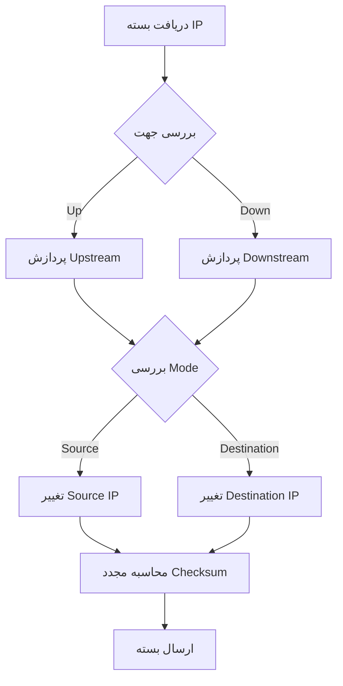

# IpOverrider

گره **IpOverrider** آدرس‌های IP source یا destination در header های IP را تغییر می‌دهد.

## عملکرد

- **IP Address Replacement**: جایگزینی آدرس‌های IP
- **Source/Destination Override**: تغییر آدرس مبدأ یا مقصد
- **IPv4/IPv6 Support**: پشتیبانی از هر دو پروتکل

## پیکربندی

```json
{
  "name": "ip_overrider",
  "type": "IpOverrider",
  "settings": {
    "override-ip": "192.168.1.100",
    "mode": "source",
    "direction": "up"
  }
}
```

### پارامترها

- **`override-ip`** (string): آدرس IP جایگزین
  - IPv4: `"192.168.1.100"`
  - IPv6: `"2001:db8::1"`

- **`mode`** (string): نوع override
  - `"source"`: تغییر آدرس مبدأ
  - `"destination"`: تغییر آدرس مقصد

- **`direction`** (string): جهت اعمال
  - `"up"`: upstream
  - `"down"`: downstream

## نمونه‌های کاربردی

### 1. NAT Simulation
```json
{
  "name": "nat_override",
  "type": "IpOverrider",
  "settings": {
    "override-ip": "10.0.0.1",
    "mode": "source",
    "direction": "up"
  }
}
```

### 2. Load Balancing
```json
{
  "name": "lb_override",
  "type": "IpOverrider",
  "settings": {
    "override-ip": "192.168.1.10",
    "mode": "destination",
    "direction": "down"
  }
}
```

### 3. IPv6 Migration
```json
{
  "name": "ipv6_override",
  "type": "IpOverrider",
  "settings": {
    "override-ip": "2001:db8::100",
    "mode": "source",
    "direction": "up"
  }
}
```

## ویژگی‌ها

- **Dual Stack Support**: پشتیبانی از IPv4 و IPv6
- **Directional Override**: کنترل جهت اعمال تغییرات
- **Mode Selection**: انتخاب نوع آدرس برای تغییر

## مراحل پردازش



## نکات مهم

- Checksum به طور خودکار محاسبه می‌شود
- برای NAT و load balancing مفید است
- با دقت استفاده شود تا routing مختل نشود

## واژه‌نامه

- **IP Override**: تغییر آدرس IP
- **Source Mode**: حالت تغییر مبدأ
- **Destination Mode**: حالت تغییر مقصد
- **Dual Stack**: پشتیبانی از IPv4 و IPv6