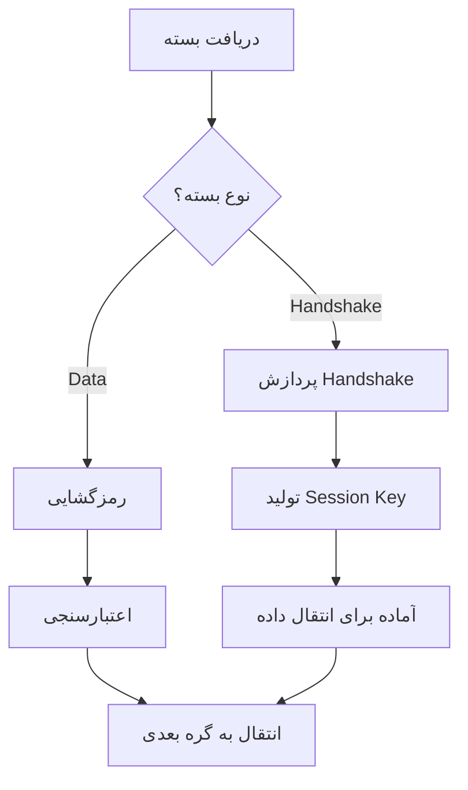

# WireGuardDevice

گره **WireGuardDevice** پیاده‌سازی کامل پروتکل WireGuard VPN است. این گره تونل‌های رمزگذاری شده را مدیریت کرده و اتصالات peer-to-peer امن فراهم می‌کند.

## عملکرد

- **WireGuard Protocol**: پیاده‌سازی کامل پروتکل WireGuard
- **Encrypted Tunnels**: ایجاد تونل‌های رمزگذاری شده
- **Peer Management**: مدیریت اتصالات چندین peer
- **Cryptographic Handshake**: پیاده‌سازی Noise protocol

## پارامترهای پیکربندی

```json
{
  "name": "wireguard_device",
  "type": "WireGuardDevice",
  "settings": {
    "privatekey": "base64_encoded_private_key",
    "peers": [
      {
        "publickey": "base64_encoded_public_key",
        "presharedkey": "base64_encoded_preshared_key",
        "allowedips": "192.168.1.0/24,10.0.0.0/8",
        "endpoint": "203.0.113.1:51820",
        "persistentkeepalive": 25
      }
    ]
  }
}
```

### پارامترهای اصلی

- **`privatekey`** (string): کلید خصوصی (base64)
- **`peers`** (array): آرایه تنظیمات peer ها

### تنظیمات Peer

- **`publickey`** (string): کلید عمومی peer (base64)
- **`presharedkey`** (string): کلید از پیش اشتراک گذاشته شده (اختیاری)
- **`allowedips`** (string): محدوده IP های مجاز
- **`endpoint`** (string): endpoint peer به فرمت `"ip:port"`
- **`persistentkeepalive`** (integer): فاصله keepalive (ثانیه)

## نمونه‌های کاربردی

### 1. سرور WireGuard
```json
{
  "name": "wg_server",
  "type": "WireGuardDevice",
  "settings": {
    "privatekey": "SERVER_PRIVATE_KEY_BASE64",
    "peers": [
      {
        "publickey": "CLIENT_PUBLIC_KEY_BASE64",
        "allowedips": "10.0.0.2/32",
        "persistentkeepalive": 25
      }
    ]
  }
}
```

### 2. کلاینت WireGuard
```json
{
  "name": "wg_client",
  "type": "WireGuardDevice",
  "settings": {
    "privatekey": "CLIENT_PRIVATE_KEY_BASE64",
    "peers": [
      {
        "publickey": "SERVER_PUBLIC_KEY_BASE64",
        "allowedips": "0.0.0.0/0",
        "endpoint": "vpn.example.com:51820",
        "persistentkeepalive": 25
      }
    ]
  }
}
```

### 3. Site-to-Site VPN
```json
{
  "name": "site_to_site",
  "type": "WireGuardDevice",
  "settings": {
    "privatekey": "SITE_A_PRIVATE_KEY_BASE64",
    "peers": [
      {
        "publickey": "SITE_B_PUBLIC_KEY_BASE64",
        "allowedips": "192.168.2.0/24",
        "endpoint": "site-b.example.com:51820",
        "persistentkeepalive": 60
      }
    ]
  }
}
```

## ویژگی‌های امنیتی

### رمزگذاری
- **Noise Protocol**: پیاده‌سازی کامل handshake
- **ChaCha20-Poly1305**: رمزگذاری داده‌ها
- **Curve25519**: تبادل کلید

### محافظت
- **Anti-replay**: محافظت در برابر حملات replay
- **Forward Secrecy**: محرمانگی رو به جلو
- **Key Rotation**: چرخش خودکار کلیدها

## بهینه‌سازی عملکرد

### کارایی
- **Hardware Acceleration**: استفاده از شتاب سخت‌افزاری
- **Efficient Encryption**: رمزگذاری بهینه
- **Memory Management**: مدیریت کارآمد حافظه

### شبکه
- **UDP Protocol**: استفاده از UDP برای کارایی بالا
- **NAT Traversal**: عبور از NAT با keepalive
- **Path MTU**: مدیریت خودکار MTU

## مراحل پردازش



## نکات مهم

- نیاز به کلیدهای صحیح WireGuard
- پشتیبانی از چندین peer همزمان
- مناسب برای VPN های high-performance
- پیاده‌سازی cross-platform

## واژه‌نامه

- **Noise Protocol**: پروتکل handshake WireGuard
- **Peer**: گره مقصد در شبکه WireGuard
- **Allowed IPs**: محدوده IP های مجاز برای peer
- **Keepalive**: پیام‌های حفظ اتصال