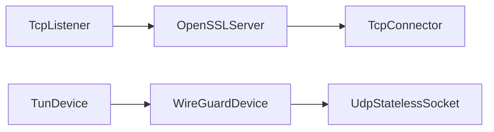
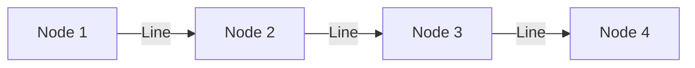
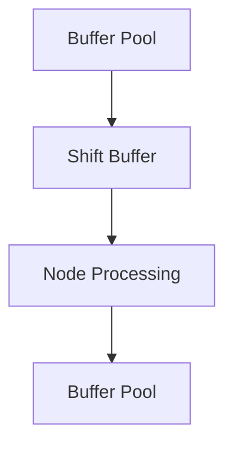
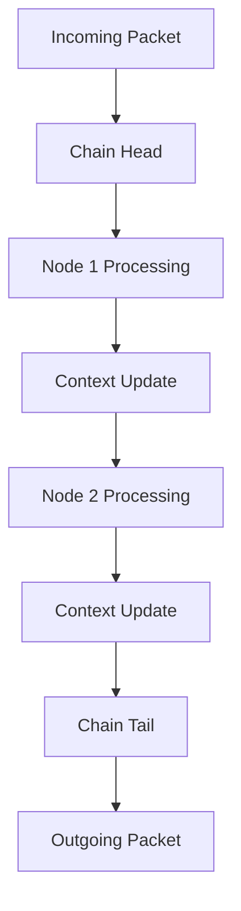

# Architecture & Core Concepts

WaterWall یک فریمورک تونل‌سازی شبکه مدولار با معماری مبتنی بر گره (Node-based) است.

## معماری کلی

### Node-based Architecture


WaterWall از **گره‌ها (Nodes)** به عنوان واحدهای بنیادی استفاده می‌کند:

- **گره (Node)**: واحد پردازش مستقل
- **زنجیره (Chain)**: اتصال گره‌ها به یکدیگر
- **خط (Line)**: کانال داده بین گره‌ها

## اجزای اصلی

### 1. Core System
```
┌─────────────────┐
│   Core Engine   │
├─────────────────┤
│ • Node Manager  │
│ • Memory Pool   │
│ • Event Loop    │
│ • Worker Threads│
└─────────────────┘
```

### 2. Node Types

#### Network Nodes
- **TcpListener**: گوش دادن به اتصالات TCP
- **TcpConnector**: اتصال به سرورهای TCP
- **UdpStatelessSocket**: مدیریت پکت‌های UDP

#### Device Nodes
- **TunDevice**: رابط شبکه مجازی
- **RawSocket**: دسترسی مستقیم به پکت‌ها
- **WireGuardDevice**: پروتکل WireGuard

#### Protocol Nodes
- **OpenSSLServer/Client**: رمزگذاری TLS/SSL
- **HTTP2Server/Client**: پروتکل HTTP/2
- **RealityServer/Client**: پروتکل Reality

#### Advanced Nodes
- **HalfDuplexClient/Server**: تقسیم کانال‌ها
- **IpManipulator**: دستکاری پکت‌ها
- **IpOverrider**: تغییر آدرس‌های IP

## مفاهیم کلیدی

### Chain (زنجیره)


زنجیره‌ها مسیر پردازش داده‌ها را تعریف می‌کنند:
- **Upstream**: جریان داده از کلاینت به سرور
- **Downstream**: جریان داده از سرور به کلاینت

### Context (زمینه)
```c
typedef struct {
    socket_context_t *socket;
    address_context_t *src_addr;
    address_context_t *dest_addr;
    // ...
} context_t;
```

Context اطلاعات مشترک بین گره‌ها را نگهداری می‌کند.

### Buffer Management


سیستم مدیریت حافظه بهینه:
- **Buffer Pool**: مجموعه بافرهای قابل استفاده مجدد
- **Shift Buffer**: بافر پویا برای پردازش
- **Zero Copy**: کاهش کپی حافظه

## Event Loop

### Multi-threaded Architecture
```
┌─────────────┐  ┌─────────────┐  ┌─────────────┐
│   Worker 1  │  │   Worker 2  │  │   Worker 3  │
├─────────────┤  ├─────────────┤  ├─────────────┤
│ Event Loop  │  │ Event Loop  │  │ Event Loop  │
│ Node Pool   │  │ Node Pool   │  │ Node Pool   │
│ Buffer Pool │  │ Buffer Pool │  │ Buffer Pool │
└─────────────┘  └─────────────┘  └─────────────┘
```

### Event Processing
1. **I/O Events**: خواندن/نوشتن داده‌ها
2. **Timer Events**: timeout و keepalive
3. **Signal Events**: مدیریت سیگنال‌ها

## Configuration System

### JSON Structure
```json
{
  "nodes": [
    {
      "name": "listener",
      "type": "TcpListener",
      "settings": { /* ... */ },
      "next": "processor"
    },
    {
      "name": "processor",
      "type": "OpenSSLServer",
      "settings": { /* ... */ },
      "next": "connector"
    }
  ]
}
```

### Dynamic Configuration
- **Runtime Changes**: تغییر پیکربندی در زمان اجرا
- **Hot Reload**: بارگذاری مجدد بدون قطع سرویس
- **Validation**: اعتبارسنجی پیکربندی

## Data Flow

### Packet Processing Pipeline


### Line States
```c
enum line_state {
    LINE_STATE_INIT,
    LINE_STATE_ESTABLISHED,
    LINE_STATE_PAUSED,
    LINE_STATE_FINISHED
};
```

## Memory Management

### Pool Architecture
```
┌─────────────────────┐
│   Master Pool       │
├─────────────────────┤
│ ┌─────────────────┐ │
│ │ Buffer Pool     │ │
│ │ Context Pool    │ │
│ │ Generic Pool    │ │
│ └─────────────────┘ │
└─────────────────────┘
```

### Memory Strategies
- **Pre-allocation**: تخصیص قبلی حافظه
- **Object Pooling**: استفاده مجدد اشیاء
- **Memory Alignment**: تراز مناسب حافظه

## Performance Optimization

### Threading Model
- **Worker Pool**: مجموعه thread های کارگر
- **Load Balancing**: توزیع بار بین worker ها
- **Lock-free Operations**: عملیات بدون قفل

### I/O Optimization
- **Epoll/Kqueue**: event notification بهینه
- **Zero Copy**: کاهش کپی داده‌ها
- **Batching**: پردازش دسته‌ای

## Security Architecture

### Isolation
- **Process Isolation**: جداسازی فرآیندها
- **Memory Protection**: محافظت حافظه
- **Privilege Separation**: جداسازی دسترسی‌ها

### Crypto Integration
- **Hardware Acceleration**: شتاب سخت‌افزاری
- **Multiple Backends**: پشتیبانی از چندین backend
- **Key Management**: مدیریت کلیدهای رمزگذاری

## Debugging & Monitoring

### Logging System
```
┌─────────────────┐
│ Core Logger     │
├─────────────────┤
│ Network Logger  │
├─────────────────┤
│ DNS Logger      │
├─────────────────┤
│ Internal Logger │
└─────────────────┘
```

### Metrics
- **Performance Counters**: شمارنده‌های عملکرد
- **Resource Usage**: استفاده از منابع
- **Error Tracking**: ردیابی خطاها

## Best Practices

### Node Design
1. **Single Responsibility**: هر گره یک وظیفه مشخص
2. **Stateless When Possible**: تا حد امکان بدون state
3. **Error Handling**: مدیریت صحیح خطاها

### Chain Design
1. **Minimal Hops**: کمترین تعداد گره
2. **Efficient Ordering**: ترتیب بهینه گره‌ها
3. **Resource Sharing**: اشتراک منابع

### Configuration
1. **Validation**: اعتبارسنجی کامل
2. **Documentation**: مستندسازی کامل
3. **Testing**: آزمایش پیکربندی‌ها

## نکات مهم

- WaterWall برای عملکرد بالا طراحی شده است
- معماری مدولار امکان توسعه آسان را فراهم می‌کند
- سیستم مدیریت حافظه بهینه شده است
- پشتیبانی کامل از محیط‌های چند thread دارد

## واژه‌نامه

- **Node**: گره - واحد پردازش
- **Chain**: زنجیره - اتصال گره‌ها
- **Line**: خط - کانال داده
- **Context**: زمینه - اطلاعات مشترک
- **Buffer Pool**: مجموعه بافرهای حافظه
- **Event Loop**: حلقه رویداد
- **Worker Thread**: thread کارگر