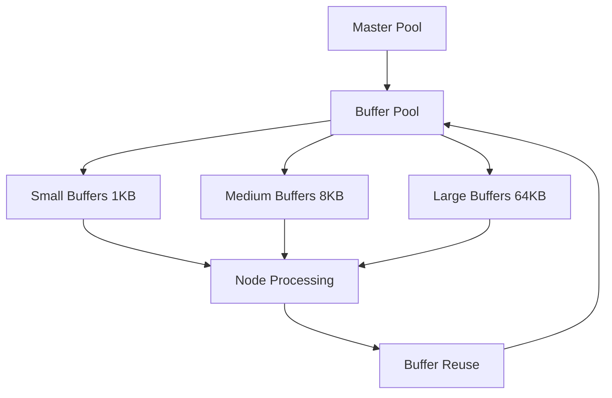

# Performance Optimization

راهنمای بهینه‌سازی عملکرد WaterWall برای حداکثر throughput و کمترین latency.

## معیارهای عملکرد

### Key Performance Indicators (KPIs)
- **Throughput**: حجم داده منتقل شده در واحد زمان
- **Latency**: زمان تأخیر در انتقال داده
- **CPU Usage**: استفاده از پردازنده
- **Memory Usage**: استفاده از حافظه
- **Connection Rate**: نرخ اتصالات جدید

## تنظیمات سیستم

### Worker Thread Configuration
```json
{
  "misc": {
    "workers": 0,  // 0 = auto-detect CPU cores
    "ram-profile": "server"
  }
}
```

#### RAM Profiles
- **`minimal`**: 250KB - برای محیط‌های محدود
- **`client`**: 2-10MB - برای کلاینت‌ها
- **`server`**: 40MB per thread - برای سرورها

### Optimal Worker Count
```bash
# محاسبه تعداد بهینه worker
workers = CPU_cores * 2
# یا بر اساس نوع workload
workers = min(CPU_cores * 2, max_connections / 1000)
```

## بهینه‌سازی شبکه

### TCP Optimization
```json
{
  "name": "optimized_tcp_listener",
  "type": "TcpListener",
  "settings": {
    "address": "0.0.0.0",
    "port": 443,
    "nodelay": true,              // غیرفعال کردن Nagle algorithm
    "balance-group": "servers",   // Load balancing
    "balance-interval": 50        // کاهش interval برای واکنش سریع‌تر
  }
}
```

### TCP Connector Optimization
```json
{
  "name": "fast_connector",
  "type": "TcpConnector",
  "settings": {
    "address": "target.com",
    "port": 443,
    "nodelay": true,
    "fastopen": true,    // TCP Fast Open
    "reuseaddr": true    // Port reuse
  }
}
```

### UDP Optimization
```json
{
  "name": "high_perf_udp",
  "type": "UdpStatelessSocket",
  "settings": {
    "listen-address": "0.0.0.0",
    "listen-port": 443,
    "fwmark": 1  // برای routing optimization
  }
}
```

## مدیریت حافظه

### Buffer Pool Optimization


### Memory Allocation Strategy
```c
// بهینه‌سازی allocation
buffer_pool_size = workers * 1000 * average_buffer_size
pre_allocated_buffers = expected_concurrent_connections * 2
```

## I/O Optimization

### Event Loop Tuning
```json
{
  "log": {
    "core": {
      "loglevel": "WARN"  // کاهش logging برای عملکرد بالا
    },
    "network": {
      "loglevel": "ERROR"
    }
  }
}
```

### File Descriptor Limits
```bash
# تنظیم limits سیستم
ulimit -n 65536
echo "65536" > /proc/sys/fs/file-max

# برای systemd service
[Service]
LimitNOFILE=65536
```

## بهینه‌سازی پروتکل

### TLS/SSL Performance
```json
{
  "name": "optimized_ssl",
  "type": "OpenSSLServer",
  "settings": {
    "cert-file": "/path/to/cert.pem",
    "key-file": "/path/to/key.pem",
    "cipher-suites": "ECDHE-RSA-AES128-GCM-SHA256",  // سریع‌ترین cipher
    "protocols": ["TLSv1.3"],  // جدیدترین پروتکل
    "session-cache": true,     // فعال‌سازی session cache
    "session-timeout": 3600    // timeout مناسب
  }
}
```

### HTTP/2 Optimization
```json
{
  "name": "http2_optimized",
  "type": "Http2Server",
  "settings": {
    "initial-window-size": 65536,      // افزایش window size
    "max-frame-size": 16384,           // حداکثر frame size
    "header-table-size": 4096,         // بهینه‌سازی header compression
    "enable-push": false               // غیرفعال کردن server push
  }
}
```

## کانفیگ بهینه‌سازی شده

### High-Performance Proxy
```json
{
  "name": "high_perf_proxy",
  "nodes": [
    {
      "name": "listener",
      "type": "TcpListener",
      "settings": {
        "address": "0.0.0.0",
        "port": 443,
        "nodelay": true,
        "balance-group": "backend",
        "balance-interval": 10
      },
      "next": "connector"
    },
    {
      "name": "connector",
      "type": "TcpConnector",
      "settings": {
        "address": "backend.local",
        "port": 8080,
        "nodelay": true,
        "fastopen": true,
        "reuseaddr": true
      }
    }
  ]
}
```

### Load Balancer Optimization
```json
{
  "nodes": [
    {
      "name": "lb_listener_1",
      "type": "TcpListener",
      "settings": {
        "address": "0.0.0.0",
        "port": 443,
        "nodelay": true,
        "balance-group": "lb_group",
        "balance-interval": 5
      },
      "next": "backend_1"
    },
    {
      "name": "lb_listener_2",
      "type": "TcpListener",
      "settings": {
        "address": "0.0.0.0",
        "port": 444,
        "nodelay": true,
        "balance-group": "lb_group",
        "balance-interval": 5
      },
      "next": "backend_2"
    }
  ]
}
```

## سیستم‌عامل Tuning

### Linux Kernel Parameters
```bash
# Network stack tuning
echo 'net.core.rmem_max = 33554432' >> /etc/sysctl.conf
echo 'net.core.wmem_max = 33554432' >> /etc/sysctl.conf
echo 'net.ipv4.tcp_rmem = 4096 16384 33554432' >> /etc/sysctl.conf
echo 'net.ipv4.tcp_wmem = 4096 65536 33554432' >> /etc/sysctl.conf

# Connection tracking
echo 'net.netfilter.nf_conntrack_max = 1000000' >> /etc/sysctl.conf
echo 'net.core.netdev_max_backlog = 5000' >> /etc/sysctl.conf

# TCP optimization
echo 'net.ipv4.tcp_congestion_control = bbr' >> /etc/sysctl.conf
echo 'net.ipv4.tcp_fastopen = 3' >> /etc/sysctl.conf

sysctl -p
```

### CPU Affinity
```bash
# Pin WaterWall to specific CPU cores
taskset -c 0-3 ./waterwall config.json
```

## نظارت عملکرد

### Monitoring Script
```bash
#!/bin/bash
# monitoring.sh
while true; do
  echo "=== $(date) ==="
  
  # CPU usage
  top -p $(pgrep waterwall) -n 1 -b | grep waterwall
  
  # Memory usage
  ps -p $(pgrep waterwall) -o pid,ppid,cmd,rss,vsz
  
  # Network connections
  ss -tuln | grep waterwall
  
  # File descriptors
  lsof -p $(pgrep waterwall) | wc -l
  
  sleep 30
done
```

### Performance Metrics
```json
{
  "log": {
    "core": {
      "loglevel": "INFO",
      "file": "metrics.log"
    }
  }
}
```

## بهینه‌سازی پیشرفته

### NUMA Optimization
```bash
# برای سرورهای چند-socket
numactl --cpunodebind=0 --membind=0 ./waterwall config.json
```

### Huge Pages
```bash
# فعال‌سازی huge pages
echo 1024 > /proc/sys/vm/nr_hugepages
echo always > /sys/kernel/mm/transparent_hugepage/enabled
```

### IRQ Balancing
```bash
# توزیع IRQ بین CPU cores
echo 2 > /proc/irq/24/smp_affinity  # NIC IRQ to CPU 1
echo 4 > /proc/irq/25/smp_affinity  # NIC IRQ to CPU 2
```

## عیب‌یابی عملکرد

### Bottleneck Detection
```bash
# CPU profiling
perf record -g ./waterwall config.json
perf report

# Memory profiling
valgrind --tool=massif ./waterwall config.json

# Network profiling
ss -s  # socket statistics
netstat -i  # interface statistics
```

### Common Issues

#### High CPU Usage
```bash
# بررسی thread contention
perf record -e cpu/event=0x3c,umask=0x00/ ./waterwall config.json
```

#### Memory Leaks
```bash
# بررسی memory usage
valgrind --leak-check=full ./waterwall config.json
```

#### Network Bottlenecks
```bash
# بررسی network queue
tc qdisc show dev eth0
```

## بهترین تنظیمات

### Production Ready Configuration
```json
{
  "log": {
    "path": "/var/log/waterwall/",
    "core": {
      "loglevel": "WARN",
      "file": "core.log",
      "console": false
    },
    "network": {
      "loglevel": "ERROR",
      "file": "network.log",
      "console": false
    }
  },
  "misc": {
    "workers": 0,
    "ram-profile": "server"
  }
}
```

### Benchmark Configuration
```json
{
  "nodes": [
    {
      "name": "benchmark_listener",
      "type": "TcpListener",
      "settings": {
        "address": "0.0.0.0",
        "port": 8080,
        "nodelay": true
      },
      "next": "benchmark_connector"
    },
    {
      "name": "benchmark_connector",
      "type": "TcpConnector",
      "settings": {
        "address": "127.0.0.1",
        "port": 8081,
        "nodelay": true,
        "fastopen": true
      }
    }
  ]
}
```

## نکات مهم

### Do's
- ✅ از `nodelay: true` استفاده کنید
- ✅ تعداد worker مناسب تنظیم کنید
- ✅ RAM profile مناسب انتخاب کنید
- ✅ سیستم‌عامل را tune کنید
- ✅ عملکرد را monitor کنید

### Don'ts
- ❌ logging بیش از حد فعال نکنید
- ❌ worker های زیادی تنظیم نکنید
- ❌ file descriptor limits را فراموش نکنید
- ❌ network parameters را نادیده نگیرید

## واژه‌نامه

- **Throughput**: حجم داده منتقل شده
- **Latency**: زمان تأخیر
- **TCP_NODELAY**: غیرفعال کردن Nagle algorithm
- **TCP_FASTOPEN**: تسریع handshake
- **Buffer Pool**: مجموعه بافرهای حافظه
- **Load Balancing**: تعادل بار
- **NUMA**: Non-Uniform Memory Access
- **IRQ**: Interrupt Request