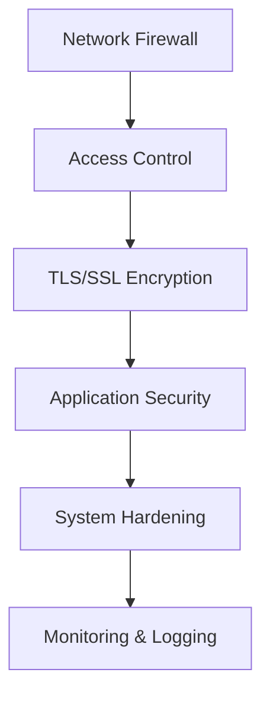

# Security Best Practices

راهنمای امنیت WaterWall برای حفاظت از سیستم و داده‌ها.

## اصول امنیت

### Defense in Depth


### Security Layers
1. **Network Security**: فایروال و فیلترینگ
2. **Access Control**: کنترل دسترسی
3. **Encryption**: رمزگذاری داده‌ها
4. **Authentication**: احراز هویت
5. **Monitoring**: نظارت و logging

## Access Control

### IP-based Filtering
```json
{
  "name": "secure_listener",
  "type": "TcpListener",
  "settings": {
    "address": "0.0.0.0",
    "port": 443,
    "whitelist": [
      "192.168.1.0/24",
      "10.0.0.0/8",
      "172.16.0.0/12"
    ],
    "blacklist": [
      "192.168.1.100/32",
      "10.0.0.50/32"
    ]
  },
  "next": "ssl_handler"
}
```

### Geographic Filtering
```json
{
  "name": "geo_filtered_listener",
  "type": "TcpListener",
  "settings": {
    "address": "0.0.0.0",
    "port": 443,
    "whitelist": [
      "1.1.1.0/24",     // Cloudflare
      "8.8.8.0/24"      // Google DNS
    ]
  },
  "next": "secure_handler"
}
```

## TLS/SSL Security

### Strong TLS Configuration
```json
{
  "name": "secure_tls_server",
  "type": "OpenSSLServer",
  "settings": {
    "cert-file": "/etc/ssl/certs/server.crt",
    "key-file": "/etc/ssl/private/server.key",
    "ca-file": "/etc/ssl/certs/ca.crt",
    "protocols": ["TLSv1.3", "TLSv1.2"],
    "cipher-suites": [
      "TLS_AES_256_GCM_SHA384",
      "TLS_CHACHA20_POLY1305_SHA256",
      "TLS_AES_128_GCM_SHA256"
    ],
    "verify-cert": true,
    "session-cache": true,
    "session-timeout": 300
  },
  "next": "backend"
}
```

### Certificate Management
```bash
# تولید کلید و گواهی
openssl genrsa -out server.key 4096
openssl req -new -key server.key -out server.csr
openssl x509 -req -days 365 -in server.csr -signkey server.key -out server.crt

# تنظیم permissions
chmod 600 server.key
chmod 644 server.crt
chown waterwall:waterwall server.key server.crt
```

### Client Certificate Authentication
```json
{
  "name": "client_auth_server",
  "type": "OpenSSLServer",
  "settings": {
    "cert-file": "/etc/ssl/certs/server.crt",
    "key-file": "/etc/ssl/private/server.key",
    "ca-file": "/etc/ssl/certs/client-ca.crt",
    "verify-cert": true,
    "require-client-cert": true,
    "protocols": ["TLSv1.3"]
  },
  "next": "authenticated_handler"
}
```

## Advanced Security Protocols

### Reality Protocol Security
```json
{
  "name": "reality_server",
  "type": "RealityServer",
  "settings": {
    "dest": "cloudflare.com:443",
    "server-names": ["example.com", "www.example.com"],
    "private-key": "PRIVATE_KEY_BASE64",
    "short-ids": ["SHORT_ID_1", "SHORT_ID_2"],
    "min-client-ver": "1.8.0",
    "max-client-ver": "1.8.99"
  },
  "next": "inner_handler"
}
```

### Multi-layer Encryption
```json
{
  "nodes": [
    {
      "name": "outer_tls",
      "type": "OpenSSLServer",
      "settings": {
        "cert-file": "/etc/ssl/outer.crt",
        "key-file": "/etc/ssl/outer.key",
        "protocols": ["TLSv1.3"]
      },
      "next": "reality_layer"
    },
    {
      "name": "reality_layer",
      "type": "RealityServer",
      "settings": {
        "dest": "fallback.com:443",
        "private-key": "REALITY_KEY"
      },
      "next": "inner_tls"
    },
    {
      "name": "inner_tls",
      "type": "OpenSSLServer",
      "settings": {
        "cert-file": "/etc/ssl/inner.crt",
        "key-file": "/etc/ssl/inner.key"
      },
      "next": "final_handler"
    }
  ]
}
```

## WireGuard Security

### Secure WireGuard Configuration
```json
{
  "name": "secure_wireguard",
  "type": "WireGuardDevice",
  "settings": {
    "privatekey": "PRIVATE_KEY_BASE64",
    "peers": [
      {
        "publickey": "CLIENT_PUBLIC_KEY",
        "presharedkey": "PSK_FOR_QUANTUM_RESISTANCE",
        "allowedips": "10.0.0.2/32",
        "endpoint": "client.example.com:41194",
        "persistentkeepalive": 25
      }
    ]
  },
  "next": "secure_handler"
}
```

### Key Management
```bash
# تولید کلیدهای WireGuard
wg genkey | tee server_private.key | wg pubkey > server_public.key
wg genkey | tee client_private.key | wg pubkey > client_public.key
wg genpsk > preshared.key

# تنظیم permissions
chmod 600 *private.key preshared.key
chmod 644 *public.key
```

## System Hardening

### User and Permissions
```bash
# ایجاد کاربر اختصاصی
useradd -r -s /bin/false -d /var/lib/waterwall waterwall

# تنظیم permissions
chown -R waterwall:waterwall /etc/waterwall
chmod -R 750 /etc/waterwall
chmod 600 /etc/waterwall/config.json
```

### File System Security
```bash
# Mount options for security
mount -o noexec,nosuid,nodev /var/lib/waterwall

# SELinux context
setsebool -P httpd_can_network_connect 1
restorecon -R /var/lib/waterwall
```

### Resource Limits
```bash
# /etc/security/limits.conf
waterwall soft nofile 65536
waterwall hard nofile 65536
waterwall soft nproc 32768
waterwall hard nproc 32768
```

## Network Security

### Firewall Configuration
```bash
# UFW rules
ufw allow from 192.168.1.0/24 to any port 443
ufw allow from 10.0.0.0/8 to any port 443
ufw deny 443
ufw enable

# iptables rules
iptables -A INPUT -s 192.168.1.0/24 -p tcp --dport 443 -j ACCEPT
iptables -A INPUT -p tcp --dport 443 -j DROP
```

### DDoS Protection
```json
{
  "name": "ddos_protected_listener",
  "type": "TcpListener",
  "settings": {
    "address": "0.0.0.0",
    "port": 443,
    "balance-group": "ddos_protection",
    "balance-interval": 100,
    "whitelist": ["trusted-networks"],
    "nodelay": true
  },
  "next": "rate_limiter"
}
```

### Rate Limiting
```bash
# iptables rate limiting
iptables -A INPUT -p tcp --dport 443 -m state --state NEW -m recent --set
iptables -A INPUT -p tcp --dport 443 -m state --state NEW -m recent --update --seconds 60 --hitcount 4 -j DROP
```

## Monitoring and Logging

### Security Logging
```json
{
  "log": {
    "path": "/var/log/waterwall/",
    "core": {
      "loglevel": "INFO",
      "file": "security.log",
      "console": false
    },
    "network": {
      "loglevel": "WARN",
      "file": "network-security.log",
      "console": false
    }
  }
}
```

### Intrusion Detection
```bash
# Fail2ban configuration
[waterwall]
enabled = true
port = 443
filter = waterwall
logpath = /var/log/waterwall/security.log
maxretry = 5
bantime = 3600
```

### Log Analysis
```bash
# Security log analysis
tail -f /var/log/waterwall/security.log | grep -i "failed\|error\|attack"

# Connection monitoring
ss -tuln | grep :443
lsof -i :443
```

## Backup and Recovery

### Configuration Backup
```bash
#!/bin/bash
# backup-config.sh
backup_dir="/backup/waterwall/$(date +%Y%m%d)"
mkdir -p $backup_dir

# Backup configurations
cp -r /etc/waterwall $backup_dir/
cp -r /etc/ssl/waterwall $backup_dir/

# Backup logs
cp -r /var/log/waterwall $backup_dir/

# Encrypt backup
tar -czf $backup_dir.tar.gz $backup_dir
openssl enc -aes-256-cbc -in $backup_dir.tar.gz -out $backup_dir.tar.gz.enc
rm $backup_dir.tar.gz
```

### Disaster Recovery
```bash
# Recovery procedure
systemctl stop waterwall
cp -r /backup/waterwall/latest/etc/waterwall /etc/
cp -r /backup/waterwall/latest/etc/ssl/waterwall /etc/ssl/
systemctl start waterwall
```

## Security Testing

### Configuration Testing
```bash
# SSL/TLS testing
openssl s_client -connect localhost:443 -tls1_3
sslscan localhost:443
testssl.sh localhost:443

# WireGuard testing
wg show
ping -c 4 10.0.0.1
```

### Penetration Testing
```bash
# Network scanning
nmap -sS -O -A localhost
nmap --script ssl-enum-ciphers localhost:443

# Vulnerability scanning
nikto -h https://localhost:443
```

## Incident Response

### Security Incident Handling
```bash
# Immediate response
systemctl stop waterwall
iptables -A INPUT -j DROP  # Block all traffic
cp /var/log/waterwall/security.log /forensics/

# Analysis
grep -i "attack\|intrusion\|malware" /var/log/waterwall/security.log
lsof -i | grep ESTABLISHED
```

### Recovery Steps
1. **Isolate**: قطع اتصال سیستم
2. **Analyze**: تجزیه و تحلیل logs
3. **Patch**: اعمال پچ‌های امنیتی
4. **Monitor**: نظارت دقیق
5. **Document**: مستندسازی حادثه

## Compliance

### GDPR Compliance
```json
{
  "log": {
    "core": {
      "loglevel": "WARN",  // کاهش logging شخصی
      "file": "core.log",
      "retention": 30      // نگهداری 30 روزه
    }
  }
}
```

### PCI DSS Compliance
```bash
# Encryption requirements
openssl rand -base64 32 > encryption.key
chmod 600 encryption.key

# Access logging
echo "AllowUsers waterwall" >> /etc/ssh/sshd_config
```

## Best Practices Summary

### Do's ✅
- از TLS 1.3 استفاده کنید
- Certificate validation فعال کنید
- Strong cipher suites انتخاب کنید
- IP whitelist/blacklist تنظیم کنید
- Logs را monitor کنید
- Regular backup بگیرید
- System hardening انجام دهید

### Don'ts ❌
- کلیدهای weak استفاده نکنید
- Certificate verification غیرفعال نکنید
- Sensitive data را log نکنید
- Default configurations استفاده نکنید
- Security updates را نادیده نگیرید

## Security Checklist

- [ ] TLS 1.3 پیکربندی شده
- [ ] Strong cipher suites انتخاب شده
- [ ] Certificate validation فعال
- [ ] IP filtering تنظیم شده
- [ ] Firewall پیکربندی شده
- [ ] Logging فعال شده
- [ ] Backup strategy موجود
- [ ] Incident response plan آماده
- [ ] Regular security updates
- [ ] Monitoring alerts فعال

## واژه‌نامه

- **Defense in Depth**: دفاع عمقی
- **Certificate Validation**: اعتبارسنجی گواهی
- **Cipher Suite**: مجموعه رمزنگاری
- **Intrusion Detection**: تشخیص نفوذ
- **Rate Limiting**: محدود کردن نرخ
- **DDoS Protection**: محافظت از DDoS
- **Penetration Testing**: تست نفوذ
- **Incident Response**: پاسخ به حادثه