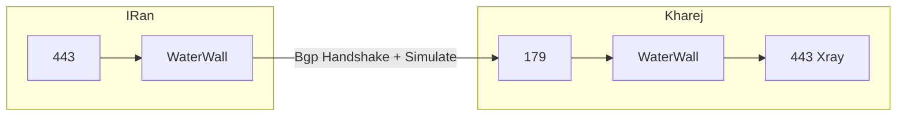

# Bgp4 Tunnel or Direct

پروتکل BGP4 (Border Gateway Protocol version 4) یک روش استاندارد برای ارتباط بین روترها است که بر روی پروتکل TCP پیاده‌سازی شده است.

علیرغم نام پیچیده، روش BGP4 بسیار ساده بوده و می‌توان آن را به عنوان یک ترنسپورت اضافه کرد.

## ویژگی‌ها و مزایا

- پروتکل BGP دارای وضعیت (state) است که به صورت ساده شبیه‌سازی شده است.
- برای استفاده از این روش، نیاز است تا در هر دو سرور ایران و خارج، WaterWall را اجرا کنید.
- این روش می‌تواند با ترکیب با نودهای معکوس (reverse) نیز پیاده‌سازی شود.
- نیازی به رمزنگاری وجود ندارد.
- هدف اصلی این روش، ایجاد تونل مستقیم پایدار و پرسرعت است.
- انتظار می‌رود که این روش بتواند محدودیت‌های اعمال شده بر روی اتصالات مستقیم را برطرف کند.

:::caution توجه
این روش جادویی نیست و قرار نیست آدرس IP مسدود شده را آزاد کند. در تست‌های اولیه، اتصال مستقیم به سرور با IP مسدود برقرار نشد، اما اتصال معکوس (reverse) موفقیت‌آمیز بود.
:::

## فلوچارت ارتباط



```json title="سرور ایران"
{
  "name": "bgp_client",
  "nodes": [
    {
      "name": "input",
      "type": "TcpListener",
      "settings": {
        "address": "0.0.0.0",
        "port": 443,
        "nodelay": true
      },
      "next": "bgp_client"
    },
    {
      "name": "bgp_client",
      "type": "Bgp4Client",
      "settings": {},
      "next": "output"
    },
    {
      "name": "output",
      "type": "TcpConnector",
      "settings": {
        "nodelay": true,
        "address": "1.1.1.1", // آدرس IP سرور خارج
        "port": 179
      }
    }
  ]
}
```

```json title="سرور خارج"
{
  "name": "bgp_server",
  "nodes": [
    {
      "name": "input",
      "type": "TcpListener",
      "settings": {
        "address": "0.0.0.0",
        "port": 179,
        "nodelay": true
      },
      "next": "bgp_server"
    },
    {
      "name": "bgp_server",
      "type": "Bgp4Server",
      "settings": {},
      "next": "output"
    },

    {
      "name": "output",
      "type": "TcpConnector",
      "settings": {
        "nodelay": true,
        "address": "127.0.0.1",
        "port": 443
      }
    }
  ]
}
```

:::tip نکات

به شدت توصیه می‌شود از پورت 179 مطابق با استاندارد BGP استفاده شود.
این پیکربندی، پورت 443 سرور ایران را به پورت 443 سرور خارج متصل می‌کند و تک پورت است.
تبدیل آن به حالت چند پورت (multi-port) بسیار ساده است.
ارتباط بین ایران و خارج از طریق پورت 179 برقرار می‌شود، برخلاف روش‌های قبلی که پورت 443 پیشنهاد می‌شد.
:::

### دانشنامه

#### BGP (Border Gateway Protocol)

- پروتکل استاندارد برای تبادل اطلاعات مسیریابی بین سیستم‌های خودمختار (AS) در شبکه‌های کامپیوتری
- نسخه 4 (BGPv4) در حال حاضر نسخه رایج مورد استفاده است
- بر روی پروتکل TCP پورت 179 اجرا می‌شود
- پروتکلی با وضعیت (stateful) است که اتصالات طولانی مدت برقرار می‌کند
- از آن برای تبادل جداول مسیریابی IP بین روترهای مرزی استفاده می‌شود
