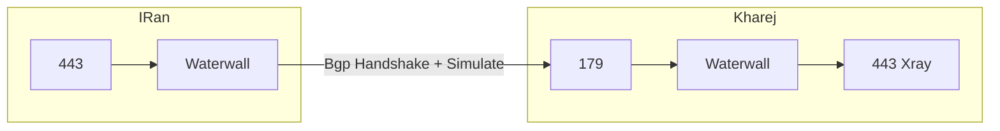

# Bgp4 Tunnel or Direct

پروتکل BGP4 (Border Gateway Protocol version 4) که طبق استاندارد بر روی پروتکل TCP پیاده‌سازی شده است، روشی برای ارتباط بین روترها محسوب می‌شود.

روش BGP4، علیرغم نام پیچیده‌اش، بسیار ساده است و می‌توان آن را به عنوان یک ترنسپورت اضافه کرد.

پروتکل BGP دارای وضعیت (state) است که در حال حاضر به صورت ساده شبیه‌سازی شده است.

برای استفاده از این روش، نیاز است تا در هر دو سرور ایران و خارج، واترفال را اجرا کنید.

این روش جادویی نیست و قرار نیست آدرس IP مسدود شده را آزاد کند. اگرچه تست کردن آن خالی از لطف نیست، اما بر روی یک سرور هتزنر که آدرس IP آن کاملاً مسدود شده بود و هیچ روش مستقیمی برای اتصال به آن وجود نداشت، آزمایش شد و اتصال مستقیم برقرار نشد، اما اتصال معکوس (reverse) موفقیت‌آمیز بود.

این روش را می‌توان به راحتی با ترکیب با نودهای معکوس (reverse) نیز پیاده‌سازی کرد.

در این روش، نیازی به رمزنگاری وجود ندارد.

مهم‌ترین هدفی که از این روش انتظار می‌رود، پایداری و امکان ایجاد تونل مستقیم است. همچنین این روش سبک و پرسرعت است.

انتظار می‌رود که این روش بتواند محدودیت‌های اعمال شده بر روی اتصالات مستقیم را برطرف کند، زیرا نوع اتصال آن متفاوت است، از TLS استفاده نمی‌کند و دارای هدر مخصوص به خود است.

در حال حاضر، به دلیل عدم تست کامل، دیدگاه دقیقی در مورد آن ندارم و آنچه گفته شد، بر اساس احتمالات بود. برای تست این روش به صورت مستقیم، از پیکربندی زیر استفاده می‌کنم.


###  فلوچارت


:::tip
آدرس IP سرور خارج به صورت فرضی `1.1.1.1` در نظر گرفته شده است و به شدت توصیه می‌شود از پورت `179` مطابق با استاندارد BGP استفاده شود.
:::


```json title="سرور ایران"
{
    "name": "bgp_client",
    "nodes": [
        {
            "name": "input",
            "type": "TcpListener",
            "settings": {
                "address": "0.0.0.0",
                "port": 443,
                "nodelay": true
            },
            "next": "bgp_client"
        },
        {
            "name": "bgp_client",
            "type": "Bgp4Client",
            "settings": {},
            "next": "output"
        },
        {
            "name": "output",
            "type": "TcpConnector",
            "settings": {
                "nodelay": true,
                "address":"1.1.1.1",
                "port":179
            }
        }
    ]
}
```


```json title="سرور خارج"
{
    "name": "bgp_server",
    "nodes": [
        {
            "name": "input",
            "type": "TcpListener",
            "settings": {
                "address": "0.0.0.0",
                "port": 179,
                "nodelay": true
            },
            "next": "bgp_server"
        },
        {
            "name":"bgp_server",
            "type":"Bgp4Server",
            "settings":{},
            "next":"output"
        },
        
        {
            "name": "output",
            "type": "TcpConnector",
            "settings": {
                "nodelay": true,
                "address": "127.0.0.1",
                "port": 443
            }
        }

    ]
}
```

:::info
این پیکربندی، پورت 443 سرور ایران را به پورت 443 سرور خارج متصل می‌کند و تک پورت است. تبدیل آن به حالت چند پورت (multi-port) بسیار ساده است و فکر می‌کنم همه بدانند چگونه این کار را انجام دهند. مثال‌هایی در مورد تغییرات لازم برای این کار قبلاً در ویکی‌ها ارائه شده است.

همچنین توجه داشته باشید که BGP بر روی پورت 179 اجرا می‌شود و ارتباط بین ایران و خارج از طریق پورت 179 برقرار می‌شود.

برخلاف روش‌های قبلی که پورت 443 را پیشنهاد می‌کردیم، در اینجا پورت 179 مورد نظر است.
:::