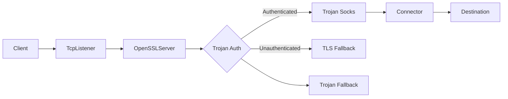

# Trojan

این روش به صورت مستقیم کار می‌کند و نیازی به سرور واسط (intermediate server) در ایران ندارد. با استفاده از این روش، می‌توانید پیکربندی Trojan را ایجاد کنید، اما این پیکربندی با پیکربندی Trojan بر روی سایر هسته‌ها (cores) متفاوت خواهد بود.

در حال حاضر، نیازی به تغییر در سمت کلاینت نیست و این پیکربندی بر روی تمامی برنامه‌های v2ray قابل اجرا است. همچنین، تغییرات به گونه‌ای اعمال می‌شوند که بر روی شبکه‌های ایرانسل و همراه اول فیلتر نشوند.

مهم‌ترین تغییر در حال حاضر، مقاوم‌سازی در برابر `tls in tls` است و با استفاده از `trojan-killer` قابل شناسایی نیست. کاربرانی که می‌خواهند این پیکربندی را تست کنند، می‌توانند آن را بر روی سرور خارجی و پورت `443` اجرا کنند.

در این پیکربندی، یک حساب کاربری Trojan با رمز عبور `1234` در نظر گرفته شده است.

:::note وضعیت فیلترینگ
تغییرات در به‌روزرسانی 1.20 برای تست قرار داده شده است و تا کنون به مدت 4 روز مشکلی مشاهده نشده است.
:::

:::tip نکات مهم

- فایل‌های گواهینامه (certificate) ضروری هستند.
- بهتر است فالبک HTTP را به وب‌سایت خودتان یا سایر وب‌سایت‌های تصادفی تغییر دهید. احتمال دارد این فالبک مورد توجه قرار گرفته باشد.
- پیشنهاد می‌شود در پیکربندی کلاینت، مقدار `alpn` را برابر با `h2` یا `http/1.1` قرار دهید.
  :::

```json
{
  "name": "direct_trojan",
  "nodes": [
    {
      "name": "my-tcp-listener",
      "type": "TcpListener",
      "settings": {
        "address": "0.0.0.0",
        "port": 443,
        "nodelay": true
      },
      "next": "my-ssl-server"
    },
    {
      "name": "my-ssl-server",
      "type": "OpenSSLServer",
      "settings": {
        "anti-tls-in-tls": true,
        "cert-file": "fullchain.pem",
        "key-file": "privkey.pem",
        "alpns": [
          {
            "value": "h2",
            "next": "node->next"
          },
          {
            "value": "http/1.1",
            "next": "node->next"
          }
        ],
        "fallback": "my-tls-fallback"
      },
      "next": "my-trojan-auth"
    },
    {
      "name": "my-trojan-auth",
      "type": "TrojanAuthServer",
      "settings": {
        "fallback": "my-trojan-fallback",
        "fallback-intence-delay": 200,
        "users": [
          {
            "name": "sample_user",
            "uid": "1234",
            "enable": true
          }
        ]
      },
      "next": "my-trojan-socks"
    },
    {
      "name": "my-trojan-socks",
      "type": "TrojanSocksServer",
      "settings": {},
      "next": "my-connector"
    },
    {
      "name": "my-connector",
      "type": "Connector",
      "settings": {
        "nodelay": true,
        "address": "dest_context->address",
        "port": "dest_context->port"
      }
    },
    {
      "name": "my-tls-fallback",
      "type": "TcpConnector",
      "settings": {
        "nodelay": true,
        "address": "demo.nginx.com",
        "port": 443
      }
    },
    {
      "name": "my-trojan-fallback",
      "type": "TcpConnector",
      "settings": {
        "nodelay": true,
        "address": "httpforever.com",
        "port": 80
      }
    }
  ]
}
```

:::info
با پیشرفت پروژه، توضیحات کامل‌تری ارائه خواهد شد، اما تا جایی که می‌دانم، با نگاه کردن به خود فایل JSON می‌توان تا حد زیادی درک کرد که هر بخش به چه منظوری است.
:::

### دانشنامه

- Trojan: پروتکل امنیتی برای عبور از سانسور و فیلترینگ اینترنت
- V2Ray: ابزاری برای ایجاد شبکه‌های پراکسی و عبور از فیلترینگ
- TLS in TLS: تکنیکی برای شناسایی و مسدودسازی ترافیک رمزگذاری شده
- ALPN (Application Layer Protocol Negotiation): مکانیزمی برای مذاکره پروتکل‌های لایه کاربرد روی TLS
- Fallback: آدرس یا سرویس جایگزین در صورت عدم دسترسی به آدرس اصلی
- NodeDelay: گزینه‌ای برای غیرفعال کردن الگوریتم Nagle و کاهش تأخیر در ارسال بسته‌های TCP



این نمودار گردش پیکربندی Trojan در WaterWall را نشان می‌دهد. درخواست‌های کلاینت ابتدا توسط TcpListener دریافت شده و سپس به OpenSSLServer منتقل می‌شوند. در آنجا، احراز هویت Trojan توسط TrojanAuthServer انجام می‌شود. اگر احراز هویت موفقیت‌آمیز باشد، درخواست به TrojanSocksServer فرستاده می‌شود و در غیر این صورت، به آدرس فالبک TLS هدایت می‌شود. Connector درخواست تأیید شده را به مقصد نهایی ارسال می‌کند.
