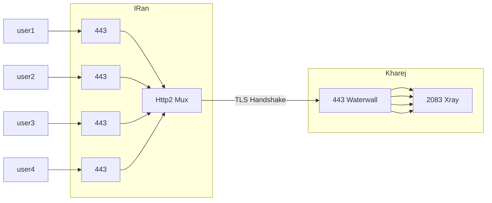

# Http2 Mux Grpc

اضافه کردن http2 به تونل، باعث می‌شود که ما به امکاناتی که Http2 ارائه می‌دهد دسترسی پیدا کنیم، از جمله mux و grpc.

با استفاده از grpc می‌توان کانکشن را از کلود فلیر هم عبور داد و مستقیم هم می‌توان استفاده کرد، فرقی نمی‌کند.

و mux هم باعث می‌شود تعداد کانکشن‌های کمتری بین سرور ایران و خارج ایجاد شود و هند شیک تایم هم تا حد خیلی خوبی پایین بیاید.

استفاده از روش‌های تونل بدون mux باعث می‌شود این احتمال وجود داشته باشد که سرور خارج شما دچار اختلال یا حتی در نهایت فیلتر شود.

پس به شدت توصیه می‌کنم این مورد را در تونل‌هایتان اعمال کنید، به‌خصوص اگر مشتری زیاد دارید روی یک سرور.

وقتی که از http2 استفاده می‌کنیم، دیگر نیازی به preconnect نداریم و استفاده از آن می‌توان گفت بی‌تأثیر است.

## اعمال روی Tls tunnel

آی‌پی سرور خارج 1.1.1.1 فرض شده است؛ اگر آی‌پی پشت دامنه است هم می‌توانید در node output دامنه وارد کنید به جای آی‌پی.

## فلوچارت سرور ایران



###  سرور ایران

```json
{
    "name": "tls_port_to_port_grpc_iran",
    "nodes": [
        {
            "name": "input",
            "type": "TcpListener",
            "settings": {
                "address": "0.0.0.0",
                "port": 443,
                "nodelay": true
            },
            "next": "pbclient"
        },
        {
            "name": "pbclient",
            "type": "ProtoBufClient",
            "settings": {},
            "next": "h2client"
        },
        {
            "name": "h2client", 
            "type": "Http2Client",
            "settings": {
                "host": "mydomain.ir",
                "port": 443,
                "path": "/",
                "content-type": "application/grpc",
                "concurrency": 64
                
            },
            "next": "sslclient"
        },
        {
            "name": "sslclient",
            "type": "OpenSSLClient",
            "settings": {
                "sni": "mydomain.ir",
                "verify": true,
                "alpn": "h2"
            },
            "next": "output"
        },
        {
            "name": "output",
            "type": "TcpConnector",
            "settings": {
                "nodelay": true,
                "address": "1.1.1.1",
                "port": 443
            }
        }
    ]
}
```

### سرور خارج


```json
{
    "name": "tls_port_to_port_grpc_kharej",
    "nodes": [
        {
            "name": "input",
            "type": "TcpListener",
            "settings": {
                "address": "0.0.0.0",
                "port": 443,
                "nodelay": true
            },
            "next": "sslserver"
        },
        {
            "name": "sslserver",
            "type": "OpenSSLServer",
            "settings": {
                "cert-file": "fullchain.pem",
                "key-file": "privkey.pem",
                "alpns": [
                    {
                        "value": "h2",
                        "next": "node->next"
                    },
                    {
                        "value": "http/1.1",
                        "next": "node->next"
                    }
                ]
            },
            "next": "h2server"
        },
        
        {
            "name": "h2server",
            "type": "Http2Server",
            "settings": {},
            "next": "pbserver"
        },
         {
            "name": "pbserver",
            "type": "ProtoBufServer",
            "settings": {},
            "next": "output"
        },
        {
            "name": "output",
            "type": "Connector",
            "settings": {
                "nodelay": true,
                "address": "127.0.0.1",
                "port": 2083
            }
        }
    ]
}
```

> در این مثال، node ProtoBuf اجباری نیست وجودش، ولی وقتی قرار داشته باشد، کانکشن grpc حساب می‌شود و می‌تواند از CDN هم رد شود.

:::info  concurrency
همان‌طور که در کانفیگ مشاهده می‌کنید، در node Http2Client یک پارامتر قرار دارد به اسم concurrency.

این به صورت پیش‌فرض 64 تنظیم شده است و به این معنی است که برای هر 64 کانکشن کاربر، یک کانکشن به سرور خارج زده می‌شود.

اگر مشتری‌هایتان خیلی زیاد هستند، مثلاً بالای 150 یا 200 تا، بهتر است concurrency را 2 برابر کنید و 128 بگذارید تا احتمال فیلترینگ بر اساس تعداد کانکشن هم نصف شود.
:::