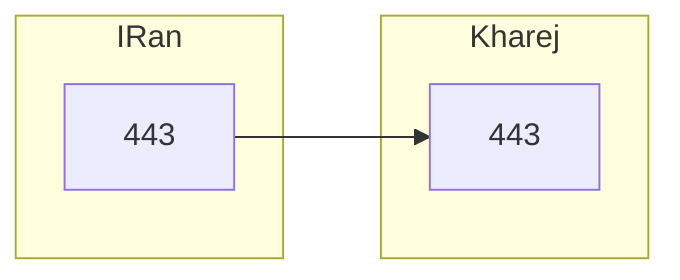
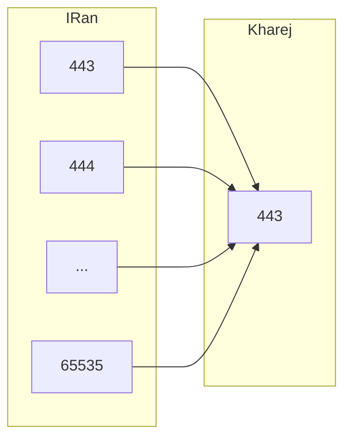
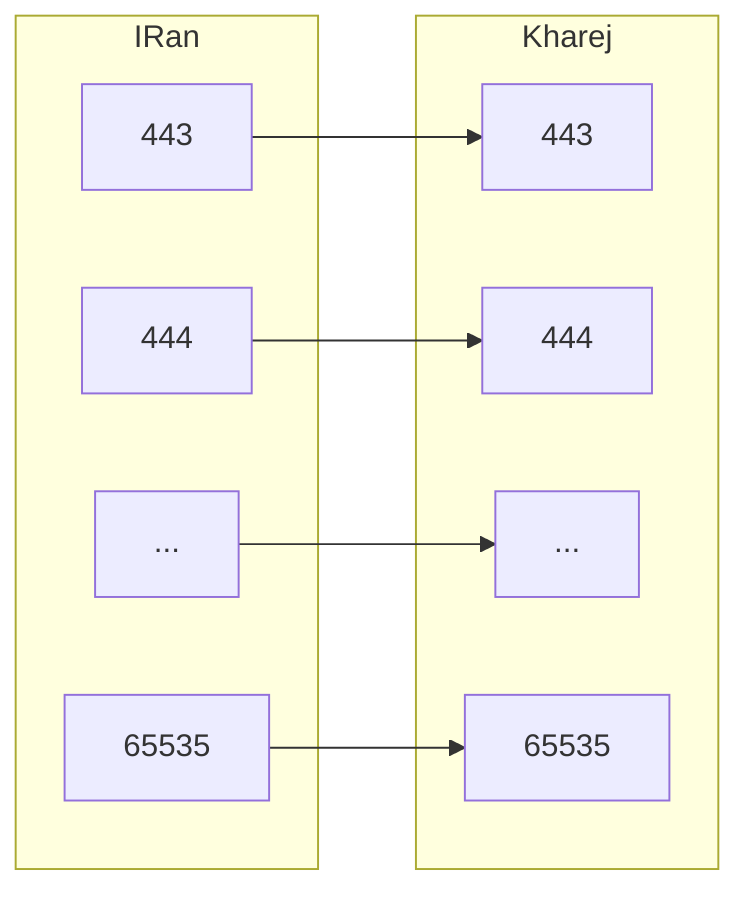
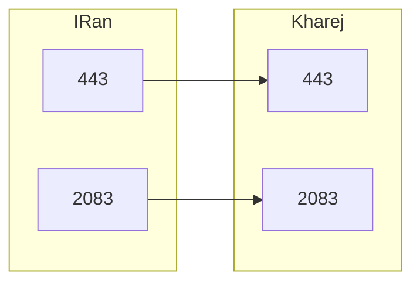

# انواع روش‌های تونل پورت به پورت

پورت به پورت یکی از ساده‌ترین و رایج‌ترین روش‌های ایجاد تونل است. در این روش، کاربر به سرور ایران متصل می‌شود و سرور ایران نیز مستقیماً به سرور خارج وصل می‌شود تا ارتباط برقرار شود.

## تک پورت به تک پورت ساده

این روش که به دوکودر هم معروف است، می‌تواند با استفاده از آی‌پی تیبل یا ابزارهایی مانند WaterWall در لایه اپلیکیشن انجام شود. تفاوت اصلی در این است که آی‌پی تیبل در لایه‌های پایین‌تر NAT را انجام می‌دهد، در حالی که WaterWall این کار را در لایه اپلیکیشن انجام می‌دهد.

برای مثال، اگر بخواهیم پورت 443 سرور ایران را به پورت 443 سرور خارج با آی‌پی 1.1.1.1 هدایت کنیم، فایل پیکربندی در سرور ایران به صورت زیر خواهد بود:



```json
{
    "name": "simple_port_to_port",
    "nodes": [
        {
            "name": "input",
            "type": "TcpListener",
            "settings": {
                "address": "0.0.0.0",
                "port": 443,
                "nodelay": true
            },
            "next": "output"
        },
        {
            "name": "output",
            "type": "TcpConnector",
            "settings": {
                "nodelay": true,
                "address": "1.1.1.1",
                "port": 443
            }
        }
    ]
}
```

این روش فقط نیاز به اجرای WaterWall بر روی سرور ایران دارد و نیازی به اجرای آن بر روی سرور خارج نیست.


## چند پورت به تک پورت ساده
در این حالت، هر پورتی که کاربر به سرور ایران متصل شود، به پورت 443 سرور خارج وصل خواهد شد.



```json
{
    "name": "simple_multiport_to_port",
    "nodes": [
        {
            "name": "input",
            "type": "TcpListener",
            "settings": {
                "address": "0.0.0.0",
                "port": [23,65535],
                "nodelay": true
            },
            "next": "output"
        },
        {
            "name": "output",
            "type": "TcpConnector",
            "settings": {
                "nodelay": true,
                "address": "1.1.1.1",
                "port": 443
            }
        }
    ]
}
```

## چند پورت به چند پورت ساده
در این روش، هر پورتی که کاربر به سرور ایران متصل شود، به همان پورت روی سرور خارج وصل خواهد شد. این روش شبیه به آی‌پی تیبل است که تمام پورت‌ها را تونل می‌کند، اما در لایه اپلیکیشن انجام می‌شود.



```json
{
    "name": "simple_multiport",
    "nodes": [
        {
            "name": "input",
            "type": "TcpListener",
            "settings": {
                "address": "0.0.0.0",
                "port": [23,65535],
                "nodelay": true
            },
            "next": "output"
        },
        {
            "name": "output",
            "type": "TcpConnector",
            "settings": {
                "nodelay": true,
                "address": "1.1.1.1",
                "port": "src_context->port"
            }
        }
    ]
}
```


##  تک پورت به تک پورت مجزا
اگر بخواهیم علاوه بر پورت 443، پورت‌های دیگری مانند 2083 را نیز به صورت جداگانه هدایت کنیم، می‌توانیم از پیکربندی زیر استفاده کنیم:



```json
{
    "name": "simple_port_to_port_x2",
    "nodes": [
        {
            "name": "input1",
            "type": "TcpListener",
            "settings": {
                "address": "0.0.0.0",
                "port": 443,
                "nodelay": true
            },
            "next": "output1"
        },
        {
            "name": "output1",
            "type": "TcpConnector",
            "settings": {
                "nodelay": true,
                "address": "1.1.1.1",
                "port": 443
            }
        },
        {
            "name": "input2",
            "type": "TcpListener",
            "settings": {
                "address": "0.0.0.0",
                "port": 2083,
                "nodelay": true
            },
            "next": "output2"
        },
        {
            "name": "output2",
            "type": "TcpConnector",
            "settings": {
                "nodelay": true,
                "address": "1.1.1.1",
                "port": 2083
            }
        }
    ]
}
```


همچنین می‌توانیم بخشی از این پیکربندی را در یک فایل JSON جداگانه قرار دهیم و آن را به core.json معرفی کنیم.

این موارد تنها بخش کوچکی از قابلیت‌های گره‌ها (Nodes) در WaterWall بودند. گره‌های مختلفی برای کارهای متنوعی مانند رمزنگاری، اتصال از پیش هند شیک شده، اتصال معکوس، Mux و غیره وجود دارند که در روش‌های بعدی به تدریج به آن‌ها خواهیم پرداخت.