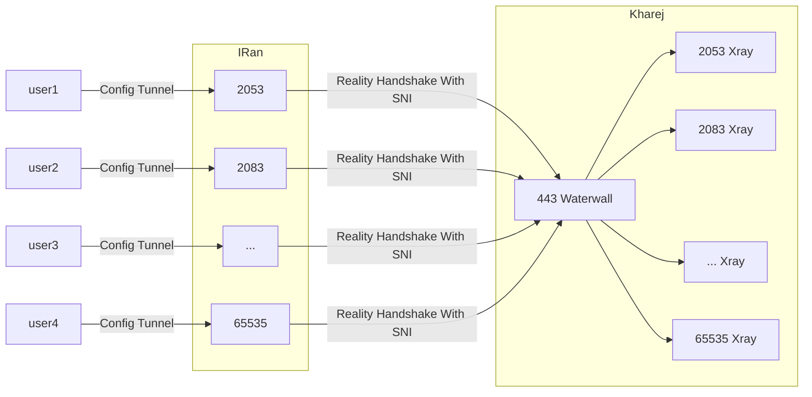

import YouTube from 'react-youtube'

# Reality Tunnel Direct

Reality Tunnel یک روش شناخته شده و پرکاربرد برای برقراری ارتباط امن است. نسخه
پیاده‌سازی شده در WaterWall با سایر پیاده‌سازی‌ها تفاوت‌هایی دارد، اما در نهایت
همگی به یک هدف می‌رسند.

Reality Tunnel به شما اجازه می‌دهد handshake را با دامنه دلخواه تکمیل کنید و در
صورت عدم احراز کانکشن، به سادگی به سایت `destination` فالبک شود. در واقع سرور
شما گویی با `iptables` به `destination` متصل شده است و به همین دلیل تشخیص آن
توسط فایروال بسیار دشوار است.

Reality Tunnel در WaterWall رمزنگاری نیز دارد. اگرچه برای تونل، رمزنگاری کامل و
سنگین مانند AES ضروری نیست، اما در حال حاضر WaterWall تنها از این الگوریتم
پشتیبانی می‌کند. این رمزنگاری به صورت سخت‌افزاری توسط OpenSSL پیاده‌سازی شده و
ممکن است تأثیر چندانی بر کارایی نداشته باشد.

پیاده‌سازی Reality Tunnel در WaterWall ساده است، اما تا جایی که اطلاع دارم، نکات
لازم در آن رعایت شده است. شما تنها به یک رمز عبور مشترک و یک SNI دلخواه نیاز
دارید.

با وجود استفاده از یک رمز عبور مشترک، داده‌های ارسالی کاملاً شبیه‌سازی شده با
TLS هستند. تمام بسته‌ها با کمک IV تصادفی ارسال می‌شوند و داده‌های هیچ نمونه‌ای
تکرار نمی‌شوند. همچنین امضای HMAC نیز انجام می‌شود تا هکرها نتوانند اطلاعات با
ارزش شما و دامنه مورد نظر کاربر را پیدا کنند.

امیدوارم این توضیحات کافی باشد. برای اطمینان از امنیت، بررسی کد توسط چند متخصص
امنیت ضروری است. اگر کسی را می‌شناسید یا خودتان در این زمینه فعال هستید، خوشحال
می‌شوم کد را بررسی کنید و نقاط ضعف احتمالی را به من اطلاع دهید.

این نکات امنیتی مربوط به الگوریتم AES بود. در آینده قصد دارم الگوریتم مورد علاقه
خودم یعنی XOR را نیز اضافه کنم که اگرچه این جزئیات امنیتی در آن رعایت نمی‌شود،
اما کارایی بهتری خواهد داشت.

## ویدیو های آموزشی

#### آموزش تانل DIRECT REALITY با هسته ی واتروال روی پنل مرزبان

<YouTube videoId="pQZWbNs7RIc" opts={{width: '100%'}} />

### فلوچارت Reality Tunnel Direct



:::note برای تونل مستقیم ریلیتی از این مثال می‌توان استفاده کرد:

آی‌پی سرور خارج: 1.1.1.1 رمز: passwd SNI: i.stack.imgur.com پورت‌های چندگانه:
443 - 65535 
:::

```json title="سرور ایران"
{
  "name": "reality_client_multiport",
  "nodes": [
    {
      "name": "users_inbound",
      "type": "TcpListener",
      "settings": {
        "address": "0.0.0.0",
        "port": [443, 65535],
        "nodelay": true
      },
      "next": "header"
    },
    {
      "name": "header",
      "type": "HeaderClient",
      "settings": {
        "data": "src_context->port"
      },
      "next": "my_reality_client"
    },
    {
      "name": "my_reality_client",
      "type": "RealityClient",
      "settings": {
        "sni": "i.stack.imgur.com",
        "password": "passwd"
      },
      "next": "outbound_to_kharej"
    },

    {
      "name": "outbound_to_kharej",
      "type": "TcpConnector",
      "settings": {
        "nodelay": true,
        "address": "1.1.1.1",
        "port": 443
      }
    }
  ]
}
```

```json title="سرور خارج"
{
  "name": "reality_server_multiport",
  "nodes": [
    {
      "name": "main_inbound",
      "type": "TcpListener",
      "settings": {
        "address": "0.0.0.0",
        "port": 443,
        "nodelay": true
      },
      "next": "my_reality_server"
    },

    {
      "name": "my_reality_server",
      "type": "RealityServer",
      "settings": {
        "destination": "reality_dest_node",
        "password": "passwd"
      },
      "next": "header_server"
    },

    {
      "name": "header_server",
      "type": "HeaderServer",
      "settings": {
        "override": "dest_context->port"
      },
      "next": "final_outbound"
    },

    {
      "name": "final_outbound",
      "type": "TcpConnector",
      "settings": {
        "nodelay": true,
        "address": "127.0.0.1",
        "port": "dest_context->port"
      }
    },

    {
      "name": "reality_dest_node",
      "type": "TcpConnector",
      "settings": {
        "nodelay": true,
        "address": "i.stack.imgur.com",
        "port": 443
      }
    }
  ]
}
```

**Reality Tunnel - دانشنامه**

Reality Tunnel روشی برای برقراری ارتباط امن بین دو نقطه است. برخی از ویژگی‌های
آن عبارتند از:

- استفاده از رمزنگاری AES (در حال حاضر در WaterWall) برای امنیت داده‌ها
- شبیه‌سازی TLS برای مخفی کردن ماهیت ترافیک
- استفاده از IV تصادفی برای جلوگیری از تکرار الگوهای داده
- امضای HMAC برای تأیید صحت و جلوگیری از دستکاری داده‌ها
- امکان استفاده از دامنه و SNI دلخواه برای فریب فایروال
- قابلیت فالبک به سایت مقصد در صورت عدم برقراری کانکشن موفق

برای راه‌اندازی Reality Tunnel در WaterWall، شما به موارد زیر نیاز دارید:

- یک سرور در خارج از کشور با آی‌پی عمومی (مثلاً `1.1.1.1`)
- یک رمز عبور مشترک بین کلاینت و سرور (مثلاً `passwd`)
- یک دامنه یا SNI دلخواه (مثلاً `i.stack.imgur.com`)
- تعیین پورت یا محدوده پورت برای کانکشن‌ها (مثلاً `443` یا `443-65535`)

سپس با تنظیم فایل‌های کانفیگ JSON مطابق نمونه‌های ارائه شده برای سرور ایران و
سرور خارج، می‌توانید Reality Tunnel را فعال کنید. دقت کنید که آی‌پی، رمز، SNI و
پورت‌ها را مطابق با نیاز خود تغییر دهید.

امنیت و کارایی Reality Tunnel به پیاده‌سازی آن بستگی دارد. بررسی دقیق کد توسط
متخصصان امنیتی برای اطمینان از عدم وجود نقاط ضعف، بسیار مهم است. همچنین استفاده
از الگوریتم‌های رمزنگاری سبک‌تر مانند XOR می‌تواند کارایی را بهبود بخشد، البته
به قیمت امنیت کمتر.
