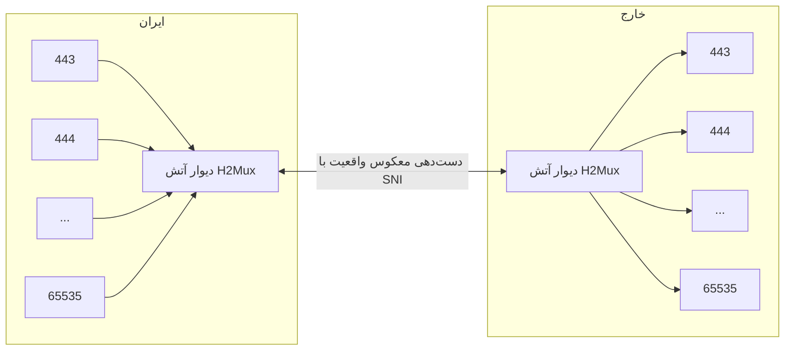

# Reverse Reality Tunnel

Reverse Reality Tunnel یک نسخه پیشرفته از تونل RTT است که عملکرد بهتری را ارائه می‌دهد. برخلاف RTT، این تونل روی دیوار آتش (Firewall) دچار اختلالات جزئی نمی‌شود و قادر است از تمام هسته‌های پردازنده سرور استفاده کند، در حالی که RTT تنها از یک ترد پشتیبانی می‌کرد.

بر اساس دانش فعلی، این تونل حتی بدون استفاده از مالتی‌پلکسینگ (Multiplexing) نیز فیلتر نمی‌شود، اما برای بهبود عملکرد، می‌توان به راحتی آن را با پروتکل HTTP/2 ترکیب کرد.

برای پیاده‌سازی معکوس تونل واقعیت، می‌توان از پیکربندی زیر استفاده کرد:

- آدرس IP سرور در ایران: 1.1.1.1
- آدرس IP سرور در خارج از کشور: 2.2.2.2
- رمز عبور: passwd
- نام سرور مجازی (SNI): matrix.snapp.ir
- پورت‌های چندگانه: (443 - 65535)

### فلوچارت Reverse Reality Tunnel
```mermaid
flowchart LR;
    subgraph خارج;
    B1[443];
    B2[444];
    B3[...];
    B4[65535];
    W_K[دیوار آتش] --> B1 & B2 & B3 & B4
    end;
    subgraph ایران;
    A1[443]    --> W_I;
    A2[444]    --> W_I;
    A3[...]    --> W_I;
    A4[65535]  --> W_I;
    W_I[دیوار آتش] <-- "دست‌دهی معکوس واقعیت با SNI"--> W_K
    W_I[دیوار آتش] <-- "دست‌دهی معکوس واقعیت با SNI"--> W_K
    W_I[دیوار آتش] <-- "دست‌دهی معکوس واقعیت با SNI"--> W_K
    W_I[دیوار آتش] <-- "دست‌دهی معکوس واقعیت با SNI"--> W_K
    end;
    ```

#### سرور ایران
```json
{
    "name": "reverse_reality_server_multiport",
    "nodes": [
        {
            "name": "users_inbound",
            "type": "TcpListener",
            "settings": {
                "address": "0.0.0.0",
                "port": [443,65535],
                "nodelay": true
            },
            "next": "header"
        },
        {
            "name": "header",
            "type": "HeaderClient",
            "settings": {
                "data": "src_context->port"
            },
            "next": "bridge2"
        },
        {
            "name": "bridge2",
            "type": "Bridge",
            "settings": {
                "pair": "bridge1"
            }
        },
        {
            "name": "bridge1",
            "type": "Bridge",
            "settings": {
                "pair": "bridge2"
            }
        },
        {
            "name": "reverse_server",
            "type": "ReverseServer",
            "settings": {},
            "next": "bridge1"
        },
        {
            "name": "reality_server",
            "type": "RealityServer",
            "settings": {
                "destination": "reality_dest",
                "password": "passwd"
            },
            "next": "reverse_server"
        },
        {
            "name": "kharej_inbound",
            "type": "TcpListener",
            "settings": {
                "address": "0.0.0.0",
                "port": 443,
                "nodelay": true,
                "whitelist": [
                    "2.2.2.2/32"
                ]
            },
            "next": "reality_server"
        },
        {
            "name": "reality_dest",
            "type": "TcpConnector",
            "settings": {
                "nodelay": true,
                "address": "matrix.snapp.ir",
                "port": 443
            }
        }
    ]
}
```
#### سرور خارج

```json
{
    "name": "reverse_reality_client_multiport",
    "nodes": [
        {
            "name": "outbound_to_core",
            "type": "TcpConnector",
            "settings": {
                "nodelay": true,
                "address": "127.0.0.1",
                "port": "dest_context->port"
            }
        },
        {
            "name": "header",
            "type": "HeaderServer",
            "settings": {
                "override": "dest_context->port"
            },
            "next": "outbound_to_core"
        },
        {
            "name": "bridge1",
            "type": "Bridge",
            "settings": {
                "pair": "bridge2"
            },
            "next": "header"
        },
        {
            "name": "bridge2",
            "type": "Bridge",
            "settings": {
                "pair": "bridge1"
            },
            "next": "reverse_client"
        },
        {
            "name": "reverse_client",
            "type": "ReverseClient",
            "settings": {
                "minimum-unused": 16
            },
            "next": "reality_client"
        },
        {
            "name": "reality_client",
            "type": "RealityClient",
            "settings": {
                "sni": "matrix.snapp.ir",
                "password": "passwd"
            },
            "next": "outbound_to_iran"
        },
        {
            "name": "outbound_to_iran",
            "type": "TcpConnector",
            "settings": {
                "nodelay": true,
                "address": "1.1.1.1",
                "port": 443
            }
        }
    ]
}
```

:::tip
برای ترکیب معکوس تونل واقعیت با مالتی‌پلکسینگ، می‌توان از پروتکل HTTP/2 و gRPC استفاده کرد:

توجه: در صورت مشاهده تأخیر پینگ بالا روی سرور مکس، ممکن است سیستم فیلترینگ اختلال ایجاد کند. در این صورت، باید از Half-duplex استفاده کنید که مستندات آن در ویکی موجود است.
:::

## پیکربندی سرور در ایران (با HTTP/2 و gRPC)

### فلوچارت


#### سرور ایران
```json
{
    "name": "reverse_reality_grpc_server_multiport",
    "nodes": [
        {
            "name": "users_inbound",
            "type": "TcpListener",
            "settings": {
                "address": "0.0.0.0",
                "port": [443,65535],
                "nodelay": true
            },
            "next": "header"
        },
        {
            "name": "header",
            "type": "HeaderClient",
            "settings": {
                "data": "src_context->port"
            },
            "next": "bridge2"
        },
        {
            "name": "bridge2",
            "type": "Bridge",
            "settings": {
                "pair": "bridge1"
            }
        },
        {
            "name": "bridge1",
            "type": "Bridge",
            "settings": {
                "pair": "bridge2"
            }
        },
        {
            "name": "reverse_server",
            "type": "ReverseServer",
            "settings": {},
            "next": "bridge1"
        },
        {
            "name": "pbserver",
            "type": "ProtoBufServer",
            "settings": {},
            "next": "reverse_server"
        },
        {
            "name": "h2server",
            "type": "Http2Server",
            "settings": {},
            "next": "pbserver"
        },
        {
            "name": "reality_server",
            "type": "RealityServer",
            "settings": {
                "destination": "reality_dest",
                "password": "passwd"
            },
            "next": "h2server"
        },
        {
            "name": "kharej_inbound",
            "type": "TcpListener",
            "settings": {
                "address": "0.0.0.0",
                "port": 443,
                "nodelay": true,
                "whitelist": [
                    "2.2.2.2/32"
                ]
            },
            "next": "reality_server"
        },
        {
            "name": "reality_dest",
            "type": "TcpConnector",
            "settings": {
                "nodelay": true,
                "address": "matrix.snapp.ir",
                "port": 443
            }
        }
    ]
}
```

#### سرور خارج
```json
{
    "name": "reverse_reality_grpc_client_multiport",
    "nodes": [
        {
            "name": "outbound_to_core",
            "type": "TcpConnector",
            "settings": {
                "nodelay": true,
                "address": "127.0.0.1",
                "port": "dest_context->port"
            }
        },
        {
            "name": "header",
            "type": "HeaderServer",
            "settings": {
                "override": "dest_context->port"
            },
            "next": "outbound_to_core"
        },
        {
            "name": "bridge1",
            "type": "Bridge",
            "settings": {
                "pair": "bridge2"
            },
            "next": "header"
        },
        {
            "name": "bridge2",
            "type": "Bridge",
            "settings": {
                "pair": "bridge1"
            },
            "next": "reverse_client"
        },
        {
            "name": "reverse_client",
            "type": "ReverseClient",
            "settings": {
                "minimum-unused": 8
            },
            "next": "pbclient"
        },
        {
            "name": "pbclient",
            "type": "ProtoBufClient",
            "settings": {},
            "next": "h2client"
        },
        {
            "name": "h2client",
            "type": "Http2Client",
            "settings": {
                "host": "matrix.snapp.ir",
                "port": 443,
                "path": "/",
                "content-type": "application/grpc"
            },
            "next": "reality_client" 
        },
        {
            "name": "reality_client",
            "type": "RealityClient",
            "settings": {
                "sni": "matrix.snapp.ir",
                "password": "passwd"
            },
            "next": "outbound_to_iran"
        },
        {
            "name": "outbound_to_iran",
            "type": "TcpConnector",
            "settings": {
                "nodelay": true,
                "address": "1.1.1.1",
                "port": 443
            }
        }
    ]
}
```
:::info
با این پیکربندی، معکوس تونل واقعیت با استفاده از مالتی‌پلکسینگ HTTP/2 و gRPC پیاده‌سازی می‌شود و عملکرد بهینه‌تری را ارائه می‌دهد.
:::