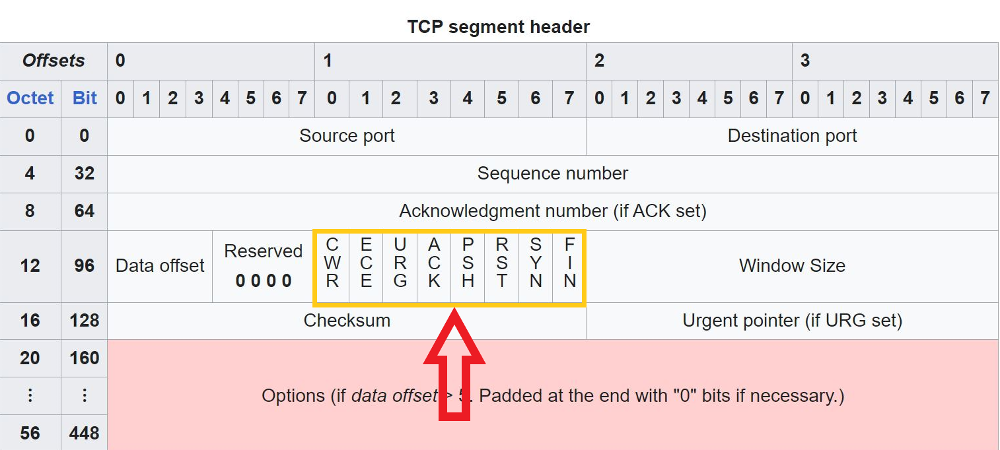

# Reset Tunnel


مدت ها بود که می خواستم رفتار فایروال رو برسی کنم وقتی که پکت در لایه های پایین تر تغییر پیدا کنه .

نود های کار با پکت های لایه ۳ بالاخره روی واتروال پیاده سازی شد.

تغییر پکت ها روی لایه های ۳ و ۴ به ما امکان اینو میده که ۱۰ ها روش تونل جدید درست کنیم ؛ روش هایی که هرکودم شکل خودشون برای ارسال دیتا رو پیاده می کنن
و دیگه محدود به قوانینی که سیستم عامل قرار داده نیستن ؛ مثلا دیگه میشه به جای tcp / udp اومد و دیتا رو بر روی پروتکل هایی مثل icmp / appletalk / NetBios رد کرد .

و همچنین میشه همه این پروتکل هارو به صورت بی قاعده تغییر داد و به حداکثر flexibility در اجرای پروتکل دست یافت.

لیست پروتکل های لایه ۴ در این لینک هستن.

https://en.wikipedia.org/wiki/Transport_layer

و لیست پروتکل های لایه ۳ در این لینک.

https://en.wikipedia.org/wiki/Network_layer

که ما همه این هارو در اختیار خواهیم داشت و آروم آروم سراغشون خواهیم رفتار.

---

##  نتیجه تست ها بر روی آیپی های مختلف


از ماه ها قبل شاهد این بودیم که سرعت دانلود روی ایپی های هتزنر خیلی کم شده بود و این تانع معکوس هم اذیت می کرد؛ نمی دونستیم که دقیقا چه محدودیتی گذاشتن.

تست هایی که زدیم فهمیدهیم که به sni ربطی نداره ؛ سرعت توی لایه های پایین تر لیمیت شده.


سپس به ۲ فرضیه رسیدیم ؛ یا سرعت و اختلال روی ایپی های هتزنر در لایه ۴ اتفاق افتاده یا در لایه ۳ .

بعداز اینکه ریست تانل تکمیل شد و تستش کردیم ؛ به جواب سوالمون رسیدیم که این لیمیت ها روی لایه ۳ بودن..

که درکل یعنی الان ریست تانل این نتایج رو به شما میده روی ایپی های مختلف:.


1- اگه ایپی کاملا کثیف باشه و بلاک شده باشه که یعنی اگه نتونید ایپی رو پینگ کنید ؛ ریست تانل هم کارساز نیست و تونلتون وصل نمی شه.


2- اگه ایپی نیمه کثیف باشه ؛ معمولا ۷۰ درصد ایپی های هتزنر اینجورین ؛ اون وقت شما یه لیمیت سرعت خواهید داشت که ریست تانل هم توانایی دور زدن این لیمیت را نداره .

چون که رسما رو لایه ایپی محدودیت گذاشته شده ؛ اینجوری بگم که فیلتر چی ترتیب اون ایپی رو داده و روشی نیست که بشه لیمیتش رو دور زد 

مگه اینکه تغییرات در لایه ایپی (لایه ۳) بدهیم.


در روش ریست تانل تغییرات روی لایه ۴ انجام می شود ؛ روشی که لایه ایپی رو تغییر بده هم میشه پیاده کرد و همین الان هم نودهای واتروال ساپورت می کنن ولی مشکل اینه که هم دیتا سنتر ایران
و هم دیتا سنتر خارج پکت هاشو دراپ می کنن ؛ اگه ایپی پکت جعل بشه پکت دراپ میشه (البته یکی دو حالت برای دور زدن این هست ؛ که به محض اینکه تحقیقاتم تموم شه و نتیجه بگیرم روش تونلشو میزارم).


3- در حالت سوم که ایپی مشکلی نداشته باشه این تانل با سرعت بسیار بالا کار خواهد کرد و فایروال نمی تواند پکت هاشو نگه داره و اختلالی از نوع پینگ توش ایجاد کنه

چون پکت هاش بی معنی هستن ؛ اینجا دیگه اصلا sni و چیز های دیگه معنی نداره و نیازی هم بهش نیست و ما عادی پورت فوروارد می کنیم روی این روش،

طبق تست هایی که این چند روز زدم ؛ فعلا که ایپی بلاک نشد یا سرورم اکسس نشد ولی خوب تست ها باید طولانی مدت زده بشه تا واقعا متوجه بشیم بلاک میشه یا نه

حدس من اینه که فعلا این روش بلاک نمی شه چون تشخیصش هم خیلی سخته هم ما کلی حالت ایجاد می کنیم و خواهیم کرد ؛ همیشه یک حالت نیستیم که ساده تشخیص داده بشه.


---

## برسی  ایده کارکرد این روش


ریست تانل اولین روشی هست که با دستکاری توی لایه های زیری شبکه ایجاد می کنیم ؛ تمام ایده این روش اینه که پروتکل tcp عادی رد و بدل میشه منتهی با یک تغییر؛ .

در پروتکل tcp فلگ های مختلفی داریم که لیستش اینجا هست.





ما با هر تغییری توی این ساختار می توانیم دیتا رو از استاندارد خارج کنیم ؛ اینطوری دیگه شخص میانی توانایی باز خوانی پکت ها و به اصطلاح reassembly را نخواهد داشت

در روش reset tunnel تغییری که اینجا شکل گرفته این هست که ؛ در تمام پکت های tcp فلگ reset ست میشه .

اینجوری پکت ها همه از نوع reset حساب میشن که کاربرد این فلگ برای این هست که کانکشن ها بسته بشه.

ولی خوب ما وقتی پکت رو دریافت می کنیم ؛ اگه از ایپی سرور تونل ما بود ؛ بیت رو دستی خاموش می کنیم و پکت اصلاح شده رو تحویل سیستم عامل می دهیم تا اتصال درست برقرار بشه.


همچنین این اتفاق توی دیتا برگشتی هم میفته تا کاملا تمام پکت ها به این شکل دستکاری شده باشن؛ دیتای ارسال از سیستم عامل دریافت میشه و پکت تغییر می کنه.

که در اینجا یعنی بیت ریست ست میشه ؛ سپس پکت به اصطلاح inject میشه به شبکه.


این شاید ساده ترین تونلیه که میشه زد و در آینده node هایی میارم که بیت هارو با هم جا به جا کنیم ؛ مثلا جای بیت fin با init عوض بشه.

و کلی حالت های دیگه که فقط میشه روی Tcp زد و سایر پرتوکل های لایه ۳و ۴ هم داریم که خیلی حالت میشه.

---

## اجرای تونل

:::warning

قبل از هرچیزی ؛ باید بگم کسی که این روش رو اجرا می کنه باید ریست کردن ایپی تیبل رو بلد باشه.

از این مجموعه دستورات برای ریست کردن ایپی تیبل استفاده کنید.

```sh

sudo iptables -P INPUT ACCEPT
sudo iptables -P FORWARD ACCEPT
sudo iptables -P OUTPUT ACCEPT
 
# Flush All Iptables Chains/Firewall rules #
sudo iptables -F
 
# Delete all Iptables Chains #
sudo iptables -X
 
# Flush all counters too #
sudo iptables -Z 
# Flush and delete all nat and  mangle #
sudo iptables -t nat -F
sudo iptables -t nat -X
sudo iptables -t mangle -F
sudo iptables -t mangle -X
sudo iptables -t raw -F
sudo iptables -t raw -X

```


وقتی با واتروال تونل های این مدلی میزنید ؛ واتروال روتینگ سیستم عامل رو دستکاری می کنه.


و این یعنی چند دستور ایپی تیبل هم ست می کنه ؛ که خوب وقتی واتروال بسته بشه هم تمام دستورات رو خودش تمیز میکنه.

اما

در دو حالت واتروال نمی تونه دستورات رو تمیز کنه ؛ حالت اول اینه که کرش کنه و حالت دوم هم اینه که hard kill بشه.

و اگه اینجوری شد باید ایپی تیبل رو خودتون حتما ریست کنید ؛ ریست کردن اش یا با ری استارت ماشین مجازی یا با همین دستوراتی که گفتم انجام میشه.

اگه ایپی تیبل ریست نشه در این حالت ؛ دیگه نه با واتروال و نه با هیچ روش تانل دیگه ای به ایپی سرور خارج ارتباط نخواهید داشت.

پس از این نظر مهمه که بلد باشید ایپی تیبل رو ریست کنید.


من خودم همیشه قبل از اجرای واتروال یه بار ریست رو انجام می دهم.

:::


:::warning

حتما چک کنید ufw خاموش باشه

```sh
sudo ufw disable
```


:::


برای اجرای ریست تانل این مثال رو برسی می کنیم ؛ این مثال تمام پورت های 23 به بالا را تونل می کنه

فایل json در این روش یک مقداری طولانی ممکنه بشه ؛ لطفا با دقت مقادیر را جای گذاری کنید


---

## سرور ایران


:::info

ایپی سرور ایران .7.7.7.7 فرض شده و یک بار در json آمده

ایپی سرور خارج 9.9.9.9 فرض شده و دو بار در json آمده

:::

پس در این فایل جای این دو باید ایپی خودتون رو بزارید 

تنها چیزی هم که باید عوض کنید همین ایپی ایران و خارج هست

:::warning

به چیز دیگه ای دست نزنید بخصوص ایپی هایی که با عدد 10 شروع شدن

:::


```json title="سرور ایران"

{
    "name": "reset_tunnel_iran",
    "nodes": [
        {
            "name": "input",
            "type": "TcpListener",
            "settings": {
                "address": "0.0.0.0",
                "port": [23, 65535],
                "nodelay": true
            },
            "next": "output"
        },
        {
            "name": "output",
            "type": "TcpConnector",
            "settings": {
                "nodelay": true,
                "address": "10.0.0.2",
                "port": "src_context->port"
            }
        },


        {
            "name": "tdev",
            "type": "TunDevice",
            "settings": {
                "device-name": "tun0",
                "device-ip": "10.0.0.1/24"
            }
        },
        {
            "name": "rdev",
            "type": "RawDevice",
            "settings": {
                "mode": "injector"
            }
        },
        {
            "name": "cdev",
            "type": "CaptureDevice",
            "settings": {
                "direction": "incoming",
                "filter-mode": "source-ip",
                "ip": "9.9.9.9/32"
            }
        },


        {
            "name": "route1_receiver",
            "type": "Layer3Receiver",
            "settings": {
                "device": "tdev"
            },
            "next": "route1_source_changer"
        },
        {
            "name": "route1_source_changer",
            "type": "Layer3IpOverrider",
            "settings": {
                "mode": "source-ip",
                "ipv4": "7.7.7.7"
            },
            "next": "tcp_reset_on"
        },
        {
            "name": "tcp_reset_on",
            "type": "Layer3TcpManipulator",
            "settings": {
                "bit-reset": "on"
            },
            "next": "route1_dest_setter"
        },
        {
            "name": "route1_dest_setter",
            "type": "Layer3IpOverrider",
            "settings": {
                "mode": "dest-ip",
                "ipv4": "9.9.9.9"
            },
            "next": "route1_writer"
        },
        {
            "name": "route1_writer",
            "type": "Layer3Sender",
            "settings": {
                "device": "rdev"
            }
        },


        {
            "name": "route2_receiver",
            "type": "Layer3Receiver",
            "settings": {
                "device": "cdev"
            },
            "next": "route2_source_changer"
        },
        {
            "name": "route2_source_changer",
            "type": "Layer3IpOverrider",
            "settings": {
                "mode": "source-ip",
                "ipv4": "10.0.0.2"
            },
            "next": "tcp_reset_off"
        },
        {
            "name": "tcp_reset_off",
            "type": "Layer3TcpManipulator",
            "settings": {
                "bit-reset": "off"
            },
            "next": "route2_dest_setter"
        },
        {
            "name": "route2_dest_setter",
            "type": "Layer3IpOverrider",
            "settings": {
                "mode": "dest-ip",
                "ipv4": "10.0.0.1"
            },
            "next": "route2_writer"
        },
        {
            "name": "route2_writer",
            "type": "Layer3Sender",
            "settings": {
                "device": "tdev"
            }
        }
    ]
}

```

همین کافیه و برنامه در سرور ایران با این کانفیگ قابل اجرا هست

---

## سرور خارج

:::info

ایپی سرور ایران .7.7.7.7 فرض شده و دو بار در json آمده

ایپی سرور خارج 9.9.9.9 فرض شده و یک بار در json آمده

مثل سرور ایران ؛ فقط همین ایپی هارو جا گذاری کنید

:::


```json title="سرور خارج"
{
    "name": "reset_tunnel_kharej",
    "nodes": [

        {
            "name": "tdev",
            "type": "TunDevice",
            "settings": {
                "device-name": "tun0",
                "device-ip": "10.0.0.1/24"
            }
        },
        {
            "name": "rdev",
            "type": "RawDevice",
            "settings": {
                "mode": "injector"
            }
        },
        {
            "name": "cdev",
            "type": "CaptureDevice",
            "settings": {
                "direction": "incoming",
                "filter-mode": "source-ip",
                "ip": "7.7.7.7/32"
            }
        },


        
        {
            "name": "route1_receiver",
            "type": "Layer3Receiver",
            "settings": {
                "device": "tdev"
            },
            "next": "route1_source_changer"
        },
        {
            "name": "route1_source_changer",
            "type": "Layer3IpOverrider",
            "settings": {
                "mode": "source-ip",
                "ipv4": "9.9.9.9"
            },
            "next": "tcp_reset_on"
        },
        {
            "name": "tcp_reset_on",
            "type": "Layer3TcpManipulator",
            "settings": {
                "bit-reset": "on"
            },
            "next": "route1_dest_setter"
        },
        {
            "name": "route1_dest_setter",
            "type": "Layer3IpOverrider",
            "settings": {
                "mode": "dest-ip",
                "ipv4": "7.7.7.7"
            },
            "next": "route1_writer"
        },
        {
            "name": "route1_writer",
            "type": "Layer3Sender",
            "settings": {
                "device": "rdev"
            }
        },

        
        {
            "name": "route2_receiver",
            "type": "Layer3Receiver",
            "settings": {
                "device": "cdev"
            },
            "next": "route2_source_changer"
        },
        {
            "name": "route2_source_changer",
            "type": "Layer3IpOverrider",
            "settings": {
                "mode": "source-ip",
                "ipv4": "10.0.0.2"
            },
            "next": "tcp_reset_off"
        },
        {
            "name": "tcp_reset_off",
            "type": "Layer3TcpManipulator",
            "settings": {
                "bit-reset": "off"
            },
            "next": "route2_dest_setter"
        },
        {
            "name": "route2_dest_setter",
            "type": "Layer3IpOverrider",
            "settings": {
                "mode": "dest-ip",
                "ipv4": "10.0.0.1"
            },
            "next": "route2_writer"
        },
        {
            "name": "route2_writer",
            "type": "Layer3Sender",
            "settings": {
                "device": "tdev"
            }
        }
    ]
}

```


اگه درست اجرا کرده باشین باید تانل برقرار بشه ؛ شما میتوانید دریافت پکت های تغییر یافته رو با این دستور دیباگ کنید
و چک کنید چی ارسال دریفایت میشه

```sh

sudo tcpdump -i eth0 src 1.1.1.1 and tcp

```


---
## سرور خارج واسطه

اگه شما نمیخواید تونل رو مستقیما بین سرور ایران و خارجتون برقرار کنید ؛ مثلا میخواید یه سرور خارج جدید بگیرید

و اینطوری تانل کنید که سرور ایران به سرور خارج جدید وصل بشه با ریست تانل و سپس از سرور خارج جدید وصل بشه به سرور اصلی

لازمه کانفیگ فایل سرور خارج رو تغییر بدید

این دوتا node را به کانفیگ سرور خارج اضافه کنید


```json = "443 تک پورت"

{
    "name": "input",
    "type": "TcpListener",
    "settings": {
        "address": "0.0.0.0",
        "port": 443,
        "nodelay": true
    },
    "next": "output"
},
{
     "name": "output",
     "type": "TcpConnector",
     "settings": {
         "nodelay": true,
         "address": "5.5.5.5",
         "port": 443
    }
}

```


```json = "مالتی پورت"

{
    "name": "input",
    "type": "TcpListener",
    "settings": {
        "address": "0.0.0.0",
        "port": [23, 65535],
        "nodelay": true
    },
    "next": "output"
},
{
     "name": "output",
     "type": "TcpConnector",
     "settings": {
         "nodelay": true,
         "address": "5.5.5.5",
         "port": "src_context->port"
    }
}

```

هم تک پورت رو گذاشتم هم مالتی پورت ؛‌ تک پورت رو گذاشتم چون تست کردم و کارکرده ولی مالتی پورتو تست کردم

احتمالش خیلی کمه ولی اگه مالتی پورت نشد تک پورت وصل کنید به خارج اصلی


