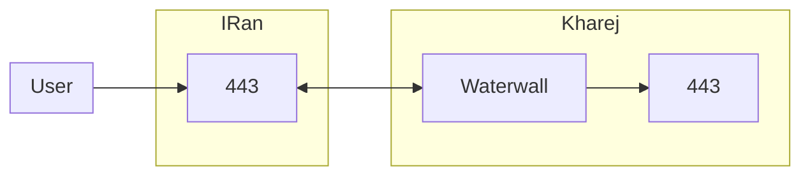
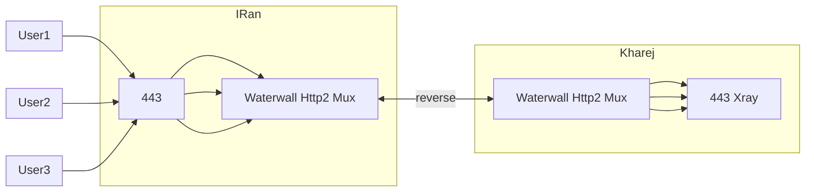

# Reverse Tunnel

روش تونل معکوس (Reverse Tunnel) یک راه حل قدرتمند برای دور زدن سیستم های فیلترینگ و سانسور است. در این روش، به جای اینکه کاربر مستقیماً به سرور خارج وصل شود، ابتدا سرور خارج مانند یک کاربر خارجی به سرور ایران متصل می شود و منتظر می ماند. سپس کاربر ایرانی به سرور ایران وصل می شود و سرور ایران اتصال کاربر ایرانی و سرور خارج را به هم پیوند می دهد. به این ترتیب یک ارتباط بین کاربر ایرانی و سرور خارج برقرار می شود.

جلوگیری از این نوع اتصال برای سیستم های فیلترینگ و سانسور دشوار است. با این حال، سیستم فیلترینگ ایران اخیراً تلاش هایی برای مقابله با این روش انجام داده است:

1. برخی آی پی های خارجی، به ویژه از هتزنر، ممکن است سرعت مناسبی نداشته باشند. البته این مورد اکنون کمتر دیده می شود.

2. دامنه ای که سرور خارج با آن به ایران وصل می شود، تأثیر زیادی بر کیفیت اتصال و پینگ دارد. بهتر است از دامنه ای استفاده شود که کمتر استفاده شده و فیلتر نشده باشد.

## روش ساده (Simple)

ساده ترین نوع تونل معکوس، اتصال TCP است. در این روش، کاربران به پورت `443` سرور ایران وصل می شوند و در نهایت به پورت `443` سرور خارج متصل می شوند.

### فلوچارت Simple



```json title="سرور ایران"
{
  "name": "myconf",
  "nodes": [
    {
      "name": "users_inbound",
      "type": "TcpListener",
      "settings": {
        "address": "0.0.0.0",
        "port": 443,
        "nodelay": true
      },
      "next": "bridge2"
    },

    {
      "name": "bridge2",
      "type": "Bridge",
      "settings": {
        "pair": "bridge1"
      }
    },
    {
      "name": "bridge1",
      "type": "Bridge",
      "settings": {
        "pair": "bridge2"
      }
    },
    {
      "name": "reverse_server",
      "type": "ReverseServer",
      "settings": {},
      "next": "bridge1"
    },
    {
      "name": "kharej_inbound",
      "type": "TcpListener",
      "settings": {
        "address": "0.0.0.0",
        "port": 443,
        "nodelay": true,
        "whitelist": ["2.2.2.2/32"]
      },
      "next": "reverse_server"
    }
  ]
}
```

```json title="سرور خارج"
{
  "name": "reverse_simple",
  "nodes": [
    {
      "name": "outbound_to_core",
      "type": "TcpConnector",
      "settings": {
        "nodelay": true,
        "address": "127.0.0.1",
        "port": 443
      }
    },

    {
      "name": "bridge1",
      "type": "Bridge",
      "settings": {
        "pair": "bridge2"
      },
      "next": "outbound_to_core"
    },
    {
      "name": "bridge2",
      "type": "Bridge",
      "settings": {
        "pair": "bridge1"
      },
      "next": "reverse_client"
    },

    {
      "name": "reverse_client",
      "type": "ReverseClient",
      "settings": {
        "minimum-unused": 16
      },
      "next": "outbound_to_iran"
    },
    {
      "name": "outbound_to_iran",
      "type": "TcpConnector",
      "settings": {
        "nodelay": true,
        "address": "1.1.1.1",
        "port": 443
      }
    }
  ]
}
```

:::tip نکته
این نوع تونل معکوس سبک و سریع است، اما فاقد رمزنگاری قوی و محدودیت تعداد اتصالات است. سرور خارج باید به تعداد کل کاربران به سرور ایران اتصال برقرار کند که ممکن است توسط فایروال ایران بلاک شود.
:::

## TLS و HTTP/2

استفاده از TLS و HTTP/2 تونل معکوس را تکمیل می کند و سرعت و امنیت بالایی فراهم می کند. کیفیت اتصال به دامنه مورد استفاده بستگی دارد. در صورت نیاز می توان از Reality استفاده کرد.

### فلوچارت TLS و HTTP/2



```json title="سرور ایران"
{
  "name": "reverse_tls_h2_multi_iran",
  "nodes": [
    {
      "name": "inbound_users",
      "type": "TcpListener",
      "settings": {
        "address": "0.0.0.0",
        "port": [80, 65535],
        "nodelay": true
      },
      "next": "header"
    },
    {
      "name": "header",
      "type": "HeaderClient",
      "settings": {
        "data": "src_context->port"
      },
      "next": "bridge2"
    },
    {
      "name": "bridge2",
      "type": "Bridge",
      "settings": {
        "pair": "bridge1"
      }
    },
    {
      "name": "bridge1",
      "type": "Bridge",
      "settings": {
        "pair": "bridge2"
      }
    },
    {
      "name": "reverse_server",
      "type": "ReverseServer",
      "settings": {},
      "next": "bridge1"
    },
    {
      "name": "pbserver",
      "type": "ProtoBufServer",
      "settings": {},
      "next": "reverse_server"
    },
    {
      "name": "h2server",
      "type": "Http2Server",
      "settings": {},
      "next": "pbserver"
    },
    {
      "name": "sslserver",
      "type": "OpenSSLServer",
      "settings": {
        "cert-file": "fullchain.pem",
        "key-file": "privkey.pem",
        "alpns": [
          {
            "value": "h2",
            "next": "node>next"
          },
          {
            "value": "http/1.1",
            "next": "node>next"
          }
        ],
        "fallbackintencedelay": 0
      },
      "next": "h2server"
    },
    {
      "name": "inbound_server_kharej",
      "type": "TcpListener",
      "settings": {
        "address": "0.0.0.0",
        "port": 443,
        "nodelay": true,
        "whitlelist": ["2.2.2.2/32"]
      },
      "next": "sslserver"
    }
  ]
}
```

```json title="سرور خارج"
{
  "name": "reverse_tls_h2_multi_kharej",
  "nodes": [
    {
      "name": "core_outbound",
      "type": "TcpConnector",
      "settings": {
        "nodelay": true,
        "address": "127.0.0.1",
        "port": "dest_context->port"
      }
    },
    {
      "name": "header",
      "type": "HeaderServer",
      "settings": {
        "override": "dest_context->port"
      },
      "next": "core_outbound"
    },
    {
      "name": "bridge1",
      "type": "Bridge",
      "settings": {
        "pair": "bridge2"
      },
      "next": "header"
    },
    {
      "name": "bridge2",
      "type": "Bridge",
      "settings": {
        "pair": "bridge1"
      },
      "next": "reverse_client"
    },
    {
      "name": "reverse_client",
      "type": "ReverseClient",
      "settings": {
        "minimum-unused": 16
      },
      "next": "pbclient"
    },
    {
      "name": "pbclient",
      "type": "ProtoBufClient",
      "settings": {},
      "next": "h2client"
    },
    {
      "name": "h2client",
      "type": "Http2Client",
      "settings": {
        "host": "mydomain.ir",
        "port": 443,
        "path": "/",
        "content-type": "application/grpc"
      },
      "next": "sslclient"
    },
    {
      "name": "sslclient",
      "type": "OpenSSLClient",
      "settings": {
        "sni": "mydomain.ir",
        "verify": true,
        "alpn": "h2"
      },
      "next": "iran_outbound"
    },
    {
      "name": "iran_outbound",
      "type": "TcpConnector",
      "settings": {
        "nodelay": true,
        "address": "1.1.1.1",
        "port": 443
      }
    }
  ]
}
```
