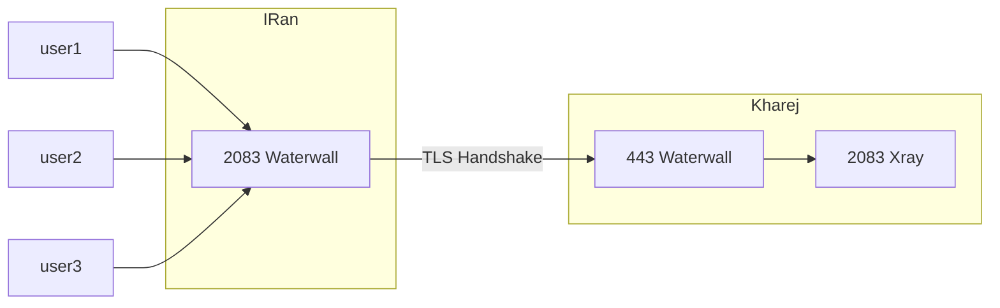
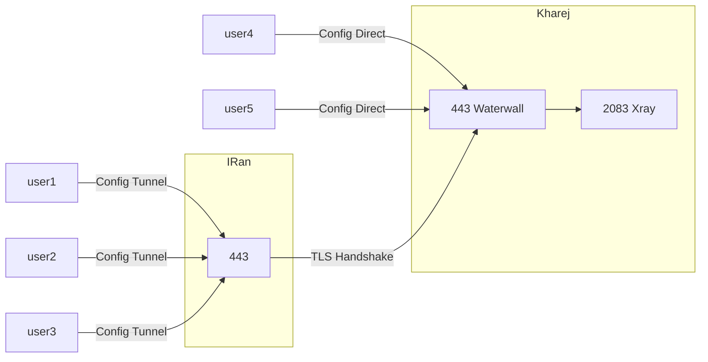
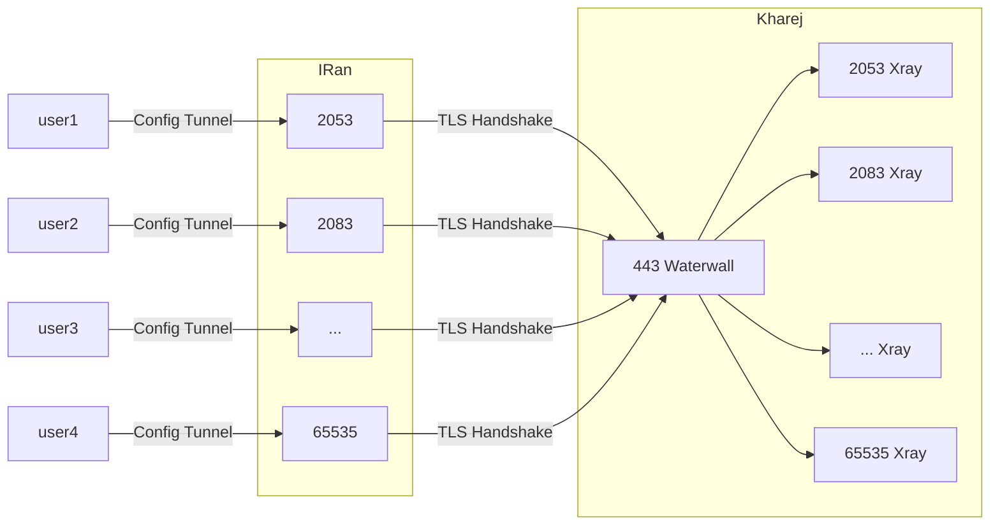

# TLS Tunnel

در این بخش، به بررسی تونل TLS می‌پردازیم که یک روش پیشرفته‌تر و امن‌تر نسبت به تونل پورت به پورت است. تونل TLS با استفاده از پروتکل امنیتی TLS، ارتباط رمزگذاری شده‌ای را بین سرور ایران و سرور خارج برقرار می‌کند.

## مزایای استفاده از تونل TLS

- مناسب برای بهبود سرعت در سرورهای خارجی مانند هتزنر که با تونل‌های معکوس مشکل سرعت دارند.
- در صورت استفاده ساده، ممکن است توسط فایروال ایران فیلتر شود. اما با اقداماتی مانند استفاده از ماکس و فعال‌سازی `anti-tls-in-tls`، می‌توان احتمال فیلتر شدن را به حداقل رساند.
- برای کاهش زمان هندشیک، بهتر است با `preconnect` ترکیب شود.

### نیازمندی‌ها

1. **دامنه**: برای برقراری تونل TLS، نیاز به یک دامنه است. دامنه‌های `.ir` ارزان‌ترین گزینه هستند و استفاده از آنها نگرانی خاصی ندارد.

2. **گواهینامه امنیتی (Certificate)**: برای دامنه، باید یک گواهینامه امنیتی دریافت شود. این کار را می‌توان با ابزار `certbot` انجام داد. دستورات نصب و درخواست گواهینامه به شرح زیر هستند:
   ```sh
   apt-get install certbot
   ```

```sh
sudo certbot certonly --standalone --preferred-challenges http --agree-tos --email emaileshoma@gmail.com -d sub.mydomain.ir
```

پس از اجرای دستورات، گواهینامه‌ها در قالب دو فایل fullchain.pem و privkey.pem ذخیره می‌شوند.

# حالت‌های مختلف تونل TLS

## حالت تک پورت و جدا

در این حالت، فرض می‌شود که همه کاربران روی یک پورت (مثلاً 2083) ساخته شده‌اند و پنل روی سرور خارج در حال اجراست.

### فلوچارت حالت تک پورت و جدا



```json title="سرور ایران"
{
  "name": "tls_port_to_port",
  "nodes": [
    {
      "name": "input",
      "type": "TcpListener",
      "settings": {
        "address": "0.0.0.0",
        "port": 2083,
        "nodelay": true
      },
      "next": "mysslclient"
    },
    {
      "name": "mysslclient",
      "type": "OpenSSLClient",
      "settings": {
        "sni": "mydomain.ir",
        "verify": true,
        "alpn": "http/1.1"
      },
      "next": "output"
    },
    {
      "name": "output",
      "type": "TcpConnector",
      "settings": {
        "nodelay": true,
        "address": "1.1.1.1",
        "port": 443
      }
    }
  ]
}
```

```json title="سرور خارج"
{
  "name": "tls_port_to_port_kharej",
  "nodes": [
    {
      "name": "input",
      "type": "TcpListener",
      "settings": {
        "address": "0.0.0.0",
        "port": 443,
        "nodelay": true
      },
      "next": "mysslserver"
    },
    {
      "name": "mysslserver",
      "type": "OpenSSLServer",
      "settings": {
        "cert-file": "fullchain.pem",
        "key-file": "privkey.pem",
        "alpns": [
          {
            "value": "h2",
            "next": "node->next"
          },
          {
            "value": "http/1.1",
            "next": "node->next"
          }
        ]
      },
      "next": "output"
    },
    {
      "name": "output",
      "type": "TcpConnector",
      "settings": {
        "nodelay": true,
        "address": "127.0.0.1",
        "port": 2083
      }
    }
  ]
}
```

## استفاده بهینه از پورت 443

برای استفاده بهینه از پورت 443 هم برای کاربران مستقیم و هم برای تونل، می‌توان کانفیگ را به شکل زیر تغییر داد:

### فلوچارت استفاده بهینه از پورت 443



```json title="سرور ایران"
{
  "name": "tls_port_to_port_iran",
  "nodes": [
    {
      "name": "input",
      "type": "TcpListener",
      "settings": {
        "address": "0.0.0.0",
        "port": 443,
        "nodelay": true
      },
      "next": "mysslclient"
    },
    {
      "name": "mysslclient",
      "type": "OpenSSLClient",
      "settings": {
        "sni": "mydomain.ir",
        "verify": true,
        "alpn": "http/1.1"
      },
      "next": "output"
    },
    {
      "name": "output",
      "type": "TcpConnector",
      "settings": {
        "nodelay": true,
        "address": "1.1.1.1",
        "port": 443
      }
    }
  ]
}
```

```json title="سرور خارج"
{
  "name": "tls_port_to_port_kharej",
  "nodes": [
    {
      "name": "input_direct_users",
      "type": "TcpListener",
      "settings": {
        "address": "0.0.0.0",
        "port": 443,
        "nodelay": true
      },
      "next": "output_direct_users"
    },
    {
      "name": "output_direct_users",
      "type": "TcpConnector",
      "settings": {
        "nodelay": true,
        "address": "127.0.0.1",
        "port": 2083
      }
    },
    {
      "name": "input_tunnel",
      "type": "TcpListener",
      "settings": {
        "address": "0.0.0.0",
        "port": 443,
        "nodelay": true,
        "whitelist": ["2.2.2.2/32"]
      },
      "next": "mysslserver"
    },
    {
      "name": "mysslserver",
      "type": "OpenSSLServer",
      "settings": {
        "cert-file": "fullchain.pem",
        "key-file": "privkey.pem",
        "alpns": [
          {
            "value": "h2",
            "next": "node->next"
          },
          {
            "value": "http/1.1",
            "next": "node->next"
          }
        ]
      },
      "next": "output_tunnel"
    },
    {
      "name": "output_tunnel",
      "type": "TcpConnector",
      "settings": {
        "nodelay": true,
        "address": "127.0.0.1",
        "port": 2083
      }
    }
  ]
}
```

## حالت مالتی پورت

در این حالت، کاربر به هر پورتی که روی سرور ایران وصل شود، به همان پورت روی سرور خارج وصل می‌شود. تبادل اطلاعات از طریق کانکشن TLS بین Waterwall سرور ایران و پورت 443 سرور خارج انجام می‌شود.

### فلوچارت حالت مالتی پورت



```json title="سرور ایران"
{
  "name": "tls_multiport_iran",
  "nodes": [
    {
      "name": "input",
      "type": "TcpListener",
      "settings": {
        "address": "0.0.0.0",
        "port": [23, 65535],
        "nodelay": true
      },
      "next": "port_header"
    },
    {
      "name": "port_header",
      "type": "HeaderClient",
      "settings": {
        "data": "src_context->port"
      },
      "next": "sslclient"
    },
    {
      "name": "sslclient",
      "type": "OpenSSLClient",
      "settings": {
        "sni": "mydomain.ir",
        "verify": true,
        "alpn": "http/1.1"
      },
      "next": "output"
    },
    {
      "name": "output",
      "type": "TcpConnector",
      "settings": {
        "nodelay": true,
        "address": "1.1.1.1",
        "port": 443
      }
    }
  ]
}
```

```json title="سرور خارج"
{
  "name": "tls_multiport_kharej",
  "nodes": [
    {
      "name": "input",
      "type": "TcpListener",
      "settings": {
        "address": "0.0.0.0",
        "port": 443,
        "nodelay": true
      },
      "next": "sslserver"
    },
    {
      "name": "sslserver",
      "type": "OpenSSLServer",
      "settings": {
        "cert-file": "fullchain.pem",
        "key-file": "privkey.pem",
        "alpns": [
          {
            "value": "h2",
            "next": "node->next"
          },
          {
            "value": "http/1.1",
            "next": "node->next"
          }
        ],
        "fallback-intence-delay": 0
      },
      "next": "port_header"
    },
    {
      "name": "port_header",
      "type": "HeaderServer",
      "settings": {
        "override": "dest_context->port"
      },
      "next": "output"
    },
    {
      "name": "output",
      "type": "TcpConnector",
      "settings": {
        "nodelay": true,
        "address": "127.0.0.1",
        "port": "dest_context->port"
      }
    }
  ]
}
```

### دانشنامه اصطلاحات

- TLS (Transport Layer Security): پروتکل امنیتی که ارتباطات رمزگذاری شده را در اینترنت فراهم می‌کند.
- گواهینامه SSL/TLS (SSL/TLS Certificate): فایلی دیجیتالی که صحت هویت وب‌سایت را تأیید می‌کند و ارتباط امن بین کاربر و سرور را ممکن می‌سازد.
- Certbot: ابزاری برای دریافت و نصب خودکار گواهینامه‌های SSL/TLS از Let's Encrypt.
- SNI (Server Name Indication): فناوری که به کاربر اجازه می‌دهد نام دامنه مورد نظر را در درخواست SSL/TLS مشخص کند تا سرور بتواند گواهینامه مناسب را ارائه دهد.
- ALPN (Application-Layer Protocol Negotiation): پروتکلی که به کاربر و سرور اجازه می‌دهد تا پروتکل لایه کاربردی مورد استفاده (مانند HTTP/2) را مذاکره کنند.
