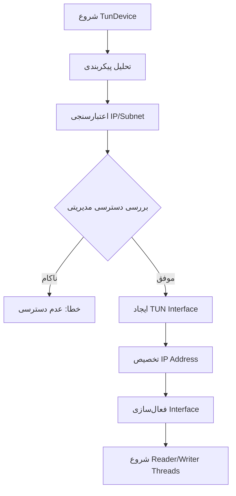
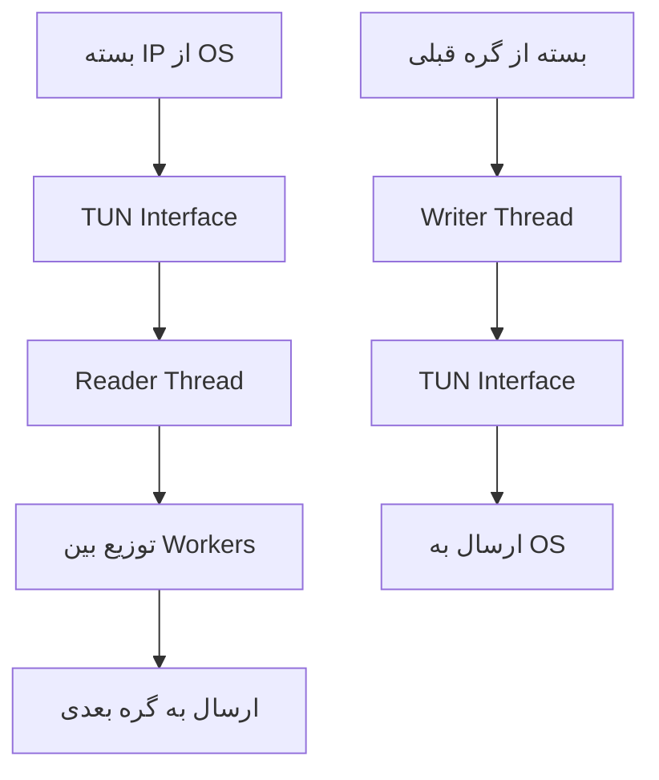

# TunDevice

گره **TunDevice** یک گره دستگاه شبکه لایه 3 است که یک interface مجازی TUN (tunnel) را در سیستم‌عامل ایجاد و مدیریت می‌کند. این گره به عنوان پلی بین سیستم تونل‌سازی WaterWall و network stack سیستم‌عامل میزبان عمل می‌کند.

## عملکرد

گره TunDevice وظایف زیر را انجام می‌دهد:

- **ایجاد Interface مجازی**: ایجاد رابط TUN در سیستم‌عامل
- **مدیریت بسته‌های IP**: خواندن و نوشتن بسته‌های IP Layer 3
- **تعامل با OS**: ارتباط مستقیم با network stack سیستم‌عامل
- **مدیریت چند thread**: پردازش کارآمد بسته‌ها در محیط چند thread
- **پردازش دوطرفه**: مدیریت جریان بسته‌ها در هر دو جهت

## ویژگی‌های کلیدی

### Chain Head Node
- این گره معمولاً در ابتدای زنجیره قرار می‌گیرد
- قابلیت اتصال به انواع مختلف گره‌های بعدی

### پشتیبانی چند platform
- **Windows**: استفاده از WinTun driver
- **Linux**: استفاده از `/dev/net/tun`
- **macOS**: استفاده از BSD TUN interface

### مدیریت دسترسی
- نیاز به دسترسی مدیریتی در Windows
- نیاز به permissions مناسب در Linux/macOS

## پارامترهای پیکربندی

### پارامترهای ضروری

```json
{
  "name": "tun_interface",
  "type": "TunDevice",
  "settings": {
    "device-name": "ww-tun0",
    "device-ip": "10.0.0.1/24"
  }
}
```

- **`device-name`** (string): نام TUN interface در سیستم
  - مثال: `"ww-tun0"`, `"waterwall-tun"`
  - این نام در دستورات شبکه سیستم‌عامل قابل مشاهده است

- **`device-ip`** (string): آدرس IP با subnet mask به صورت CIDR
  - فرمت: `"IP_ADDRESS/SUBNET_MASK"`
  - مثال IPv4: `"192.168.1.1/24"`, `"10.0.0.1/8"`
  - مثال IPv6: `"2001:db8::1/64"`
  - محدودیت‌ها:
    - IPv4: prefix length 0-32
    - IPv6: prefix length 0-128

## نمونه‌های کاربردی

### 1. VPN Gateway ساده

```json
{
  "name": "vpn_gateway",
  "type": "TunDevice",
  "settings": {
    "device-name": "vpn-tun",
    "device-ip": "10.8.0.1/24"
  },
  "next": "encryption_node"
}
```

### 2. شبکه محلی مجازی

```json
{
  "name": "local_network",
  "type": "TunDevice",
  "settings": {
    "device-name": "local-tun",
    "device-ip": "192.168.100.1/24"
  },
  "next": "router_node"
}
```

### 3. تونل IPv6

```json
{
  "name": "ipv6_tunnel",
  "type": "TunDevice",
  "settings": {
    "device-name": "ipv6-tun",
    "device-ip": "2001:db8::1/64"
  },
  "next": "ipv6_handler"
}
```

### 4. شبکه آزمایشی

```json
{
  "name": "test_network",
  "type": "TunDevice",
  "settings": {
    "device-name": "test-tun",
    "device-ip": "172.16.0.1/16"
  },
  "next": "test_processor"
}
```

## مراحل پردازش

### مرحله راه‌اندازی


### جریان بسته‌ها


## معماری Thread

### Thread های اصلی
- **Reader Thread**: خواندن مداوم بسته‌ها از TUN interface
- **Writer Thread**: نوشتن بسته‌ها به TUN interface
- **Worker Distribution**: توزیع بسته‌ها بین workers مختلف

### مدیریت همزمانی
- **Channel-based Communication**: صف‌بندی کارآمد بسته‌ها
- **Atomic Operations**: شمارش thread-safe بسته‌ها
- **Buffer Pooling**: استفاده بهینه از buffer pools

## ملاحظات Platform

### Windows
```json
{
  "device-name": "WaterWall-Tun",
  "device-ip": "10.0.0.1/24"
}
```
- **نیازمندی**: WinTun driver
- **دسترسی**: اجرا با administrator privileges
- **API**: استفاده از Windows-specific API calls

### Linux
```json
{
  "device-name": "ww-tun0",
  "device-ip": "10.0.0.1/24"
}
```
- **Interface**: `/dev/net/tun`
- **دسترسی**: permissions مناسب برای TUN device
- **پیاده‌سازی**: استفاده از file descriptor operations

### macOS
```json
{
  "device-name": "tun0",
  "device-ip": "10.0.0.1/24"
}
```
- **Interface**: BSD TUN interface
- **دسترسی**: permissions مناسب
- **پیاده‌سازی**: مشابه Linux

## بهینه‌سازی عملکرد

### مدیریت حافظه
- **Buffer Pooling**: استفاده از buffer pools اختصاصی
- **Memory Reuse**: استفاده مجدد از بافرهای حافظه
- **Efficient Allocation**: تخصیص بهینه حافظه

### کنترل جریان
- **Configurable Queue Sizes**: اندازه‌های قابل تنظیم صف
- **Backpressure Handling**: مدیریت فشار برگشتی
- **Worker Load Balancing**: تعادل بار بین workers

### بهینه‌سازی بسته‌ها
- **Checksum Recalculation**: محاسبه مجدد خودکار checksum
- **Packet Validation**: اعتبارسنجی بسته‌ها
- **Filtering Options**: گزینه‌های فیلتر برای انواع بسته‌ها

## موارد استفاده رایج

### 1. VPN Gateway
```json
{
  "name": "vpn_server",
  "type": "TunDevice",
  "settings": {
    "device-name": "vpn-server",
    "device-ip": "10.8.0.1/24"
  },
  "next": "encryption_handler"
}
```

### 2. Network Tunneling
```json
{
  "name": "network_tunnel",
  "type": "TunDevice",
  "settings": {
    "device-name": "net-tunnel",
    "device-ip": "172.16.0.1/12"
  },
  "next": "tunnel_processor"
}
```

### 3. Traffic Interception
```json
{
  "name": "traffic_monitor",
  "type": "TunDevice",
  "settings": {
    "device-name": "monitor-tun",
    "device-ip": "192.168.200.1/24"
  },
  "next": "packet_analyzer"
}
```

### 4. Network Simulation
```json
{
  "name": "network_sim",
  "type": "TunDevice",
  "settings": {
    "device-name": "sim-tun",
    "device-ip": "10.10.0.1/16"
  },
  "next": "simulation_engine"
}
```

## مدیریت خطا

### خطاهای پیکربندی
- **Invalid IP Format**: فرمت نامعتبر آدرس IP
- **Invalid Subnet**: subnet mask نامعتبر
- **Missing Parameters**: عدم وجود پارامترهای ضروری

### خطاهای Runtime
- **Permission Denied**: عدم دسترسی مناسب
- **Device Creation Failed**: ناکامی در ایجاد TUN device
- **Resource Exhaustion**: کمبود منابع سیستم

### مدیریت خطا
```c
// مثال‌هایی از error handling
if (!validate_ip_format(ip_subnet)) {
    return "Invalid IP format";
}

if (!has_admin_privileges()) {
    return "Administrator privileges required";
}
```

## Debug و Logging

### گزینه‌های Debug
```c
#define LOG_PACKET_INFO 0  // اطلاعات بسته‌ها
#define LOG_SSDP        0  // بسته‌های SSDP
#define LOG_MDNS        0  // بسته‌های mDNS
#define LOG_V6          0  // بسته‌های IPv6
```

### نظارت عملکرد
- **Packet Counters**: شمارش بسته‌های پردازش شده
- **Thread Monitoring**: نظارت بر وضعیت thread ها
- **Resource Usage**: استفاده از منابع سیستم

## نکات امنیتی

### دسترسی سیستم
- TunDevice نیاز به دسترسی‌های بالای سیستم دارد
- باید با احتیاط و در محیط امن استفاده شود

### مدیریت ترافیک
- کنترل دسترسی به TUN interface
- فیلتر کردن ترافیک مشکوک
- نظارت بر استفاده از منابع

## نکات مهم

- TunDevice معمولاً در ابتدای زنجیره قرار می‌گیرد
- نیاز به دسترسی مدیریتی دارد
- تنها بسته‌های IP Layer 3 را پردازش می‌کند
- پشتیبانی کامل از IPv4 و IPv6

## واژه‌نامه

- **TUN Interface**: رابط تونل مجازی لایه 3
- **CIDR Notation**: نمایش آدرس IP با subnet mask
- **Chain Head**: گره اول در زنجیره
- **Buffer Pool**: مجموعه بافرهای حافظه قابل استفاده مجدد
- **Worker Thread**: thread پردازش کننده
- **Packet Validation**: اعتبارسنجی بسته‌های شبکه