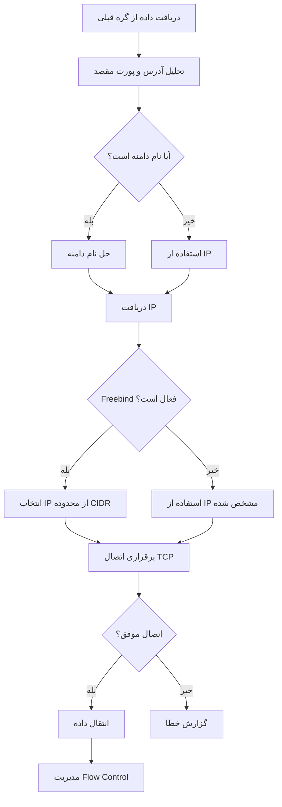

# TcpConnector

گره **TcpConnector** برای برقراری اتصالات TCP خروجی به مقاصد مشخص شده طراحی شده است. این گره معمولاً در انتهای زنجیره قرار می‌گیرد و وظیفه اتصال به سرور مقصد را بر عهده دارد.

## عملکرد

گره TcpConnector وظایف زیر را انجام می‌دهد:

- **اتصال TCP**: برقراری اتصال TCP به سرور مقصد
- **حل نام دامنه**: تبدیل نام دامنه به آدرس IP
- **مدیریت اتصال**: مدیریت چرخه حیات اتصال و کنترل جریان
- **Freebind**: پشتیبانی از انتخاب هوشمند IP در محدوده CIDR
- **بهینه‌سازی عملکرد**: تنظیمات TCP مختلف برای بهبود سرعت

## پارامترهای پیکربندی

### پارامترهای ضروری

```json
{
  "name": "tcp_connector",
  "type": "TcpConnector",
  "settings": {
    "address": "example.com",
    "port": 80
  }
}
```

- **`address`** (string): آدرس مقصد برای اتصال
  - آدرس IP: `"192.168.1.1"`, `"2001:db8::1"`
  - نام دامنه: `"httpforever.com"`
  - Context reference: `"src_context->address"`, `"dest_context->address"`
  - Freebind CIDR: `"2001:db8::1/64"`

- **`port`** (integer|string): پورت مقصد برای اتصال
  - پورت ثابت: `80`, `443`
  - Context reference: `"src_context->port"`, `"dest_context->port"`

### پارامترهای اختیاری

#### تنظیمات شبکه

```json
{
  "nodelay": true,
  "fastopen": true,
  "reuseaddr": true
}
```

- **`nodelay`** (boolean): فعال‌سازی TCP_NODELAY
  - پیش‌فرض: `true`
  - غیرفعال کردن الگوریتم Nagle برای کاهش تأخیر

- **`fastopen`** (boolean): فعال‌سازی TCP Fast Open
  - پیش‌فرض: `false`
  - تسریع برقراری اتصال (نیاز به پشتیبانی هسته)

- **`reuseaddr`** (boolean): فعال‌سازی SO_REUSEADDR
  - پیش‌فرض: `false`
  - استفاده مجدد از آدرس محلی

#### تنظیمات پیشرفته

```json
{
  "fwmark": 1,
  "domain-strategy": 0,
  "device": "wg0"
}
```

- **`fwmark`** (integer): علامت فایروال برای routing
  - پیش‌فرض: تنظیم نشده
  - فقط در لینوکس قابل استفاده

- **`domain-strategy`** (integer): استراتژی حل نام دامنه
  - پیش‌فرض: `0`
  - در حال حاضر پیاده‌سازی نشده

- **`device`** (string): نام دستگاه شبکه
  - پیش‌فرض: تنظیم نشده
  - در حال حاضر پیاده‌سازی نشده

## نمونه‌های کاربردی

### 1. اتصال ساده

```json
{
  "name": "simple_connector",
  "type": "TcpConnector",
  "settings": {
    "address": "example.com",
    "port": 80,
    "nodelay": true
  }
}
```

### 2. استفاده از Context

```json
{
  "name": "dynamic_connector",
  "type": "TcpConnector",
  "settings": {
    "address": "dest_context->address",
    "port": "dest_context->port",
    "nodelay": true
  }
}
```

### 3. Freebind (تعادل بار IP)

```json
{
  "name": "freebind_connector",
  "type": "TcpConnector",
  "settings": {
    "address": "2001:db8::1/64",
    "port": 443,
    "nodelay": true
  }
}
```

### 4. تنظیمات پیشرفته

```json
{
  "name": "advanced_connector",
  "type": "TcpConnector",
  "settings": {
    "address": "server.example.com",
    "port": 443,
    "nodelay": true,
    "fastopen": true,
    "fwmark": 1,
    "reuseaddr": true
  }
}
```

## مراحل پردازش



## Freebind - انتخاب هوشمند IP

قابلیت Freebind امکان انتخاب خودکار IP از محدوده CIDR را فراهم می‌کند:

### تنظیم سرور
```bash
# اضافه کردن محدوده محلی
ip route add local 2001:db8::/64 dev lo

# یا برای IPv4
ip route add local 192.168.100.0/24 dev lo
```

### مزایا
- **تنوع IP**: کاهش قابلیت ردیابی
- **تعادل بار**: توزیع اتصالات بین IP های مختلف
- **مقاومت در برابر فیلترینگ**: استفاده از IP های متنوع

### نمونه استفاده
```json
{
  "name": "freebind_example",
  "type": "TcpConnector",
  "settings": {
    "address": "2001:db8::1/64",
    "port": 443,
    "nodelay": true
  }
}
```

## بهینه‌سازی عملکرد

### تنظیمات بهینه‌سازی

1. **TCP_NODELAY**: کاهش تأخیر
```json
{
  "nodelay": true
}
```

2. **TCP_FASTOPEN**: تسریع handshake
```json
{
  "fastopen": true
}
```

3. **SO_REUSEADDR**: استفاده مجدد از پورت
```json
{
  "reuseaddr": true
}
```

### مدیریت حافظه

- **Buffer Pool**: استفاده بهینه از حافظه
- **Pause Queue**: کنترل جریان با ظرفیت 2 بافر
- **Flow Control**: pause/resume خودکار

## موارد استفاده رایج

### 1. پراکسی ساده
```json
{
  "name": "http_proxy",
  "type": "TcpConnector",
  "settings": {
    "address": "httpforever.com",
    "port": 80,
    "nodelay": true
  }
}
```

### 2. HTTPS Proxy
```json
{
  "name": "https_proxy",
  "type": "TcpConnector",
  "settings": {
    "address": "secure.example.com",
    "port": 443,
    "nodelay": true,
    "fastopen": true
  }
}
```

### 3. Load Balancing
```json
{
  "name": "load_balanced_connector",
  "type": "TcpConnector",
  "settings": {
    "address": "2001:db8::1/64",
    "port": 443,
    "nodelay": true
  }
}
```

### 4. Dynamic Routing
```json
{
  "name": "dynamic_connector",
  "type": "TcpConnector",
  "settings": {
    "address": "dest_context->address",
    "port": "dest_context->port",
    "nodelay": true,
    "fwmark": 1
  }
}
```

## مدیریت خطا

### خطاهای رایج
- **اتصال ناموفق**: عدم دسترسی به سرور
- **Timeout**: طولانی شدن زمان اتصال
- **DNS Resolution**: عدم حل نام دامنه

### پیشنهادات
1. استفاده از آدرس IP به جای نام دامنه برای سرعت بالاتر
2. تنظیم مناسب timeout در سطح سیستم
3. استفاده از Freebind برای redundancy

## نکات امنیتی

### Freebind
- نیاز به تنظیم مسیر محلی: `ip route add local <range> dev <interface>`
- کاهش قابلیت ردیابی با IP های متفاوت

### Firewall Mark
- امکان routing پیشرفته
- جداسازی ترافیک بر اساس علامت

## نکات مهم

- TcpConnector معمولاً آخرین گره در زنجیره است
- حل نام دامنه فعلاً سنکرون است (ممکن است باعث توقف شود)
- Freebind نیاز به تنظیم مسیر محلی در سرور دارد
- `nodelay: true` برای اکثر موارد استفاده توصیه می‌شود

## واژه‌نامه

- **TCP_NODELAY**: غیرفعال کردن الگوریتم Nagle
- **TCP_FASTOPEN**: تسریع handshake TCP
- **SO_REUSEADDR**: استفاده مجدد از آدرس محلی
- **Freebind**: قابلیت انتخاب IP از محدوده CIDR
- **fwmark**: علامت فایروال برای routing
- **Context**: اطلاعات مشترک بین گره‌ها در زنجیره