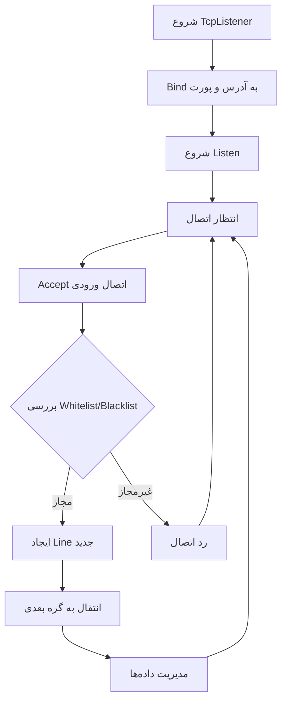

# TcpListener

گره **TcpListener** یکی از بنیادی‌ترین اجزای WaterWall است که مسئولیت گوش دادن به اتصالات TCP ورودی را بر عهده دارد.

## عملکرد

گره TcpListener وظایف زیر را انجام می‌دهد:

- **سرور TCP**: گوش دادن به اتصالات TCP ورودی روی آدرس و پورت مشخص شده
- **مدیریت اتصالات**: مدیریت چرخه حیات سوکت‌ها و انتقال داده‌ها به گره بعدی
- **کنترل دسترسی**: پیاده‌سازی فیلترینگ whitelist و blacklist برای آدرس‌های IP کلاینت
- **تعادل بار**: پشتیبانی از توزیع اتصالات ورودی بین چندین listener
- **پشتیبانی چند پورت**: قابلیت گوش دادن به پورت‌های مجزا یا محدوده‌ای از پورت‌ها

## پارامترهای پیکربندی

### پارامترهای ضروری

```json
{
  "name": "tcp_listener",
  "type": "TcpListener",
  "settings": {
    "address": "0.0.0.0",
    "port": 8443
  },
  "next": "next_node"
}
```

- **`address`** (string): آدرس IP برای گوش دادن
  - مثال: `"0.0.0.0"`, `"127.0.0.1"`, `"::"`
- **`port`** (number|array): شماره پورت یا محدوده پورت
  - پورت واحد: `8443`
  - محدوده پورت: `[8443, 8450]`

### پارامترهای اختیاری

#### تنظیمات شبکه

```json
{
  "nodelay": true,
  "multiport-backend": "iptables"
}
```

- **`nodelay`** (boolean): فعال‌سازی گزینه TCP_NODELAY
  - پیش‌فرض: `false`
  - غیرفعال کردن الگوریتم Nagle برای کاهش تأخیر
  
- **`multiport-backend`** (string): پیاده‌سازی backend برای پشتیبانی چند پورت
  - گزینه‌ها: `"iptables"` (پیش‌فرض), `"socket"`
  - فقط در استفاده از محدوده پورت مرتبط است

#### تعادل بار

```json
{
  "balance-group": "server_group",
  "balance-interval": 100
}
```

- **`balance-group`** (string): نام گروه تعادل برای Load Balancing
  - برای توزیع کلاینت‌ها بین چندین listener
  
- **`balance-interval`** (integer): زمان (میلی‌ثانیه) قبل از اینکه کلاینت بتواند مجدداً تخصیص یابد
  - پیش‌فرض: 60 ثانیه
  - کنترل فرکانس توزیع مجدد load balancing

#### کنترل دسترسی

```json
{
  "whitelist": ["192.168.1.0/24", "10.0.0.0/8"],
  "blacklist": ["192.168.1.100/32", "3.3.3.3/32"]
}
```

- **`whitelist`** (array): آدرس‌های IP/محدوده‌های CIDR مجاز
  - پشتیبانی از IPv4 و IPv6
  
- **`blacklist`** (array): آدرس‌های IP/محدوده‌های CIDR مسدود شده
  - پشتیبانی از IPv4 و IPv6

## نمونه‌های کاربردی

### 1. Listener ساده

```json
{
  "name": "simple_listener",
  "type": "TcpListener",
  "settings": {
    "address": "0.0.0.0",
    "port": 8443,
    "nodelay": true
  },
  "next": "handler_node"
}
```

### 2. Listener چند پورت

```json
{
  "name": "multi_port_listener",
  "type": "TcpListener",
  "settings": {
    "address": "0.0.0.0",
    "port": [8443, 8450],
    "nodelay": true,
    "multiport-backend": "iptables"
  },
  "next": "handler_node"
}
```

### 3. Load Balanced Listener

```json
{
  "name": "balanced_listener_1",
  "type": "TcpListener",
  "settings": {
    "address": "0.0.0.0",
    "port": 443,
    "nodelay": true,
    "balance-group": "server_group",
    "balance-interval": 100
  },
  "next": "server_1"
}
```

### 4. Listener با کنترل دسترسی

```json
{
  "name": "secure_listener",
  "type": "TcpListener",
  "settings": {
    "address": "0.0.0.0",
    "port": 8443,
    "nodelay": true,
    "whitelist": ["192.168.1.0/24", "10.0.0.0/8"],
    "blacklist": ["192.168.1.100/32"]
  },
  "next": "handler_node"
}
```

## مراحل پردازش



## بهینه‌سازی عملکرد

### ویژگی‌های بهینه‌سازی:

1. **TCP_NODELAY**: کاهش تأخیر با غیرفعال کردن الگوریتم Nagle
2. **Keepalive Timeouts**: timeout های قابل تنظیم برای مدیریت اتصالات
3. **Pause Queues**: پیاده‌سازی flow control برای جلوگیری از سرریز buffer
4. **Balance Groups**: توزیع بار بین چندین listener

### مدیریت منابع:

- **حافظه**: مدیریت کارآمد state هر اتصال
- **CPU**: بهینه‌سازی برای سناریوهای concurrency بالا
- **شبکه**: پشتیبانی از IPv4 و IPv6

## موارد استفاده رایج

1. **Port Forwarding ساده**: نقطه ورود proxy/tunnel
2. **Load Balancing**: توزیع ترافیک بین چندین سرور backend
3. **کنترل دسترسی**: محدود کردن اتصالات بر اساس آدرس IP
4. **سرویس‌های چند پورت**: مدیریت ترافیک روی چندین پورت همزمان
5. **High-Availability**: استفاده از balance groups برای redundancy

## نکات مهم

- TcpListener معمولاً به عنوان اولین گره در زنجیره (chain head) استفاده می‌شود
- برای عملکرد بهینه، `nodelay: true` را فعال کنید
- هنگام استفاده از محدوده پورت، backend مناسب را انتخاب کنید
- whitelist و blacklist همزمان قابل استفاده هستند (whitelist اولویت دارد)

## واژه‌نامه

- **TCP_NODELAY**: گزینه سوکت که الگوریتم Nagle را غیرفعال می‌کند
- **Balance Group**: گروهی از listener ها برای توزیع بار
- **Whitelist**: لیست آدرس‌های مجاز
- **Blacklist**: لیست آدرس‌های مسدود شده
- **Multiport Backend**: پیاده‌سازی زیرساخت برای پشتیبانی چند پورت