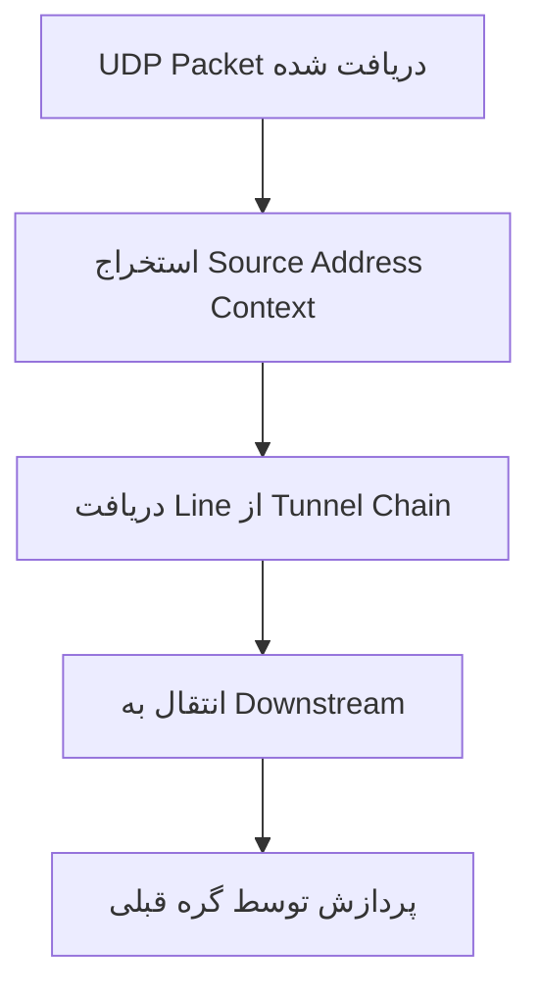
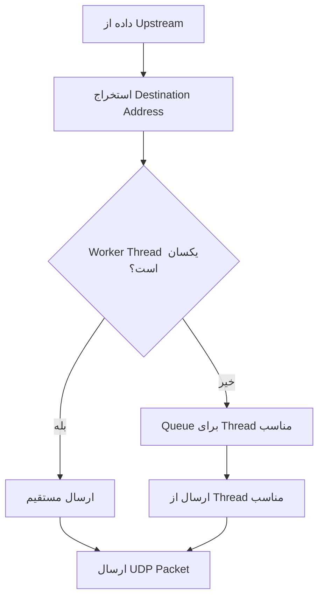

# UdpStatelessSocket

گره **UdpStatelessSocket** یک adapter تخصصی برای مدیریت UDP packets به صورت stateless است. این گره به عنوان سرور UDP عمل می‌کند و بدون حفظ وضعیت اتصال، هر packet را به صورت مستقل پردازش می‌کند.

## عملکرد

گره UdpStatelessSocket وظایف زیر را انجام می‌دهد:

- **سرور UDP**: گوش دادن به UDP packets روی آدرس و پورت مشخص شده
- **پردازش Stateless**: مدیریت هر packet به صورت مستقل بدون حفظ وضعیت اتصال
- **مدیریت دوطرفه**: دریافت و ارسال packets از/به مقاصد مختلف
- **مدیریت Worker Thread**: مدیریت ارتباطات cross-thread برای پردازش packets
- **Routing Context**: حفظ اطلاعات مبدأ و مقصد برای مسیریابی

## ویژگی‌های کلیدی

### طراحی Stateless
بر خلاف سوکت‌های UDP سنتی که وضعیت اتصال را نگه می‌دارند، این گره هر packet را مستقل پردازش می‌کند.

### Terminal Node
این گره نمی‌تواند گره بعدی داشته باشد و به عنوان endpoint عمل می‌کند.

### Multi-Threading Support
برای محیط‌های چند thread بهینه‌سازی شده است.

## پارامترهای پیکربندی

### پارامترهای ضروری

```json
{
  "name": "udp_server",
  "type": "UdpStatelessSocket",
  "settings": {
    "listen-address": "0.0.0.0",
    "listen-port": 8080
  }
}
```

- **`listen-address`** (string): آدرس IP برای bind شدن UDP socket
  - مثال: `"0.0.0.0"`, `"127.0.0.1"`, `"::1"`
  - اعتبارسنجی: باید آدرس IPv4 یا IPv6 معتبر باشد

- **`listen-port`** (integer): شماره پورت برای گوش دادن
  - محدوده: 0-65535
  - مثال: `8080`, `53`

### پارامترهای اختیاری

```json
{
  "fwmark": 1
}
```

- **`fwmark`** (integer): علامت فایروال برای routing پیشرفته
  - پیش‌فرض: تنظیم نشده
  - کاربرد: مسیریابی پیشرفته و QoS

## نمونه‌های کاربردی

### 1. UDP Echo Server

```json
{
  "name": "udp_echo",
  "type": "UdpStatelessSocket",
  "settings": {
    "listen-address": "0.0.0.0",
    "listen-port": 7
  }
}
```

### 2. DNS Proxy

```json
{
  "name": "dns_proxy",
  "type": "UdpStatelessSocket",
  "settings": {
    "listen-address": "127.0.0.1",
    "listen-port": 53
  }
}
```

### 3. Game Server Proxy

```json
{
  "name": "game_proxy",
  "type": "UdpStatelessSocket",
  "settings": {
    "listen-address": "0.0.0.0",
    "listen-port": 27015,
    "fwmark": 1
  }
}
```

### 4. Load Balancer Endpoint

```json
{
  "name": "lb_endpoint",
  "type": "UdpStatelessSocket",
  "settings": {
    "listen-address": "192.168.1.100",
    "listen-port": 8080
  }
}
```

## مراحل پردازش

### جریان داده ورودی (UDP Packets دریافتی)



### جریان داده خروجی (UDP Packets ارسالی)



## ساختار داده‌ها

### Tunnel State
```c
typedef struct {
    char*    listen_address;    // آدرس گوش دادن
    uint16_t listen_port;       // پورت گوش دادن
    int      fwmark;           // علامت فایروال
    wio_t*   io;               // WaterWall I/O object
    int      io_wid;           // Worker ID
} udpstatelesssocket_tstate_t;
```

### Line State
```c
typedef struct {
    int unused;  // در حال حاضر استفاده نمی‌شود
} udpstatelesssocket_lstate_t;
```

## موارد استفاده رایج

### 1. UDP Proxy/Relay
```json
{
  "name": "udp_relay",
  "type": "UdpStatelessSocket",
  "settings": {
    "listen-address": "0.0.0.0",
    "listen-port": 1194
  }
}
```

### 2. Protocol Gateway
```json
{
  "name": "protocol_gateway",
  "type": "UdpStatelessSocket",
  "settings": {
    "listen-address": "127.0.0.1",
    "listen-port": 5060
  }
}
```

### 3. Network Testing
```json
{
  "name": "test_endpoint",
  "type": "UdpStatelessSocket",
  "settings": {
    "listen-address": "192.168.1.1",
    "listen-port": 12345
  }
}
```

### 4. Load Balancer
```json
{
  "name": "udp_lb",
  "type": "UdpStatelessSocket",
  "settings": {
    "listen-address": "0.0.0.0",
    "listen-port": 80,
    "fwmark": 2
  }
}
```

## بهینه‌سازی عملکرد

### مزایای Stateless Design
- **بدون Overhead**: عدم نیاز به حفظ وضعیت اتصال
- **High Throughput**: مناسب برای سناریوهای throughput بالا
- **Memory Efficient**: استفاده بهینه از حافظه

### مدیریت Thread
- **Worker Thread Awareness**: آگاهی از محیط multi-threaded
- **Cross-Thread Communication**: ارتباط کارآمد بین thread ها
- **Thread Safety**: مدیریت ایمن عملیات cross-thread

### مدیریت حافظه
- **Buffer Pool**: استفاده بهینه از buffer pool
- **Proper Cleanup**: آزادسازی صحیح منابع
- **Resource Management**: مدیریت منابع سوکت

## محدودیت‌ها

### ویژگی‌های Terminal Node
- **بدون Next Node**: نمی‌تواند گره بعدی داشته باشد
- **Endpoint Role**: تنها به عنوان endpoint عمل می‌کند

### عملکرد Stateless
- **بدون Connection State**: عدم مدیریت وضعیت اتصال
- **Independent Packets**: هر packet به صورت مستقل پردازش می‌شود

### پشتیبانی فعلی
- **fwmark**: تعریف شده اما هنوز پیاده‌سازی نشده
- **IPv4/IPv6 Only**: محدود به فرمت‌های استاندارد IP

## مدیریت خطا

### خطاهای رایج
- **Invalid IP Address**: آدرس IP نامعتبر در `listen-address`
- **Port Out of Range**: شماره پورت خارج از محدوده 0-65535
- **Socket Creation Failure**: ناکامی در ایجاد سوکت
- **Missing Configuration**: عدم وجود فیلدهای ضروری

### پیشنهادات
1. اعتبارسنجی آدرس IP قبل از اعمال پیکربندی
2. بررسی دسترسی به پورت موردنظر
3. مدیریت صحیح resource cleanup
4. بررسی ساختار JSON

## نکات امنیتی

### Network Exposure
- انتخاب آدرس listen مناسب (`127.0.0.1` vs `0.0.0.0`)
- محدود کردن دسترسی به پورت‌های حساس

### Firewall Configuration
- استفاده از `fwmark` برای routing پیشرفته
- تنظیم قوانین فایروال مناسب

## نکات مهم

- UdpStatelessSocket نمی‌تواند گره بعدی داشته باشد
- هر UDP packet به صورت مستقل پردازش می‌شود
- برای محیط‌های multi-threaded بهینه‌سازی شده است
- عدم نیاز به مدیریت وضعیت اتصال آن را بسیار کارآمد می‌کند

## واژه‌نامه

- **Stateless**: بدون حفظ وضعیت اتصال
- **UDP Socket**: سوکت پروتکل UDP
- **Terminal Node**: گره انتهایی بدون خروجی
- **Worker Thread**: thread پردازش کننده
- **fwmark**: علامت فایروال برای routing
- **Cross-Thread**: عملیات بین thread های مختلف