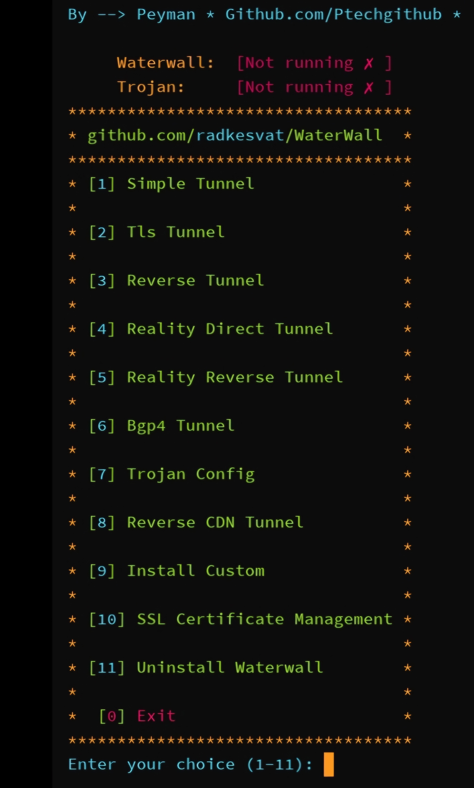

# اسکریپت های خودکار

اسکریپت های نصب و اجرای خودکار که توسط توسعه دهندگاه دیگه طراحی شده اند تا فرایند نصب و کانفیگ را ساده و سریع تر کنند در این صفحه قرار خواهد گرفت

دقت کنید که سورس کد این اسکریپت ها باز هست و توسط سازنده اسکریپت آپدیت خواهد شد

## اسکریپت Ptechgithub

```bash
bash <(curl -fsSL https://raw.githubusercontent.com/Ptechgithub/WaterWall-Docs/main/install.sh)
```



> - [Ptech Github](https://github.com/Ptechgithub)
> - [Code Repo](https://github.com/Ptechgithub/WaterWall-Docs)
